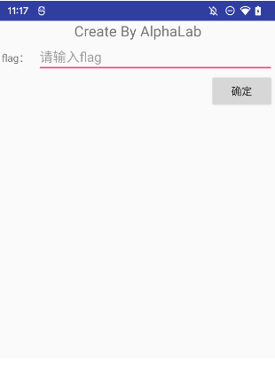
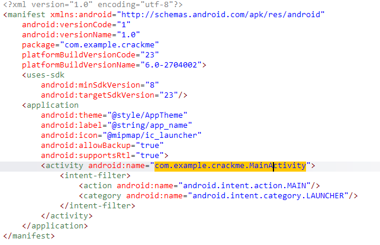
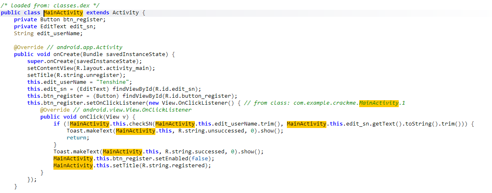
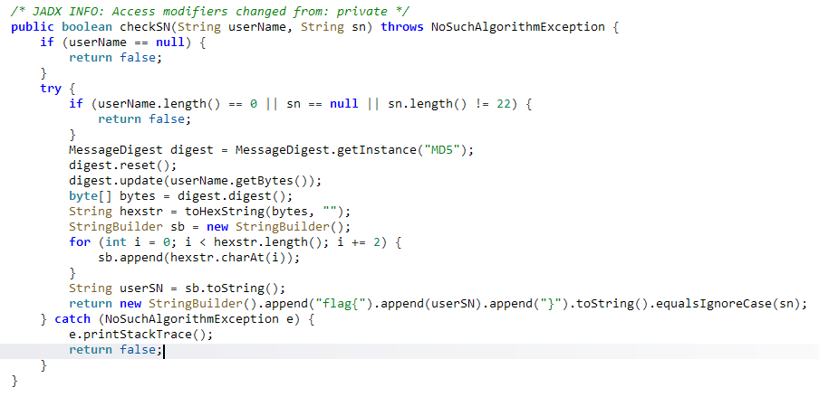
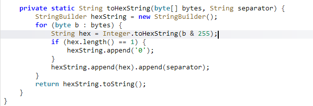

- 打开apk文件：

很明显，用户输入flag，系统判断是否正确

- Jadx反编译分析AndroidManifest.xml：

只有一个页面，跳转过去进行分析

- 分析MainActivity：

硬编码userName值为"Tenshine"，sn为用户输入的值，将userName和sn传入checkSN()方法进行校验，如果checkSN()返回false，通过!反转为true后弹出失败提示并返回；如果checkSN()返回true，则弹出成功提示，禁用按钮并修改标题

- 进入checkSN()：

经过对userName（非空且长度不为0）、sn（非空且长度必须为22）的基础判断之后，创建md5加密器，重置加密器，将userName转字节数组后进行md5加密，得到16字节的加密结果bytes数组，传入toHexString（分隔符为空字符串）处理得到32位十六进制字符串。之后遍历该字符串，每2位取第1位（索引0、2、4...30）添加到字符串构建器sb中，将sb内容转为字符串赋值给userSN，最后拼接格式为"flag{"+userSN+"}"，与sn进行忽略大小写对比，相同则返回true，否则返回false

- 进入toHexString()：

构建hexString字符串构建器，通过for循环遍历bytes数组，每个字节b与255进行按位与运算（转换为无符号整数），将结果转为十六进制字符串hex。如果hex长度为1，就在后面补"0"，否则直接使用。之后将hex与传入的separator（空）拼接至hexString，最终返回拼接后的字符串

- 写出逆向脚本：
```python
import hashlib

username = "Tenshine"

md5 = hashlib.md5(username.encode('UTF-8'))
md5_bytes = md5.digest()

hex_str = ""
for b in md5_bytes:
    unsigned = b & 0xFF
    hex_char = f"{unsigned:x}"
    if len(hex_char) == 1:
        hex_char = f"0{hex_char}"
    hex_str += hex_char

user_sn = ''.join([hex_str[i] for i in range(0, 32, 2)])

flag = f"flag{{{user_sn}}}"

print("MD5转32位十六进制：", hex_str)
print("截取后16位字符串：", user_sn)
print("最终正确flag：", flag)

# 运行结果：flag{bc72f242a6af3857}
```