# 1、环境介绍
```
外网机：192.168.111.80 / 10.10.10.80
PC：10.10.10.201
DC：10.10.10.10
```


# 2、打靶过程：
## 1、拿下webshell
- 访问外网机：
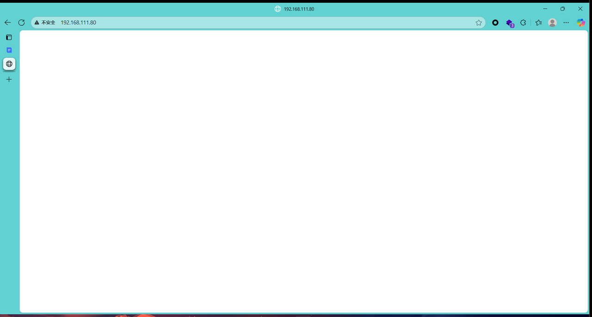
- nmap探测目标端口：
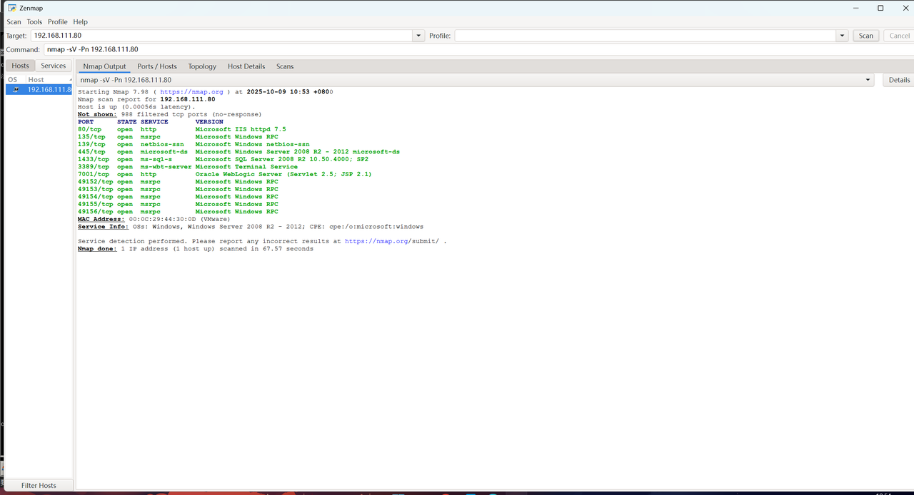
- 发现存在7001端口，通过weblogic扫描此端口：
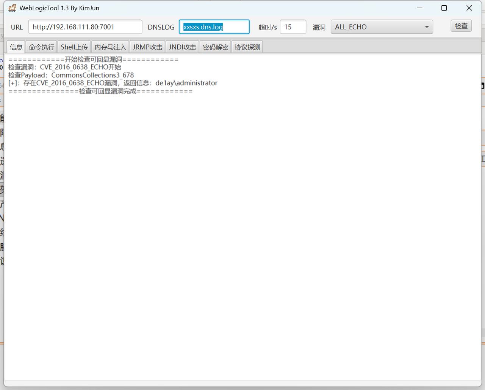
- 注入内存马：
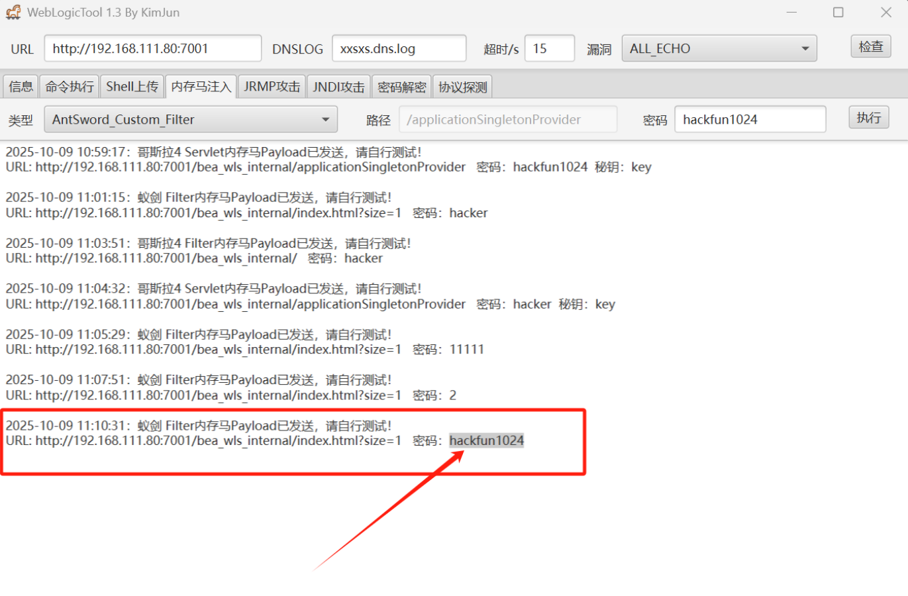
- 蚁剑连接：
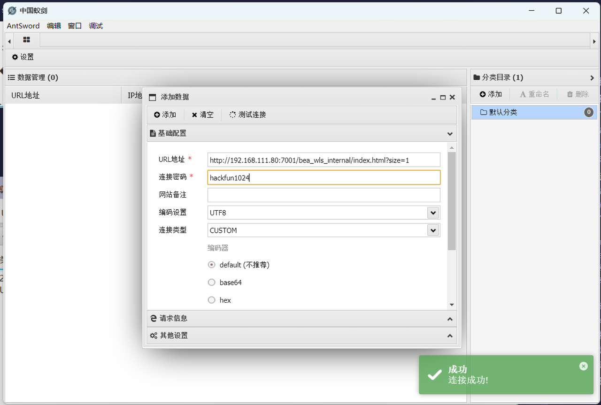
- 连接成功：
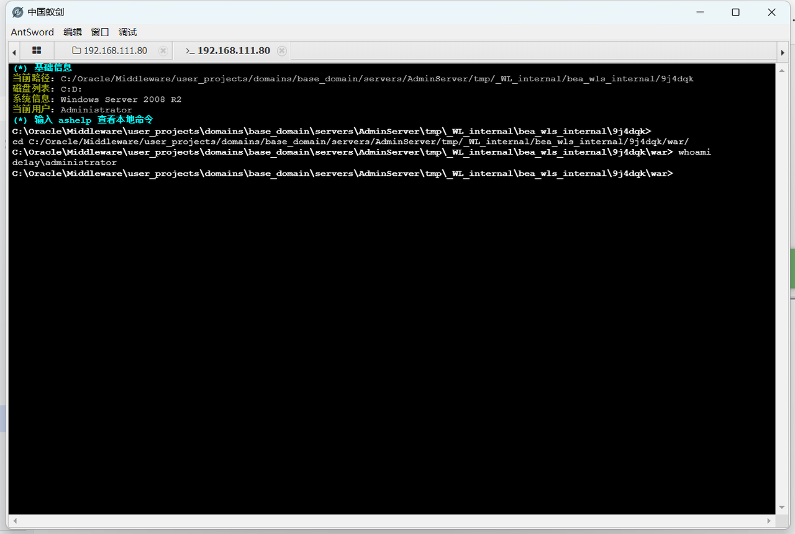

## 2、内网信息收集
- Ipconfig查看当前机器信息：
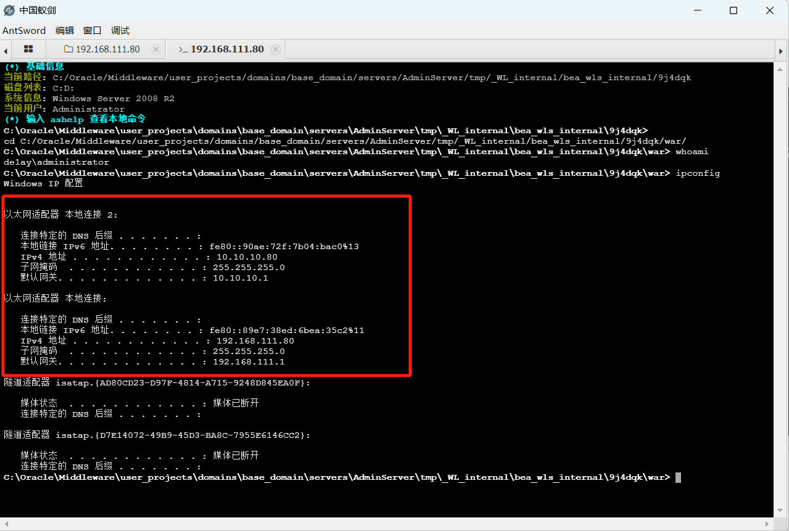
- 目标存在两个网段，蚂剑上传CS马，获取目标CS终端：
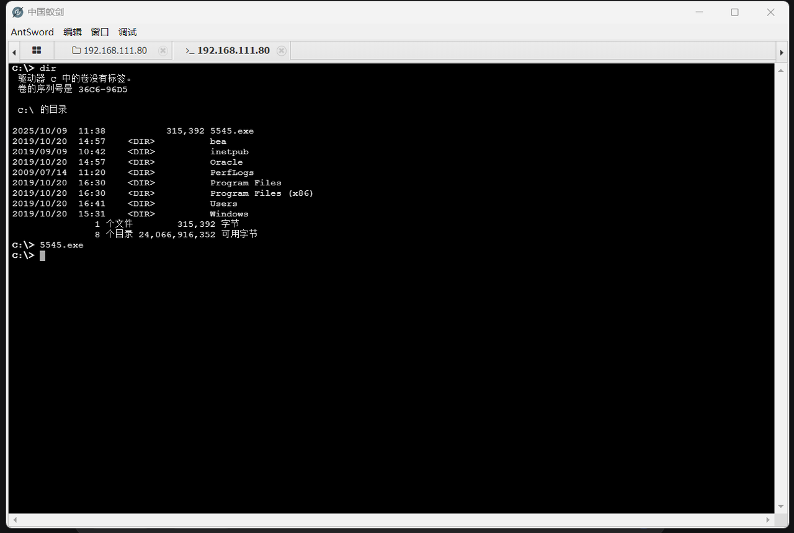
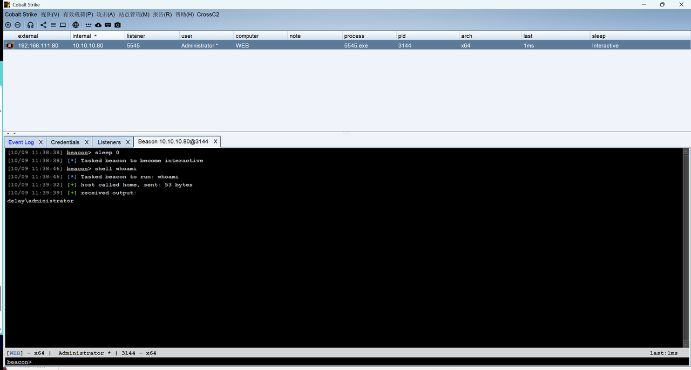
- 上传fscan进行扫描：
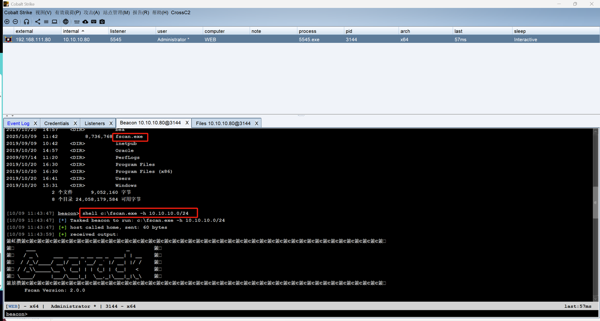
- 导出扫描结果并查看：
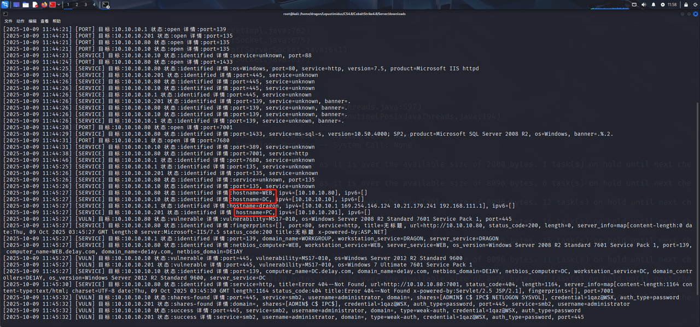
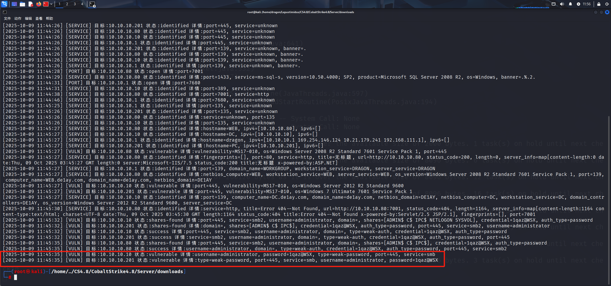
```
WEB：192.168.111.80 / 10.10.10.80
DC：10.10.10.10  administrator:1qaz@WSX
PC：10.10.10.201 administrator:1qaz@WSX
doamin：DE1AY
```

## 3、socks+proxifier全局代理
- CS搭建socks5：
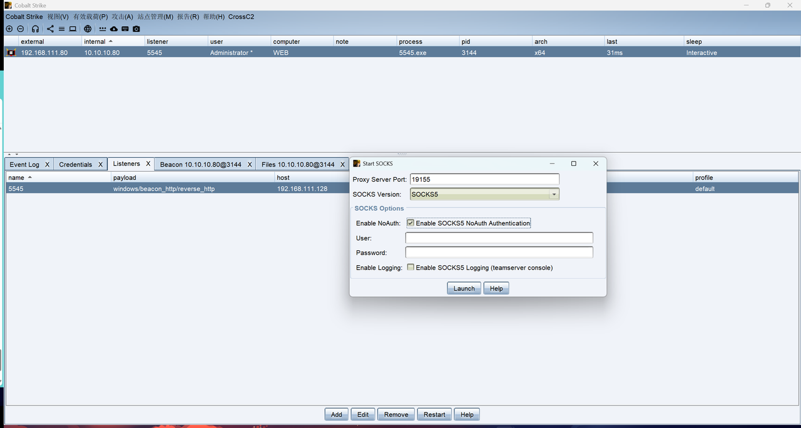
- proxifier搭建全局代理：
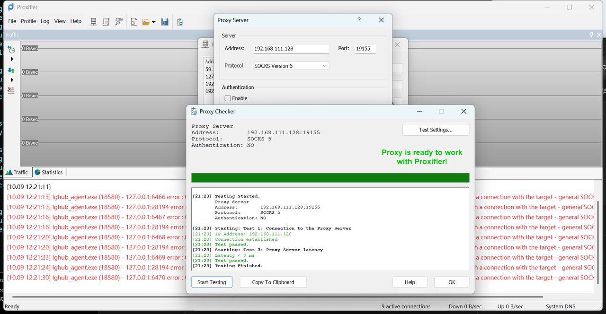

## 4、内网横向
- 通过impacket工具箱中的psexec横向到PC：
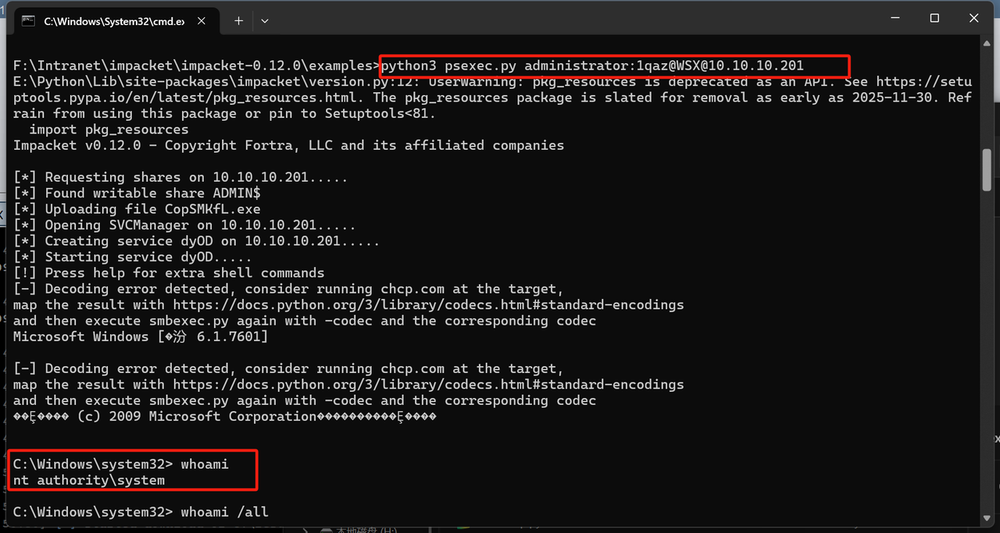
- 通过impacket工具箱中的psexec横向到DC：
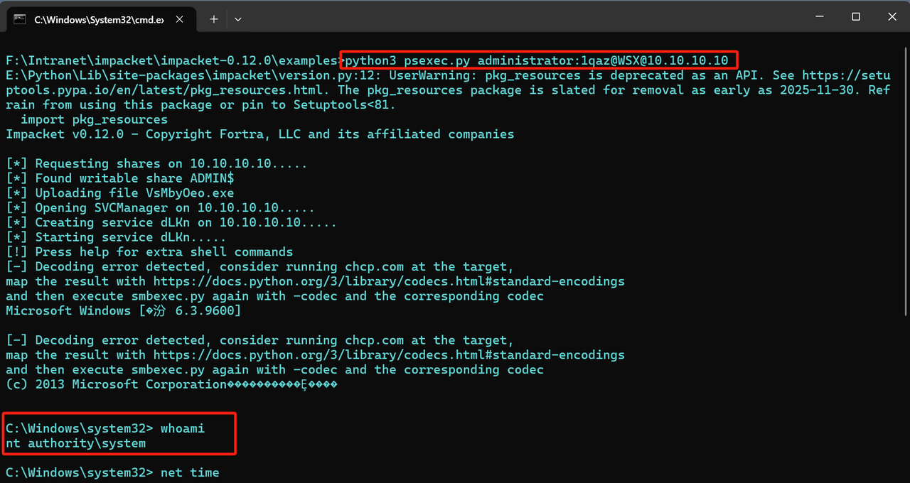
