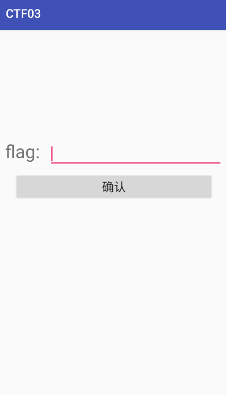
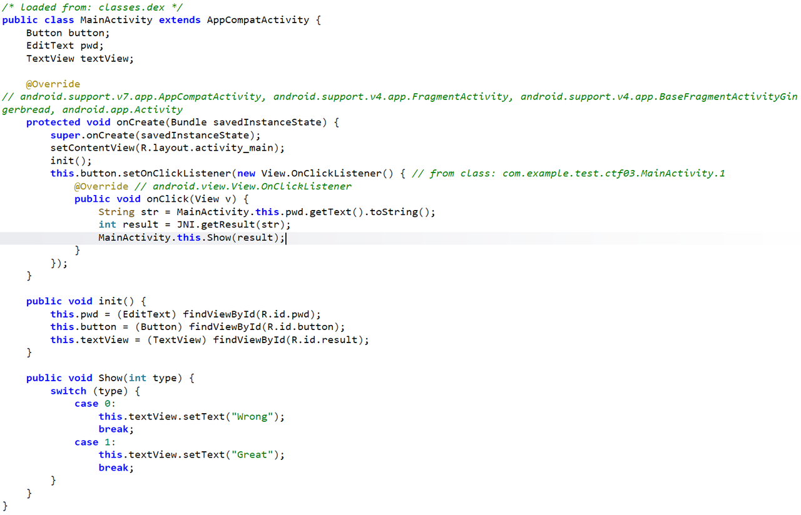
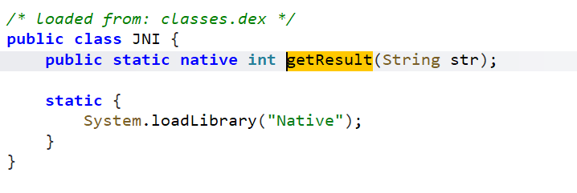
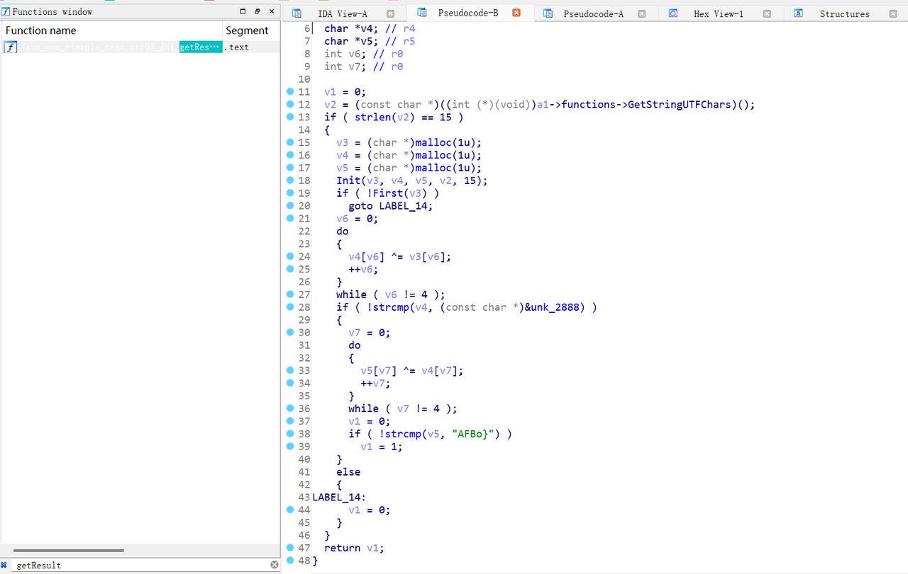
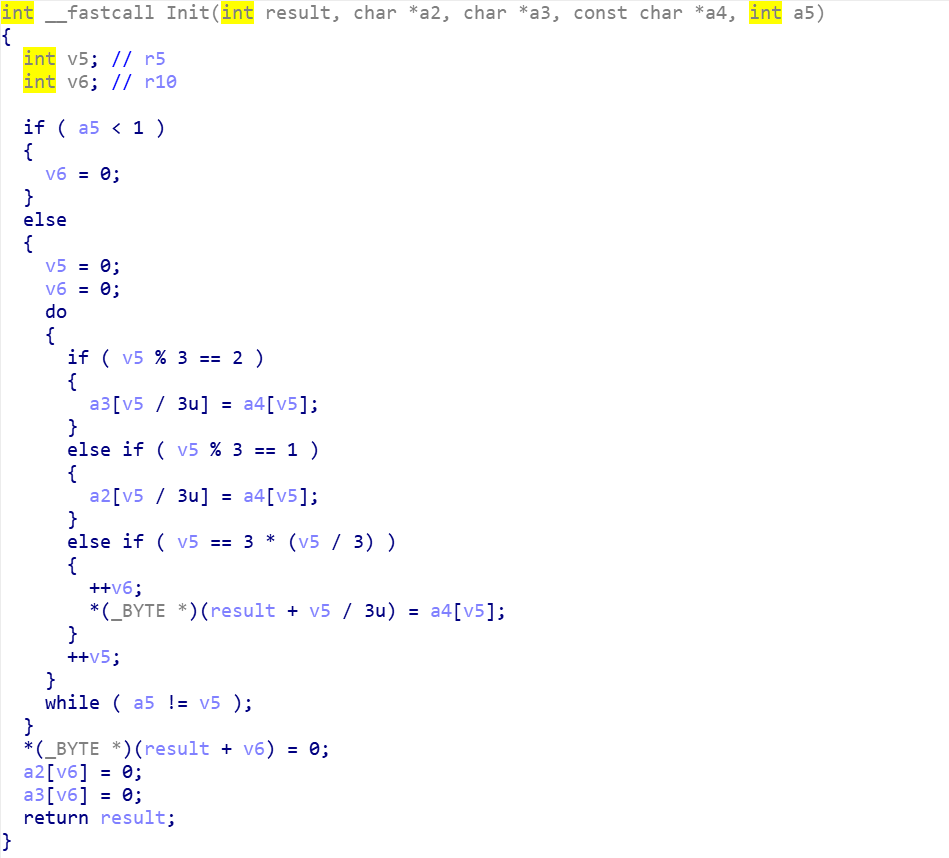
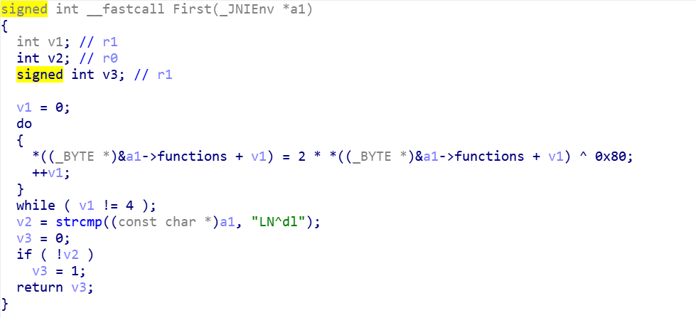
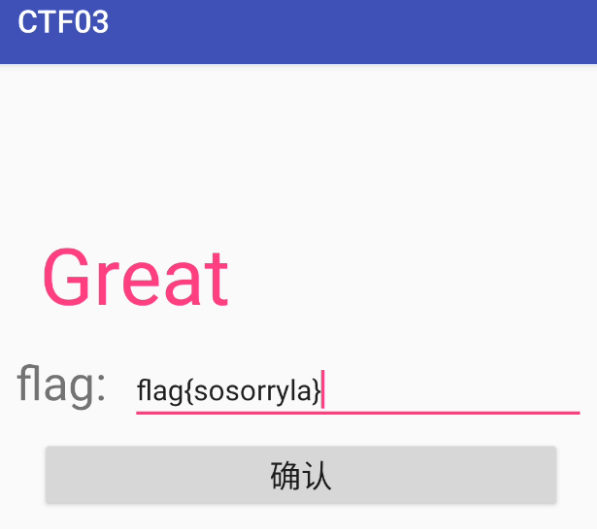

# 打靶过程：
- 测试机打开apk：

题目意思很明确，就是逆向得到flag，并输入进系统进行判断是否正确

- jadx反编译分析AndroidManifest.xml：

只有一个MainActivity页面

- 分析MainActivity：

通过getResult()方法判断用户输入的str（flag值）

- 进入getResult()：


- IDA打开对应的so文件并搜索得到getResult()方法：

给v3、v4、v5分配内存空间，并将v3（对应result）、v4（对应a2）、v5（对应a3）、输入字符串v2（对应a4）、长度15（对应a5）作为参数传入Init()

- 分析Init()：

在Init()中进入do while循环15次（v5从0到14），按以下规则拆分v2的数据：
- 将索引为2、5、8、11、14（v5%3==2）的值从v2中提取，赋值给v5数组（a3），索引为v5/3（0、1、2、3、4）
- 将索引为1、4、7、10、13（v5%3==1）的值从v2中提取，赋值给v4数组（a2），索引为v5/3（0、1、2、3、4）
- 将索引为0、3、6、9、12（v5%3==0）的值从v2中提取，赋值给v3（result），索引为v5/3（0、1、2、3、4），同时计数器v6自增（最终v6=5）
最终v3、v4、v5均在索引v6处补0作为结束符，返回v3值，并传递给Frist()进行判断

- 分析Frist()：

进入do while循环4次（v1从0到3），每次对v3的前4个字节执行运算：v3[v1] = 2*v3[v1] ^ 0x80（先乘2再与128异或）
将运算后的v3与字符串“LN^dl”比较，若相等（strcmp返回0）则返回1，否则返回0
回到getResult方法，若First(v3)返回1（验证通过），则进入do while循环4次（v6从0到3），对v4和v3的前4个字节执行异或：v4[v6] ^= v3[v6]
将异或后的v4与地址unk_2888中的字符串比较，若相等（strcmp返回0）则继续，否则跳至失败逻辑（返回0）
继续进入do while循环4次（v7从0到3），对v5和异或后的v4的前4个字节执行异或：v5[v7] ^= v4[v7]
将异或后的v5与字符串“AFBo}”比较，若相等则返回1（全部验证通过），否则返回0
如果最终返回1，则通过Java层show()方法返回Great，代表flag正确

- 写出逆向脚本：
```python
# reverse_flag
str1 = "LN^dl"  # 对应C中的str
str2 = [0x20, 0x35, 0x2d, 0x16, 0x61]  # 对应C中的str2（前5个字节）
str3 = "AFBo}"  # 对应C中的str3

flag = [''] * 15  # 初始化15字节的flag数组
j = 0

# 处理前4组（i=0到3）
for i in range(4):
    # 计算flag[j]：(str1[i] ^ 0x80) / 2
    flag[j] = chr((ord(str1[i]) ^ 0x80) // 2)
    # 计算flag[j+1]：str2[i] ^ str1[i]的ASCII值
    flag[j+1] = chr(str2[i] ^ ord(str1[i]))
    # 计算flag[j+2]：str3[i]的ASCII值 ^ str2[i]
    flag[j+2] = chr(ord(str3[i]) ^ str2[i])
    j += 3  # 每次处理3个字节，索引+3

# 处理第5组（i=4），填充最后3个字节（索引12、13、14）
flag[j] = str1[4]  # str1[4]是'l'
flag[j+1] = chr(str2[4])  # str2[4]是0x61（对应'a'）
flag[j+2] = str3[4]  # str3[4]是'}'

# 拼接并打印结果（15字节）
print(''.join(flag))

# 运行结果：flag{sosorryla}
```
