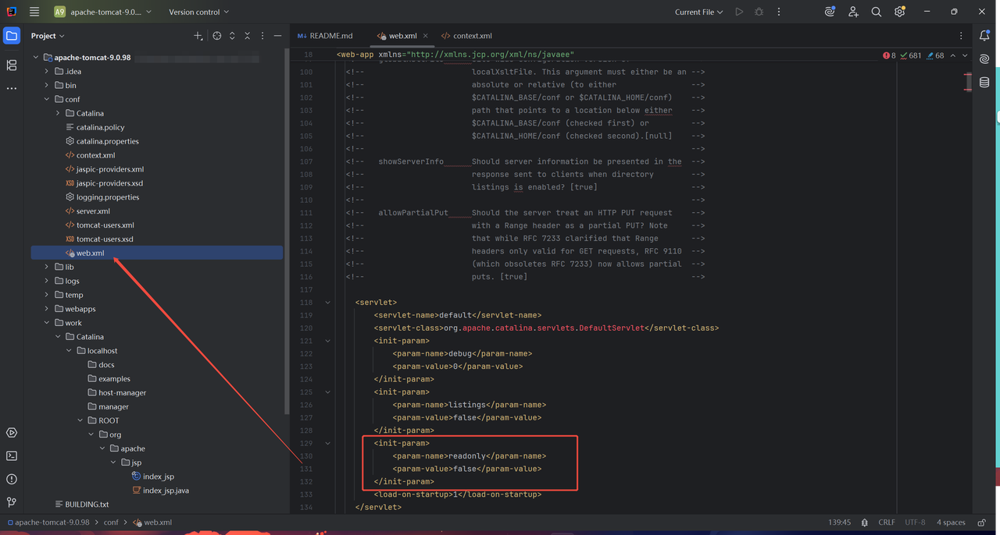
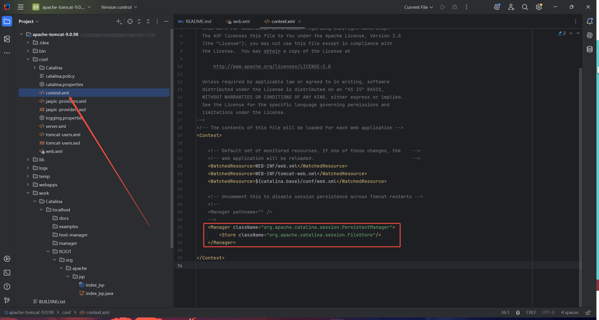
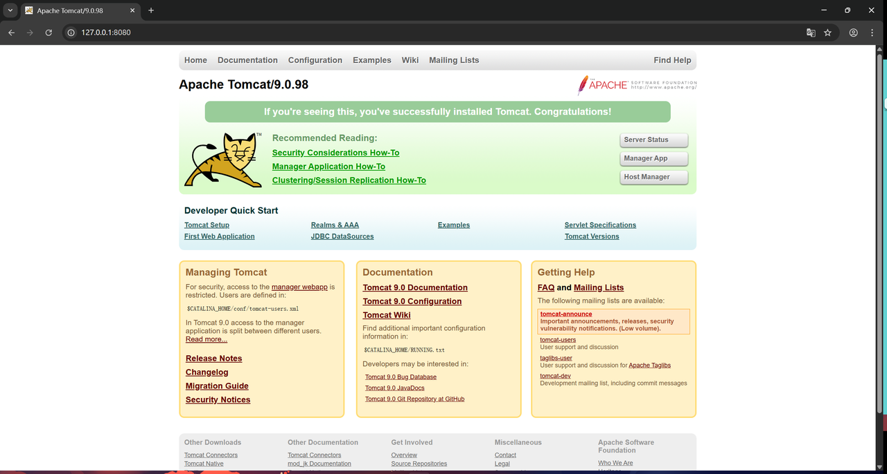
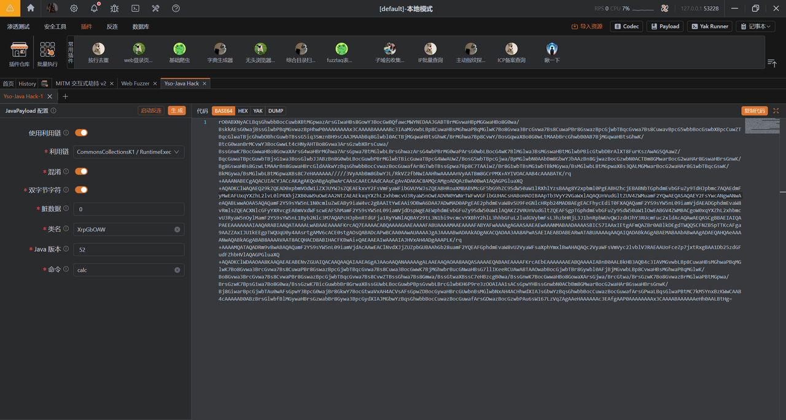
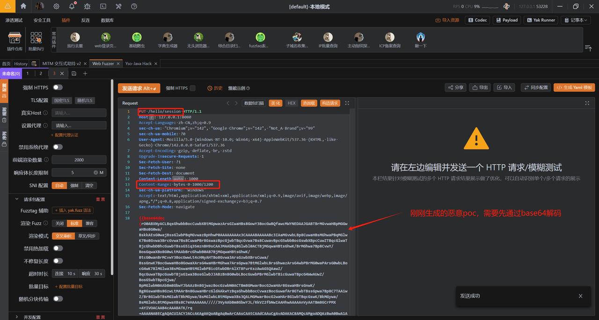
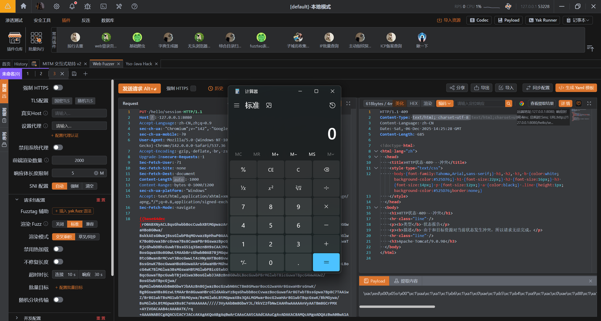
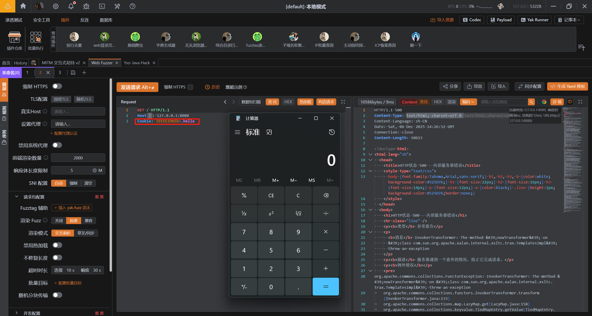

# 1、基础简述
- Tomcat：tomcat是 Apache 软件基金会下属的开源 Java Servlet 容器，同时支持 JavaServer Pages（JSP）、Java Expression Language（EL）等 Java Web 技术规范，核心作用是运行 Java 编写的 Web 应用程序，是开发和部署 Java Web 项目的主流工具之一

# 2、漏洞原理
- 介绍：当用户通过Partial PUT请求上传数据时，tomcat会将用户输入的文件名和路径中的"/"解析成"."，临时存储在tomcat的/work/Catalina/localhost/ROOT目录下，比如：用户通过Partial PUT方法在/hello/session目录上传数据，那么tomcat就会将/hello/session解析成：.hello.session并存储在/work/Catalina/localhost/ROOT目录下，之后该文件.hello.session文件中的恶意poc会自动或者用户手动进行触发
- 利用条件：
  - DefaultServlet启用写入权限（readonly=false，默认关闭）
  - 应用支持partialPUT请求（默认启动状态）
  - 启用文件会话持久化
  - 应用存在反序列化利用链库，比如：Commons-Collections
- 影响范围：
```
9.0.0.M1  <= tomcat <= 9.0.98
10.1.0-M1 <= tomcat <= 10.1.34
11.0.0-M1 <= tomcat <= 11.0.2
```

# 3、漏洞环境搭建
- 安装可利用版本Tomcat：

下载链接：[传送门](https://archive.apache.org/dist/tomcat/tomcat-9/v9.0.98/bin/apache-tomcat-9.0.98.zip)
- DefaultServlet启用写入权限：
```
<init-param>
    <param-name>readonly</param-name>
    <param-value>false</param-value>
</init-param>
```


- 启用文件会话持久化：
```
<Manager className="org.apache.catalina.session.PersistentManager">
    <Store className="org.apache.catalina.session.FileStore"/>
</Manager>
```


- 应用存在反序列化利用链库：

下载链接：[传送门](https://mvnrepository.com/artifact/commons-collections/commons-collections/3.2.1)

将下载好的commons-collections放到webapps/ROOT/WEB-INF/lib目录下：


# 4、漏洞复现
- 运行/bin/startup.bat脚本启动Tomcat并访问：


- 通过yakit自带工具生成base64编码后的k1链反序列化poc：


- 构造恶意请求包并发送：


- 结果：

发送数据包之后等待一段时间即可自动触发：

或者发送如下数据包进行手动触发：
