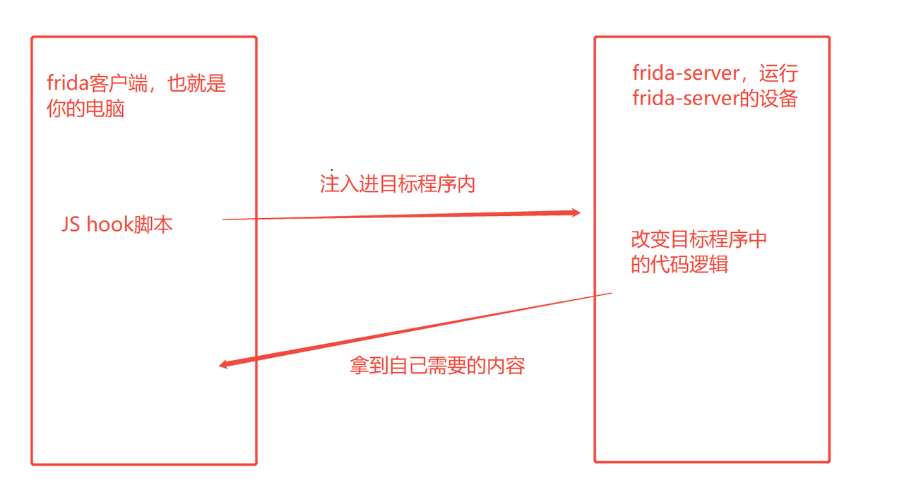
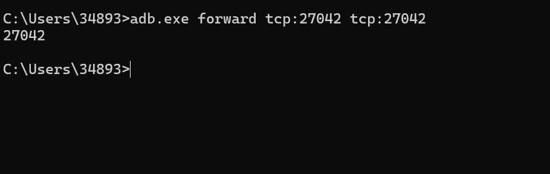
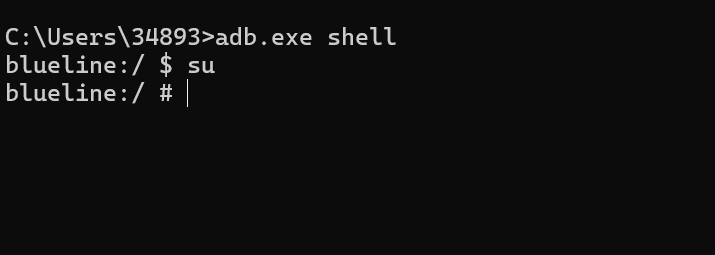
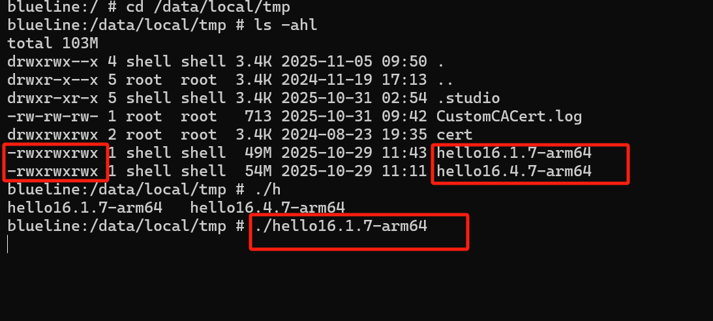
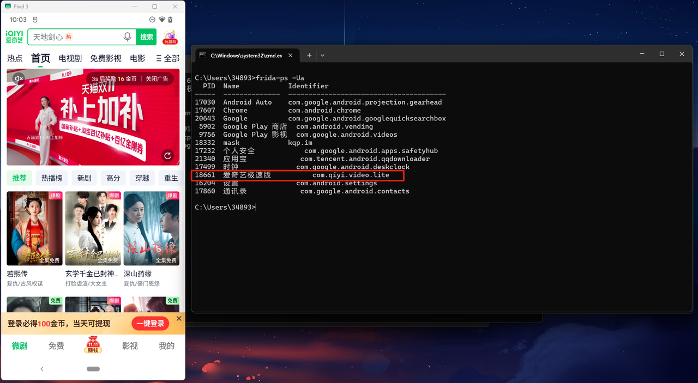
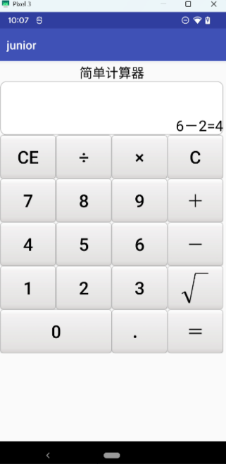
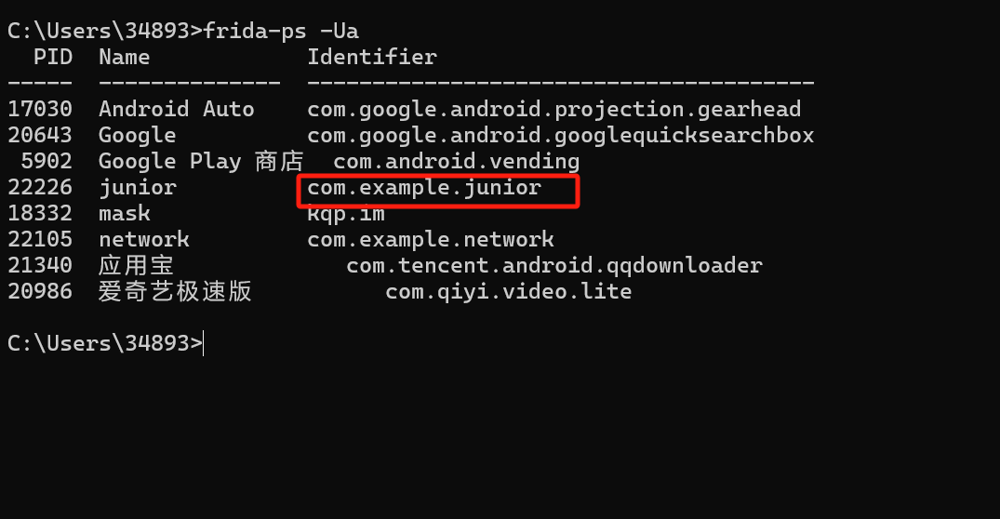
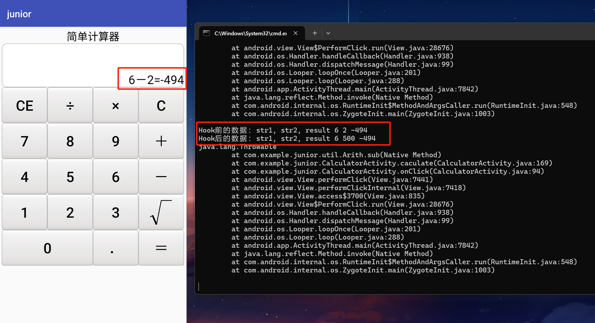

# 1、介绍

- 如果把APP比做无人机，静态分析就像是将无人机各个部件拆卸下来进行研究，而Frida就像是通过遥控器控制无人机按照自己的意愿行动，进行动态分析
- frida是一款动态插桩工具，用于在APP运行时插入JavaScript代码，来监控或者修改APP的运行逻辑，从而让逆向工程师获取到想要的数据或者实现想要实现的功能，这种方式被称之为HOOK，frida支持运行在Windows、Mac、Android、IOS等主流平台
- frida拥有全栈hook能力：Java层、Native层

# 2、原理

- Frida采用了客户端-服务器的架构设计：
  - 客户端：就是自己的电脑，用于将你的hook脚本推送到服务端运行并接收从服务端hook回来的数据
  - 服务端：也就是frida-server，运行frida-server的设备就是服务端，用于运行需要被hook的应用程序
- Frida工作流程：
  1. 建立连接与注入：
        - spawn模式：Frida启动目标程序后，在其程序main()执行前暂停它，然后将自己的代码注入进去，从程序启动的第一刻就进行控制
        - attach模式：attach方式是在目标应用程序已经运行的过程中动态的注入代码

        ``注意：Frida注入的内容是Frida Gadget动态库（在Windows上是.dll，在Linux/Android上是.so，在macOS/IOS上是.dylib）Gadget中包含了Frida的全部核心引擎``
  2. 构建虚拟机
        - Frida Gadget被注入后，会在目标进程中创建一个完整的 JavaScript 运行时环境，用于执行JS Hook脚本与目标程序的编程语言比如C/C++、Java进行代码之间的交互
  3. Hook脚本加载与通信
        - 客户端与服务端通过通信信道（如 USB 或 TCP）将JS Hook脚本发送到服务端，Gadget接收到脚本后，将其加载到内部的JavaScript引擎中解析并执行，并通过这个通信信道将目标进程的数据发回客户端



>网图--基于Ptrace的Hook工作流程

# 3、使用

## 1、安装
```
pip install frida
pip install frida-tools
```
[frida-server下载链接](https://github.com/frida/frida)

## 2、常用语法
```
# 查看USB设备上所有进程
frida-ps -Ua

# spawn模式：启动进程并注入脚本
frida -U -f com.xxx.xxx -l hook.js --no-pause

# attach模式：附加到前台进程并注入脚本
frida -UF -l hook.js

# attach模式：附加到指定PID进程（替换1234为实际PID）
frida -U -p 1234 -l hook.js
```

## 3、建立连接

* 通过adb设置frida客户端和服务端的通信端口
```bash
adb.exe forward tcp:27042 tcp:27042
```

``注意事项：为防止出错，移动端每次启动frida-server都需要配置端口``

* 将frida-server上传到服务端：
```
adb.exe push xxx/xxx/frida-server /data/local/tmp
# 将客户端路径xxx/xxx/下的frida-server上传到服务端的/data/local/tmp路径下
```

* 通过adb进入shell并切换为root：
```
adb.exe shell                  # 进入设备shell
su                             # 切换为root权限
```


* 切换到/data/local/tmp路径下给与frida-server执行权限并执行：

``这里我对frida-server重命名了``

* 至此连接建立完毕，比如通过客户端查看服务端正在运行的进程有哪些：
```bash
frida-ps -Ua
```


## 4、简单案例演示

- 这是某APP的计算器功能：


- 找到此APP的进程：


- 通过对此APP反编译分析代码之后得到如下hook脚本：
```javascript
// hook_sub.js
function main() {
    Java.perform(function (){
        var Arith = Java.use('com.example.junior.util.Arith')
        Arith.sub.overload("java.lang.String","java.lang.String").implementation = function (str1, str2) {
            var str_haha = '500'
            var result = this.sub(str1, str_haha)
            console.log('Hook前的数据：str1, str2, result', str1, str2, result)
            console.log('Hook后的数据：str1, str2, result', str1, str_haha, result)
            console.log(Java.use("android.util.Log").getStackTraceString(Java.use("java.lang.Throwable").$new()))
            return result
        }
    })
}
setImmediate(main)
```

- 客户端通过attach模式将该hook脚本注入到目标进程中进行hook：
```bash
frida -UF -l hook_sub.js
```


- 可以看到，通过hook，改变了程序的减法代码实现逻辑