> 练习apk来自看雪
>
> [apk传送](https://bbs.kanxue.com/thread-278023.htm)

## 演员列表

```
frida 16.1.7
frida-server 16.1.7

frida_train_7.apk
```

## 正片
### 登录口：
- 打开apk：


- 搜索关键字定位到对应代码：
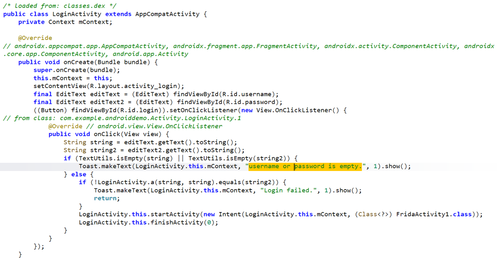
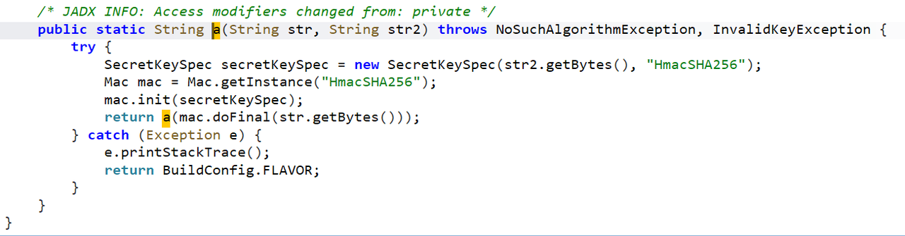
用户输入的username和password分别对应string、string2，然后将username传入LoginActivity.a()方法进行计算之后和password进行判断是否相等，如果相等，就进入FridaActivity1.class页面
a方法中就是将输入的username进行加密计算，然后返回username的加密结果
这里我的思路是直接hookLoginActivity.a()方法，让返回值等于用户输入的密码即可

- 编写脚本：
```javascript
// train7.js
Java.perform(function(){

    // 登录口hook
    var LoginActivity = Java.use("com.example.androiddemo.Activity.LoginActivity")

    // 因为LoginActivity类中有两个重载a方法，所以需要通过overload确定具体是那个
    LoginActivity.a.overload('java.lang.String', 'java.lang.String').implementation = function(str, str2) {
        var result = this.a(str, str2);
        result = "admin";
        console.log("str:", str);
        console.log("str2:", str2);
        console.log("result:", result);
        return result;
    }
});
```
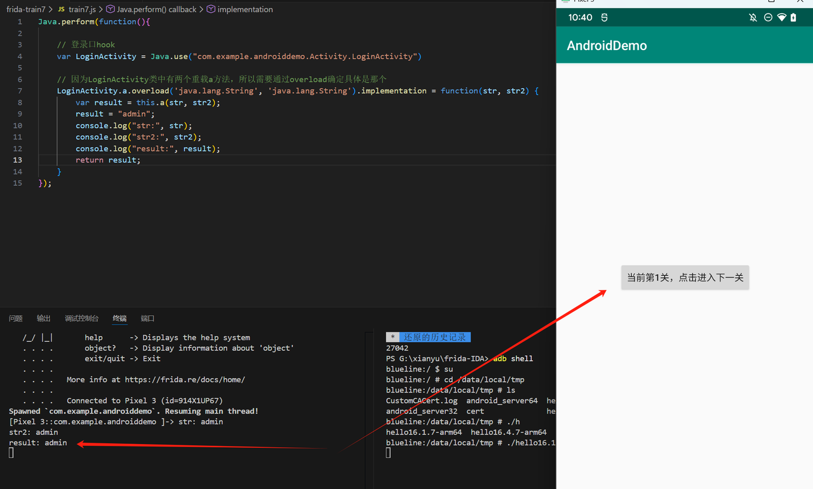
成功来到第1关

### 第1关：
- 进入FridaActivity1.class：
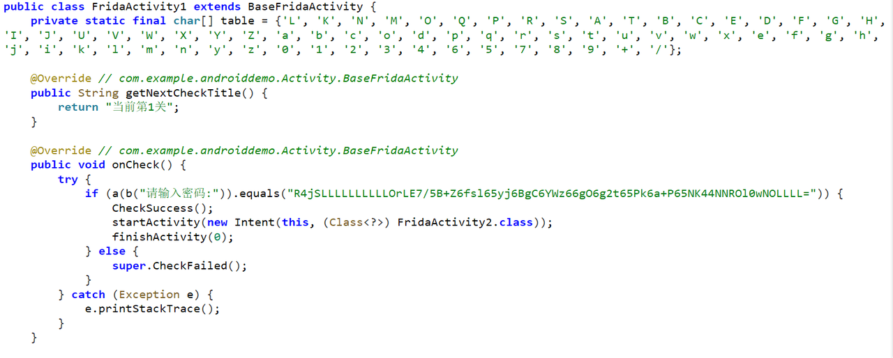
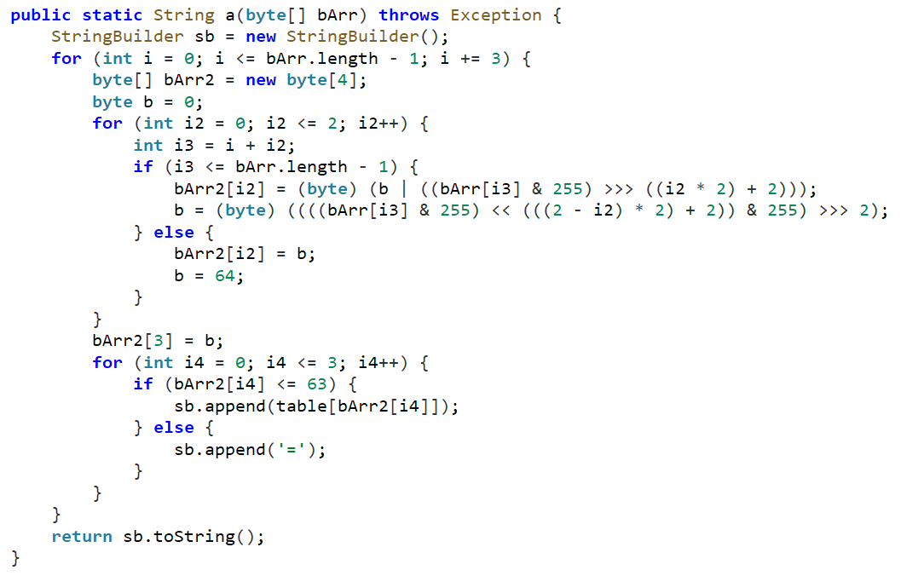
将用户输入的密码和字符串"R4jSLLLLLLLLLLOrLE7/5B+Z6fsl65yj6BgC6YWz66gO6g2t65Pk6a+P65NK44NNROl0wNOLLLL="进行对比，如果一样，就进入下一关FridaActivity2.class
a方法中对密码进行加密并返回加密后的结果
这里我的思路是hook a方法，然后返回值直接等于字符串"R4jSLLLLLLLLLLOrLE7/5B+Z6fsl65yj6BgC6YWz66gO6g2t65Pk6a+P65NK44NNROl0wNOLLLL="即可

- 编写脚本：
```javascript
// train7.js
Java.perform(function(){

    // 登录口hook
    var LoginActivity = Java.use("com.example.androiddemo.Activity.LoginActivity")

    // 因为LoginActivity类中有两个重载a方法，所以需要通过overload确定具体是那个
    LoginActivity.a.overload('java.lang.String', 'java.lang.String').implementation = function(str, str2) {
        var result = this.a(str, str2);
        result = "admin";
        console.log("str:", str);
        console.log("str2:", str2);
        console.log("result:", result);
        return result;
    }

    
    // 第1关hook
    var FridaActivity1 = Java.use("com.example.androiddemo.Activity.FridaActivity1");
    FridaActivity1.a.implementation = function(bArr) {
        var result = this.a(bArr);
        result = "R4jSLLLLLLLLLLOrLE7/5B+Z6fsl65yj6BgC6YWz66gO6g2t65Pk6a+P65NK44NNROl0wNOLLLL=";
        console.log("bArr:", bArr);
        console.log("result:", result);
        
        return result;
    }
});
```
在上一个脚本的基础上添加本关hook代码之后保存一下即可，然后点击“当前第1关，点击进入下一关”：
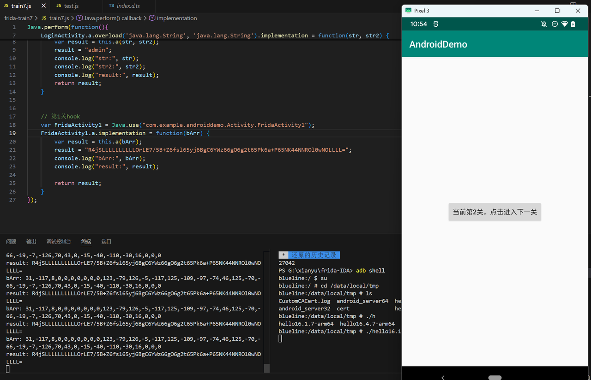
成功来到第2关

### 第2关：
- 进入FridaActivity2.class：
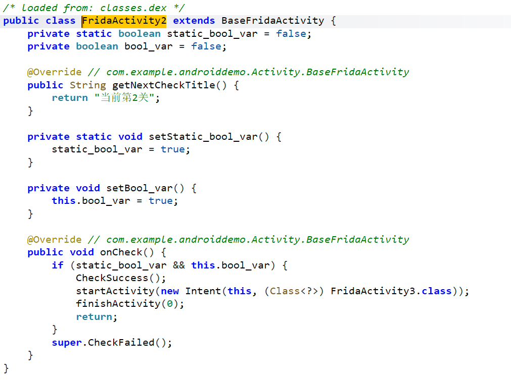
这里是通过if语句判断static_bool_var和bool_var变量的值是否是true，如果是，就进入下一关：FridaActivity3.class
而这两个变量初始值都是false，但是可以通过setStatic_bool_var()和setBool_var()两个方法将他们的值改为true
所以这里我的思路是编写hook脚本，主动调用这两个方法实现赋值操作

- 编写脚本：
```javascript
// train7.js
Java.perform(function(){

    // 登录口hook
    var LoginActivity = Java.use("com.example.androiddemo.Activity.LoginActivity")

    // 因为LoginActivity类中有两个重载a方法，所以需要通过overload确定具体是那个
    LoginActivity.a.overload('java.lang.String', 'java.lang.String').implementation = function(str, str2) {
        var result = this.a(str, str2);
        result = "admin";
        console.log("str:", str);
        console.log("str2:", str2);
        console.log("result:", result);
        return result;
    }

    
    // 第1关hook
    var FridaActivity1 = Java.use("com.example.androiddemo.Activity.FridaActivity1");
    FridaActivity1.a.implementation = function(bArr) {
        var result = this.a(bArr);
        result = "R4jSLLLLLLLLLLOrLE7/5B+Z6fsl65yj6BgC6YWz66gO6g2t65Pk6a+P65NK44NNROl0wNOLLLL=";
        console.log("bArr:", bArr);
        console.log("result:", result);
        
        return result;
    }
});

// 第2关hook
function two() {
    Java.perform(function() {
        var FridaActivity2 = Java.use("com.example.androiddemo.Activity.FridaActivity2");
        
        // 因为setStatic_bool_var()是静态的，可以直接通过类去调用，但是setBool_var()不是静态的，所以我们如果要想调用这个方法首先要找到该类的实例化对象，在frida语法中通过Java.choose()方法搜索当前进程中已加载的指定类的所有实例的API，然后通过回调函数对setBool_var()方法进行调用
        FridaActivity2.setStatic_bool_var();
        Java.choose("com.example.androiddemo.Activity.FridaActivity2", {
            // 每当搜索到一个目标类的实例时，就会调用一次onMatch，通过onMatch调用实例方法、访问实例变量
            onMatch: function(instance) {
                instance.setBool_var();
            }, 
            // 执行完毕onMatch中的方法之后会执行onComplete中的方法，可以什么也不写
            onComplete: function() {

            }
        })
    });
}
```
终端输入two()进行主动调用
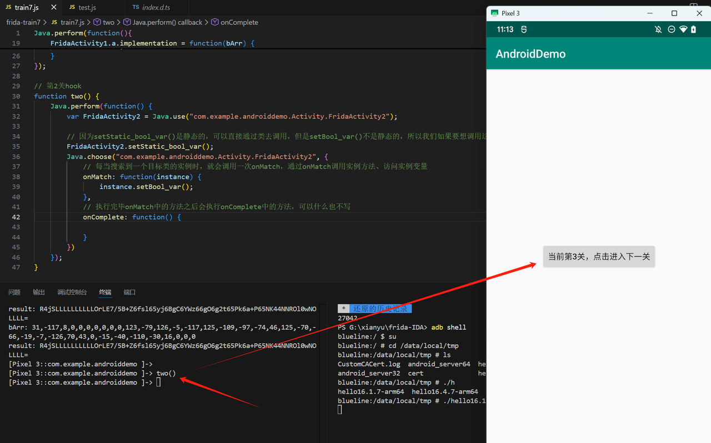
成功来到第3关

### 第3关：
- 进入FridaActivity3.class：
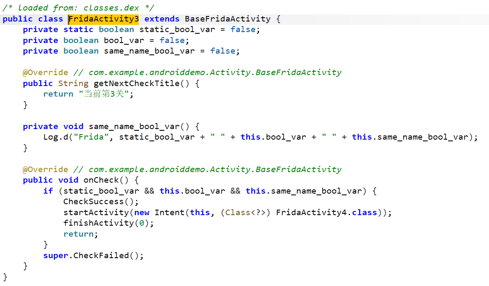
和上一关差不多，只不过这一关是通过hook直接修改变量的值

- 编写脚本：
```javascript
// train7.js
Java.perform(function(){

    // 登录口hook
    var LoginActivity = Java.use("com.example.androiddemo.Activity.LoginActivity")

    // 因为LoginActivity类中有两个重载a方法，所以需要通过overload确定具体是那个
    LoginActivity.a.overload('java.lang.String', 'java.lang.String').implementation = function(str, str2) {
        var result = this.a(str, str2);
        result = "admin";
        console.log("str:", str);
        console.log("str2:", str2);
        console.log("result:", result);
        return result;
    }

    
    // 第1关hook
    var FridaActivity1 = Java.use("com.example.androiddemo.Activity.FridaActivity1");
    FridaActivity1.a.implementation = function(bArr) {
        var result = this.a(bArr);
        result = "R4jSLLLLLLLLLLOrLE7/5B+Z6fsl65yj6BgC6YWz66gO6g2t65Pk6a+P65NK44NNROl0wNOLLLL=";
        console.log("bArr:", bArr);
        console.log("result:", result);
        
        return result;
    }
});

// 第2关hook
function two() {
    Java.perform(function() {
        var FridaActivity2 = Java.use("com.example.androiddemo.Activity.FridaActivity2");
        
        // 因为setStatic_bool_var()是静态的，可以直接通过类去调用，但是setBool_var()不是静态的，所以我们如果要想调用这个方法首先要找到该类的实例化对象，在frida语法中通过Java.choose()方法搜索当前进程中已加载的指定类的所有实例的API，然后通过回调函数对setBool_var()方法进行调用
        FridaActivity2.setStatic_bool_var();
        Java.choose("com.example.androiddemo.Activity.FridaActivity2", {
            // 每当搜索到一个目标类的实例时，就会调用一次onMatch，通过onMatch调用实例方法、访问实例变量
            onMatch: function(instance) {
                instance.setBool_var();
            }, 
            // 执行完毕onMatch中的方法之后会执行onComplete中的方法，可以什么也不写
            onComplete: function() {

            }
        })
    });
}

// 第3关hook
function three() {
    Java.perform(function() {
        var FridaActivity3 = Java.use("com.example.androiddemo.Activity.FridaActivity3");

        // frida中通过xxx.value的方式获取呼叫哦修改变量的值
        FridaActivity3.static_bool_var.value = true;
        Java.choose("com.example.androiddemo.Activity.FridaActivity3", {
            onMatch: function(instance) {
                instance.bool_var.value = true;
                instance._same_name_bool_var.value = true;
            },
            onComplete: function() {

            }
        })
    });
}
```
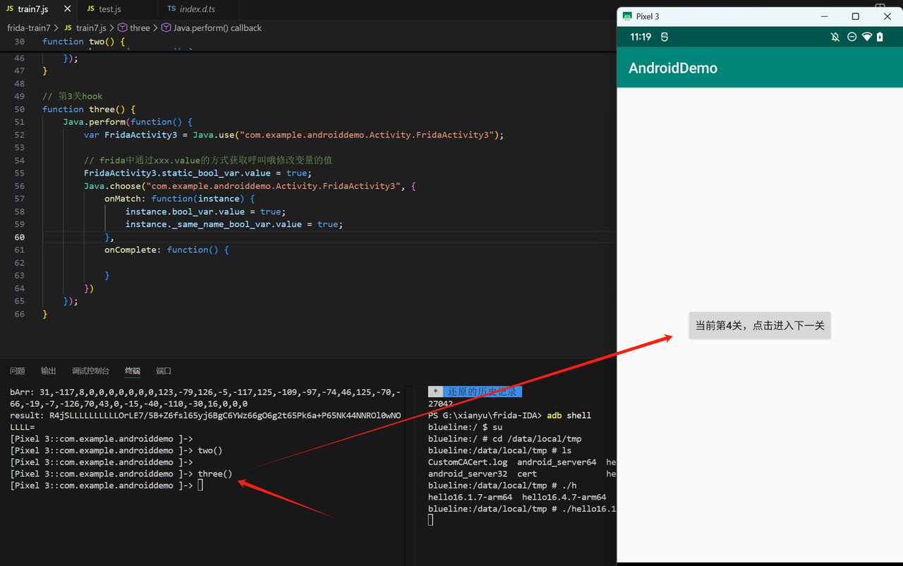
成功来到第4关

### 第4关：
- 进入FridaActivity4.class：
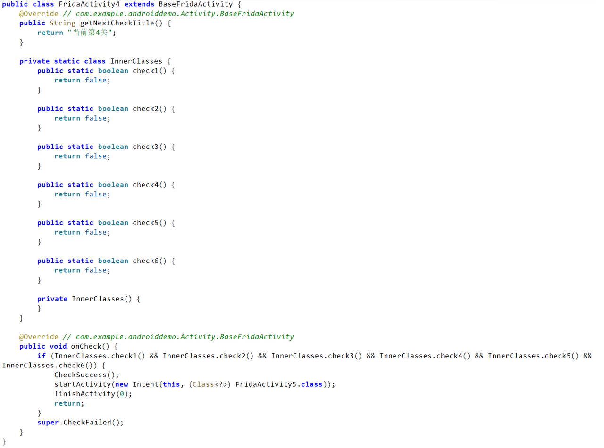
if语句判断check1~6这6个方法，如果都是true则进入下一关，而且6个方法初始返回值都是false
所以我的思路是分别hook这6个方法，改变他们的返回值为true即可

- 编写脚本：
```javascript
// train7.js
Java.perform(function(){

    // 登录口hook
    var LoginActivity = Java.use("com.example.androiddemo.Activity.LoginActivity")

    // 因为LoginActivity类中有两个重载a方法，所以需要通过overload确定具体是那个
    LoginActivity.a.overload('java.lang.String', 'java.lang.String').implementation = function(str, str2) {
        var result = this.a(str, str2);
        result = "admin";
        console.log("str:", str);
        console.log("str2:", str2);
        console.log("result:", result);
        return result;
    }

    
    // 第1关hook
    var FridaActivity1 = Java.use("com.example.androiddemo.Activity.FridaActivity1");
    FridaActivity1.a.implementation = function(bArr) {
        var result = this.a(bArr);
        result = "R4jSLLLLLLLLLLOrLE7/5B+Z6fsl65yj6BgC6YWz66gO6g2t65Pk6a+P65NK44NNROl0wNOLLLL=";
        console.log("bArr:", bArr);
        console.log("result:", result);
        
        return result;
    }

    // 第4关hook
    var FridaActivity4 = Java.use("com.example.androiddemo.Activity.FridaActivity4$InnerClasses");
    FridaActivity4.check1.implementation = function() {
        return true;
    }
    
    FridaActivity4.check2.implementation = function() {
        return true;
    }

    FridaActivity4.check3.implementation = function() {
        return true;
    }

    FridaActivity4.check4.implementation = function() {
        return true;
    }

    FridaActivity4.check5.implementation = function() {
        return true;
    }
    
    FridaActivity4.check6.implementation = function() {
        return true;
    }
});

// 第2关hook
function two() {
    Java.perform(function() {
        var FridaActivity2 = Java.use("com.example.androiddemo.Activity.FridaActivity2");
        
        // 因为setStatic_bool_var()是静态的，可以直接通过类去调用，但是setBool_var()不是静态的，所以我们如果要想调用这个方法首先要找到该类的实例化对象，在frida语法中通过Java.choose()方法搜索当前进程中已加载的指定类的所有实例的API，然后通过回调函数对setBool_var()方法进行调用
        FridaActivity2.setStatic_bool_var();
        Java.choose("com.example.androiddemo.Activity.FridaActivity2", {
            // 每当搜索到一个目标类的实例时，就会调用一次onMatch，通过onMatch调用实例方法、访问实例变量
            onMatch: function(instance) {
                instance.setBool_var();
            }, 
            // 执行完毕onMatch中的方法之后会执行onComplete中的方法，可以什么也不写
            onComplete: function() {

            }
        })
    });
}

// 第3关hook
function three() {
    Java.perform(function() {
        var FridaActivity3 = Java.use("com.example.androiddemo.Activity.FridaActivity3");

        // frida中通过xxx.value的方式获取呼叫哦修改变量的值
        FridaActivity3.static_bool_var.value = true;
        Java.choose("com.example.androiddemo.Activity.FridaActivity3", {
            onMatch: function(instance) {
                instance.bool_var.value = true;
                instance._same_name_bool_var.value = true;
            },
            onComplete: function() {

            }
        })
    });
}
```
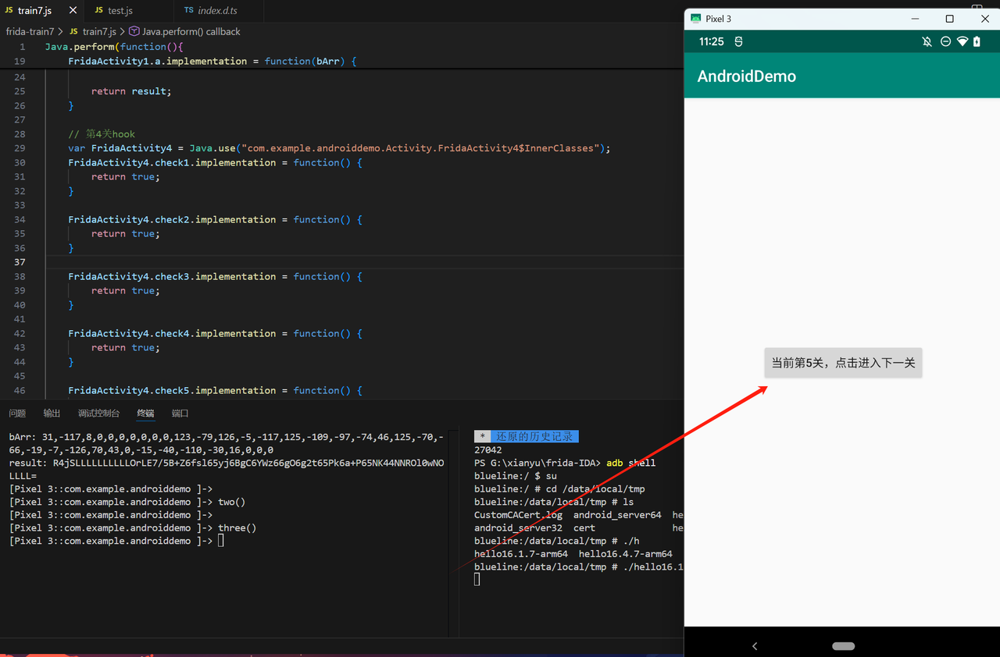
成功来到第5关

### 第5关：
- 进入FridaActivity5.class：
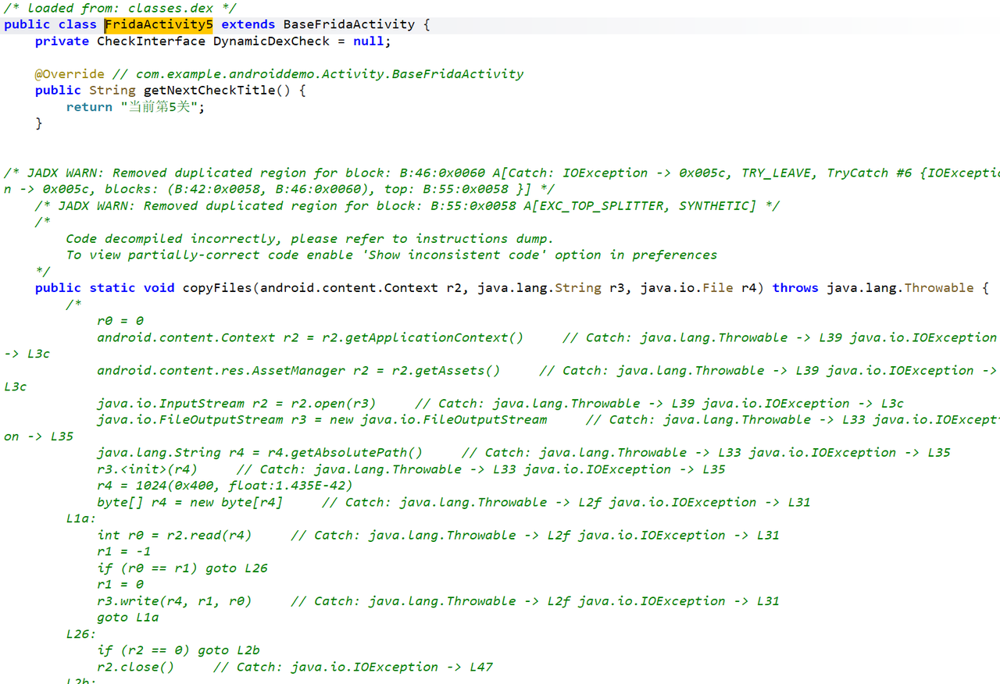
可以看到这里由于jadx反编译出现了错误，导致出现了不完整的Java代码，但是不影响解出这一关
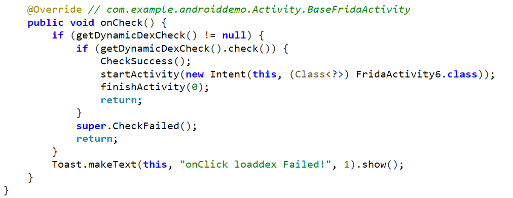
如果getDynamicDexCheck().check()的返回值为true，那么就进入下一关

- 跳转到getDynamicDexCheck()：
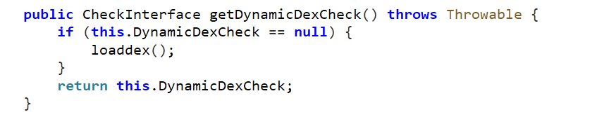
因为DynamicDexCheck初始值是null，所以一定会执行loaddex()方法，执行之后返回DynamicDexCheck的值

- 跳转到loaddex()：
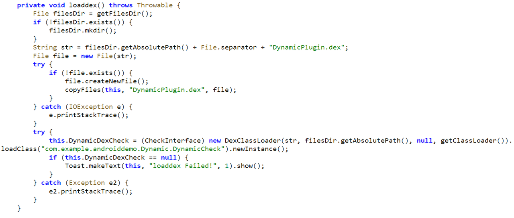
通过filesDir获取到应用的本地路径，把DynamicPlugin.dex复制到应用里面，再用DexClassLoader加载这个 DynamicPlugin.dex文件，然后拿到里面的DynamicCheck类实例
再结合getDynamicDexCheck()分析可知getDynamicDexCheck()最终返回的值就是DynamicCheck类实例，所以getDynamicDexCheck().check()调用的也就是DynamicCheck类实例的方法check()
所以这里我的思路是hook动态加载的DynamicCheck类的check()方法

- 编写脚本：
```javascript
// train7.js
Java.perform(function(){

    // 登录口hook
    var LoginActivity = Java.use("com.example.androiddemo.Activity.LoginActivity")

    // 因为LoginActivity类中有两个重载a方法，所以需要通过overload确定具体是那个
    LoginActivity.a.overload('java.lang.String', 'java.lang.String').implementation = function(str, str2) {
        var result = this.a(str, str2);
        result = "admin";
        console.log("str:", str);
        console.log("str2:", str2);
        console.log("result:", result);
        return result;
    }

    
    // 第1关hook
    var FridaActivity1 = Java.use("com.example.androiddemo.Activity.FridaActivity1");
    FridaActivity1.a.implementation = function(bArr) {
        var result = this.a(bArr);
        result = "R4jSLLLLLLLLLLOrLE7/5B+Z6fsl65yj6BgC6YWz66gO6g2t65Pk6a+P65NK44NNROl0wNOLLLL=";
        console.log("bArr:", bArr);
        console.log("result:", result);
        
        return result;
    }

    // 第4关hook
    var FridaActivity4 = Java.use("com.example.androiddemo.Activity.FridaActivity4$InnerClasses");
    FridaActivity4.check1.implementation = function() {
        return true;
    }
    
    FridaActivity4.check2.implementation = function() {
        return true;
    }

    FridaActivity4.check3.implementation = function() {
        return true;
    }

    FridaActivity4.check4.implementation = function() {
        return true;
    }

    FridaActivity4.check5.implementation = function() {
        return true;
    }
    
    FridaActivity4.check6.implementation = function() {
        return true;
    }
});

// 第2关hook
function two() {
    Java.perform(function() {
        var FridaActivity2 = Java.use("com.example.androiddemo.Activity.FridaActivity2");
        
        // 因为setStatic_bool_var()是静态的，可以直接通过类去调用，但是setBool_var()不是静态的，所以我们如果要想调用这个方法首先要找到该类的实例化对象，在frida语法中通过Java.choose()方法搜索当前进程中已加载的指定类的所有实例的API，然后通过回调函数对setBool_var()方法进行调用
        FridaActivity2.setStatic_bool_var();
        Java.choose("com.example.androiddemo.Activity.FridaActivity2", {
            // 每当搜索到一个目标类的实例时，就会调用一次onMatch，通过onMatch调用实例方法、访问实例变量
            onMatch: function(instance) {
                instance.setBool_var();
            }, 
            // 执行完毕onMatch中的方法之后会执行onComplete中的方法，可以什么也不写
            onComplete: function() {

            }
        })
    });
}

// 第3关hook
function three() {
    Java.perform(function() {
        var FridaActivity3 = Java.use("com.example.androiddemo.Activity.FridaActivity3");

        // frida中通过xxx.value的方式获取呼叫哦修改变量的值
        FridaActivity3.static_bool_var.value = true;
        Java.choose("com.example.androiddemo.Activity.FridaActivity3", {
            onMatch: function(instance) {
                instance.bool_var.value = true;
                instance._same_name_bool_var.value = true;
            },
            onComplete: function() {

            }
        })
    });
}

// 第5关hook
function five() {
    Java.perform(function () {
        var FridaActivity5 = Java.use("com.example.androiddemo.Activity.FridaActivity5");
        Java.choose("com.example.androiddemo.Activity.FridaActivity5", {
            onMatch: function (instance) {
                // 打印动态加载的DynamicCheck的类名
                console.log(instance.getDynamicDexCheck().$className);
            }, onComplete: function () {
            }
        });

        // 遍历所有类加载器
        Java.enumerateClassLoaders({
            onMatch: function (loader) {
                try {
                    // 打印出加载DynamicPlugin.dex的加载器
                    console.log(loader);
                    // 切换当前类加载器，为了可以使Java.use能找到动态类DynamicCheck
                    Java.classFactory.loader = loader;
                } catch (error) {
                }
            }, onComplete: function () {
            }
        });

        // 获取动态加载的DynamicCheck类hook check()
        var DynamicCheck = Java.use("com.example.androiddemo.Dynamic.DynamicCheck");
        console.log(DynamicCheck);
        DynamicCheck.check.implementation = function () {
            return true;
        }
    });
}
```
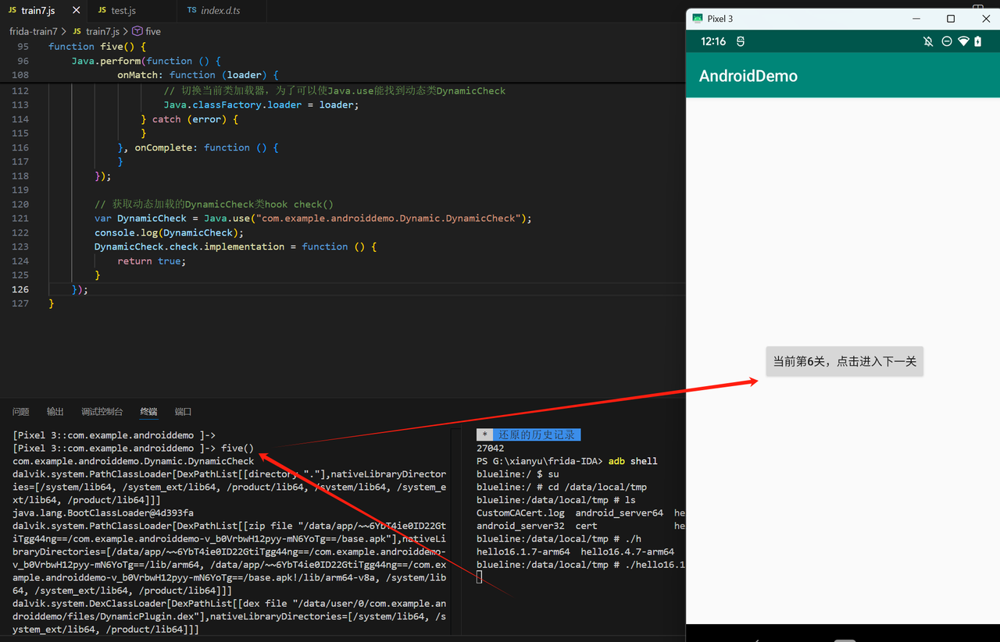
成功来到第6关

### 第6关：
- 进入FridaActivity6.class：
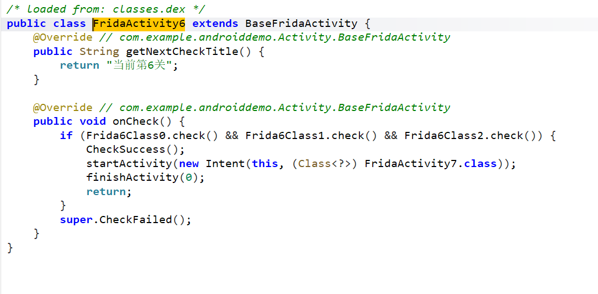
```javascript
// train7.js
package com.example.androiddemo.Activity.Frida6;
/* loaded from: classes.dex */
public class Frida6Class0 {
    public static boolean check() {
        return false;
    }
}


package com.example.androiddemo.Activity.Frida6;
/* loaded from: classes.dex */
public class Frida6Class1 {
    public static boolean check() {
        return false;
    }
}


package com.example.androiddemo.Activity.Frida6;
/* loaded from: classes.dex */
public class Frida6Class2 {
    public static boolean check() {
        return false;
    }
}
```
这里就很简单，分别hook这三个方法即可

- 编写脚本：
```javascript
// train7.js
Java.perform(function(){

    // 登录口hook
    var LoginActivity = Java.use("com.example.androiddemo.Activity.LoginActivity")

    // 因为LoginActivity类中有两个重载a方法，所以需要通过overload确定具体是那个
    LoginActivity.a.overload('java.lang.String', 'java.lang.String').implementation = function(str, str2) {
        var result = this.a(str, str2);
        result = "admin";
        console.log("str:", str);
        console.log("str2:", str2);
        console.log("result:", result);
        return result;
    }

    
    // 第1关hook
    var FridaActivity1 = Java.use("com.example.androiddemo.Activity.FridaActivity1");
    FridaActivity1.a.implementation = function(bArr) {
        var result = this.a(bArr);
        result = "R4jSLLLLLLLLLLOrLE7/5B+Z6fsl65yj6BgC6YWz66gO6g2t65Pk6a+P65NK44NNROl0wNOLLLL=";
        console.log("bArr:", bArr);
        console.log("result:", result);
        
        return result;
    }

    // 第4关hook
    var FridaActivity4 = Java.use("com.example.androiddemo.Activity.FridaActivity4$InnerClasses");
    FridaActivity4.check1.implementation = function() {
        return true;
    }
    
    FridaActivity4.check2.implementation = function() {
        return true;
    }

    FridaActivity4.check3.implementation = function() {
        return true;
    }

    FridaActivity4.check4.implementation = function() {
        return true;
    }

    FridaActivity4.check5.implementation = function() {
        return true;
    }
    
    FridaActivity4.check6.implementation = function() {
        return true;
    }
});

// 第2关hook
function two() {
    Java.perform(function() {
        var FridaActivity2 = Java.use("com.example.androiddemo.Activity.FridaActivity2");
        
        // 因为setStatic_bool_var()是静态的，可以直接通过类去调用，但是setBool_var()不是静态的，所以我们如果要想调用这个方法首先要找到该类的实例化对象，在frida语法中通过Java.choose()方法搜索当前进程中已加载的指定类的所有实例的API，然后通过回调函数对setBool_var()方法进行调用
        FridaActivity2.setStatic_bool_var();
        Java.choose("com.example.androiddemo.Activity.FridaActivity2", {
            // 每当搜索到一个目标类的实例时，就会调用一次onMatch，通过onMatch调用实例方法、访问实例变量
            onMatch: function(instance) {
                instance.setBool_var();
            }, 
            // 执行完毕onMatch中的方法之后会执行onComplete中的方法，可以什么也不写
            onComplete: function() {

            }
        })
    });
}

// 第3关hook
function three() {
    Java.perform(function() {
        var FridaActivity3 = Java.use("com.example.androiddemo.Activity.FridaActivity3");

        // frida中通过xxx.value的方式获取呼叫哦修改变量的值
        FridaActivity3.static_bool_var.value = true;
        Java.choose("com.example.androiddemo.Activity.FridaActivity3", {
            onMatch: function(instance) {
                instance.bool_var.value = true;
                instance._same_name_bool_var.value = true;
            },
            onComplete: function() {

            }
        })
    });
}

// 第5关hook
function five() {
    Java.perform(function () {
        var FridaActivity5 = Java.use("com.example.androiddemo.Activity.FridaActivity5");
        Java.choose("com.example.androiddemo.Activity.FridaActivity5", {
            onMatch: function (instance) {
                // 打印动态加载的DynamicCheck的类名
                console.log(instance.getDynamicDexCheck().$className);
            }, onComplete: function () {
            }
        });

        // 遍历所有类加载器
        Java.enumerateClassLoaders({
            onMatch: function (loader) {
                try {
                    // 打印出加载DynamicPlugin.dex的加载器
                    console.log(loader);
                    // 切换当前类加载器，为了可以使Java.use能找到动态类DynamicCheck
                    Java.classFactory.loader = loader;
                } catch (error) {
                }
            }, onComplete: function () {
            }
        });

        // 获取动态加载的DynamicCheck类hook check()
        var DynamicCheck = Java.use("com.example.androiddemo.Dynamic.DynamicCheck");
        console.log(DynamicCheck);
        DynamicCheck.check.implementation = function () {
            return true;
        }
    });
}

function six() {
    Java.perform(function() {
        var Frida6Class0 = Java.use("com.example.androiddemo.Activity.Frida6.Frida6Class0");
        var Frida6Class1 = Java.use("com.example.androiddemo.Activity.Frida6.Frida6Class1");
        var Frida6Class2 = Java.use("com.example.androiddemo.Activity.Frida6.Frida6Class2");

        Frida6Class0.check.implementation = function() {
            return true;
        }

        Frida6Class1.check.implementation = function() {
            return true;
        }

        Frida6Class2.check.implementation = function() {
            return true;
        }

    });
}
```
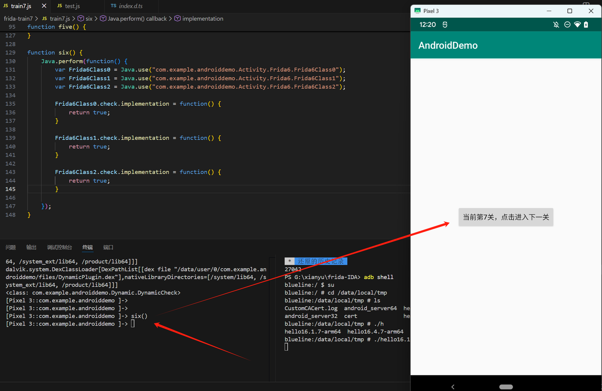
至此7关全部通过！