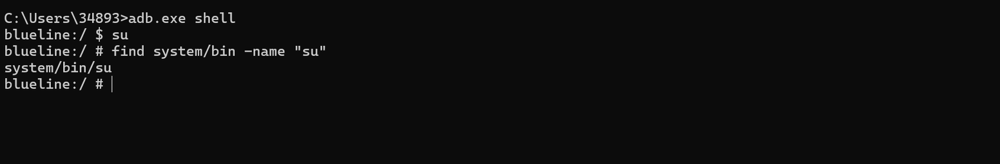
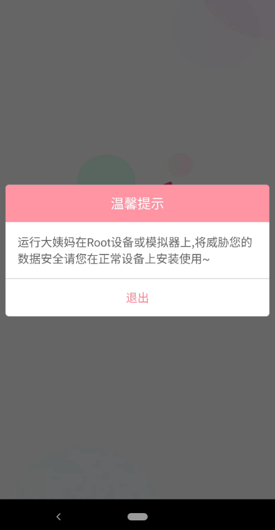
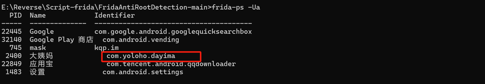
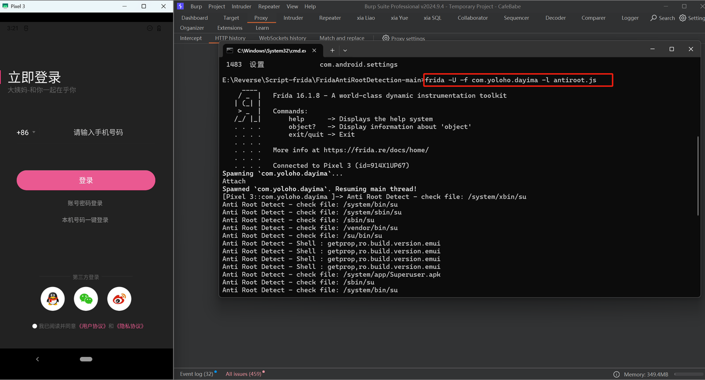
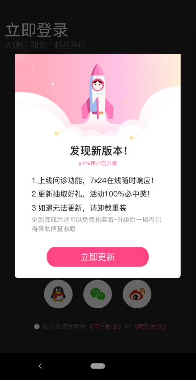
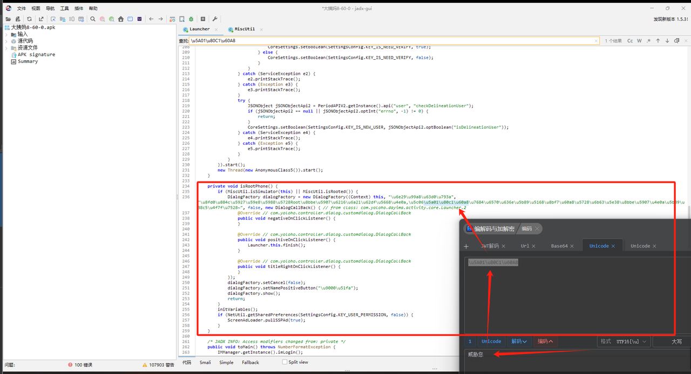
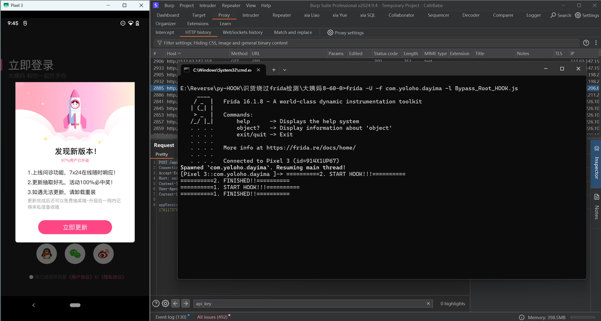

# 1、Root检测原理及判断
- 原理：当APP运行之后，APP的检测root的代码就会运行，然后去特定的路径下检查是否存在su命令，如果存在su命令，则说明此APP已经被root了，反正则无

- 为什么：为什么可以通过这种方式判断设备是否已经被root？因为被root的设备有很多的特征，特征之一就是会在特定的路径下面生成su命令，使用不同的root软件root设备之后，su命令存在位置不同，以下是一些常见的：
```
system/bin/su   # 通过面具root设备之后su命令的存在位置
data/local/bin/su
sbin/su
...
```

- 判断设备是否已被root：通过adb连接设备，尝试在特定的路径下找到su命令，找到则被root，反正则无，比如我的设备：

可以看到我的设备在system/bin路径下存在su命令，说明已被root

# 2、绕过root检测
## 方案一：
- 原理：
  - 通过HOOK使APP在检查对应文件的时候，检测不到su命令
- 案例：


- 运行之后直接提示此设备已被root，不能正常使用此APP
查看此APP包名：


- 运行HOOK脚本：

> [脚本地址](https://github.com/AshenOneYe/FridaAntiRootDetection)
```javascript
// antiroot.js    
const commonPaths = [
    "/data/local/bin/su",
    "/data/local/su",
    "/data/local/xbin/su",
    "/dev/com.koushikdutta.superuser.daemon/",
    "/sbin/su",
    "/system/app/Superuser.apk",
    "/system/bin/failsafe/su",
    "/system/bin/su",
    "/su/bin/su",
    "/system/etc/init.d/99SuperSUDaemon",
    "/system/sd/xbin/su",
    "/system/xbin/busybox",
    "/system/xbin/daemonsu",
    "/system/xbin/su",
    "/system/sbin/su",
    "/vendor/bin/su",
    "/cache/su",
    "/data/su",
    "/dev/su",
    "/system/bin/.ext/su",
    "/system/usr/we-need-root/su",
    "/system/app/Kinguser.apk",
    "/data/adb/magisk",
    "/sbin/.magisk",
    "/cache/.disable_magisk",
    "/dev/.magisk.unblock",
    "/cache/magisk.log",
    "/data/adb/magisk.img",
    "/data/adb/magisk.db",
    "/data/adb/magisk_simple",
    "/init.magisk.rc",
    "/system/xbin/ku.sud",
    "/data/adb/ksu",
    "/data/adb/ksud"
];

const ROOTmanagementApp = [
    "com.noshufou.android.su",
    "com.noshufou.android.su.elite",
    "eu.chainfire.supersu",
    "com.koushikdutta.superuser",
    "com.thirdparty.superuser",
    "com.yellowes.su",
    "com.koushikdutta.rommanager",
    "com.koushikdutta.rommanager.license",
    "com.dimonvideo.luckypatcher",
    "com.chelpus.lackypatch",
    "com.ramdroid.appquarantine",
    "com.ramdroid.appquarantinepro",
    "com.topjohnwu.magisk",
    "me.weishu.kernelsu"
];


function stackTraceHere(isLog){
    var Exception = Java.use('java.lang.Exception');
    var Log = Java.use('android.util.Log');
    var stackinfo = Log.getStackTraceString(Exception.$new())
    if(isLog){
        console.log(stackinfo)
    }else{
        return stackinfo
    }
}

function stackTraceNativeHere(isLog){
    var backtrace = Thread.backtrace(this.context, Backtracer.ACCURATE)
    .map(DebugSymbol.fromAddress)
    .join("\n\t");
    console.log(backtrace)
}


function bypassJavaFileCheck(){
    var UnixFileSystem = Java.use("java.io.UnixFileSystem")
    UnixFileSystem.checkAccess.implementation = function(file,access){

        var stack = stackTraceHere(false)

        const filename = file.getAbsolutePath();

        if (filename.indexOf("magisk") >= 0) {
            console.log("Anti Root Detect - check file: " + filename)
            return false;
        }

        if (commonPaths.indexOf(filename) >= 0) {
            console.log("Anti Root Detect - check file: " + filename)
            return false;
        }

        return this.checkAccess(file,access)
    }
}

function bypassNativeFileCheck(){
    var fopen = Module.findExportByName("libc.so","fopen")
    Interceptor.attach(fopen,{
        onEnter:function(args){
            this.inputPath = args[0].readUtf8String()
        },
        onLeave:function(retval){
            if(retval.toInt32() != 0){
                if (commonPaths.indexOf(this.inputPath) >= 0) {
                    console.log("Anti Root Detect - fopen : " + this.inputPath)
                    retval.replace(ptr(0x0))
                }
            }
        }
    })

    var access = Module.findExportByName("libc.so","access")
    Interceptor.attach(access,{
        onEnter:function(args){
            this.inputPath = args[0].readUtf8String()
        },
        onLeave:function(retval){
            if(retval.toInt32()==0){
                if(commonPaths.indexOf(this.inputPath) >= 0){
                    console.log("Anti Root Detect - access : " + this.inputPath)
                    retval.replace(ptr(-1))
                }
            }
        }
    })
}

function setProp(){
    var Build = Java.use("android.os.Build")
    var TAGS = Build.class.getDeclaredField("TAGS")
    TAGS.setAccessible(true)
    TAGS.set(null,"release-keys")

    var FINGERPRINT = Build.class.getDeclaredField("FINGERPRINT")
    FINGERPRINT.setAccessible(true)
    FINGERPRINT.set(null,"google/crosshatch/crosshatch:10/QQ3A.200805.001/6578210:user/release-keys")

    // Build.deriveFingerprint.inplementation = function(){
    //     var ret = this.deriveFingerprint() //该函数无法通过反射调用
    //     console.log(ret)
    //     return ret
    // }

    var system_property_get = Module.findExportByName("libc.so", "__system_property_get")
    Interceptor.attach(system_property_get,{
        onEnter(args){
            this.key = args[0].readCString()
            this.ret = args[1]
        },
        onLeave(ret){
            if(this.key == "ro.build.fingerprint"){
                var tmp = "google/crosshatch/crosshatch:10/QQ3A.200805.001/6578210:user/release-keys"
                var p = Memory.allocUtf8String(tmp)
                Memory.copy(this.ret,p,tmp.length+1)
            }
        }
    })

}

//android.app.PackageManager
function bypassRootAppCheck(){
    var ApplicationPackageManager = Java.use("android.app.ApplicationPackageManager")
    ApplicationPackageManager.getPackageInfo.overload('java.lang.String', 'int').implementation = function(str,i){
        // console.log(str)
        if (ROOTmanagementApp.indexOf(str) >= 0) {
            console.log("Anti Root Detect - check package : " + str)
            str = "ashen.one.ye.not.found"
        }
        return this.getPackageInfo(str,i)
    }

    //shell pm check
}

function bypassShellCheck(){
    var String = Java.use('java.lang.String')

    var ProcessImpl = Java.use("java.lang.ProcessImpl")
    ProcessImpl.start.implementation = function(cmdarray,env,dir,redirects,redirectErrorStream){

        if(cmdarray[0] == "mount"){
            console.log("Anti Root Detect - Shell : " + cmdarray.toString())
            arguments[0] = Java.array('java.lang.String',[String.$new("")])
            return ProcessImpl.start.apply(this,arguments)
        }

        if(cmdarray[0] == "getprop"){
            console.log("Anti Root Detect - Shell : " + cmdarray.toString())
            const prop = [
                "ro.secure",
                "ro.debuggable"
            ];
            if(prop.indexOf(cmdarray[1]) >= 0){
                arguments[0] = Java.array('java.lang.String',[String.$new("")])
                return ProcessImpl.start.apply(this,arguments)
            }
        }

        if(cmdarray[0].indexOf("which") >= 0){
            const prop = [
                "su"
            ];
            if(prop.indexOf(cmdarray[1]) >= 0){
                console.log("Anti Root Detect - Shell : " + cmdarray.toString())
                arguments[0] = Java.array('java.lang.String',[String.$new("")])
                return ProcessImpl.start.apply(this,arguments)
            }
        }

        return ProcessImpl.start.apply(this,arguments)
    }
}

console.log("Attach")
bypassNativeFileCheck()
bypassJavaFileCheck()
setProp()
bypassRootAppCheck()
bypassShellCheck()
```

root检测已被HOOK，导致APP无法检测到su命令，成功绕过root检测

## 方案二：
- 原理：
  - magisk+Shamiko模块做Root隐藏，使用面具的Zygisk来隐藏指定APP的Root隐藏
- 打开magisk并下载Shamiko模块：


- 首页设置-Zygisk：


- 在排除列表中添加目标APP之后再次打开APP：

成功绕过root检测

## 方案三：
- 原理：
  - 反编译APP，编写HOOK脚本绕过root检测
- jadx反编译APP代码，定位到对应代码位置：

此处通过isSimulator、isRooted来判断是否为虚拟机环境或者该设备是否已被root，如果二者满足其一则弹窗阻止用户使用此APP，经过对isSimulator、isRooted的分析编写HOOK绕过root检测脚本

- HOOK脚本：
```javascript
// Bypass_Root_HOOK
Java.perform(function () {
   var MiscUtil = Java.use("com.yoloho.libcore.util.MiscUtil");

   MiscUtil.isRooted.implementation = function () {
       console.log("==========1. START HOOK!!!==========");
       console.log("==========1. FINISHED!!==========");
       return false;
   }

   MiscUtil.isSimulator.implementation = function () {
       console.log("==========2. START HOOK!!!==========");
       console.log("==========2. FINISHED!!==========");
       return false;
   }
});
```

HOOK成功，绕过root检测