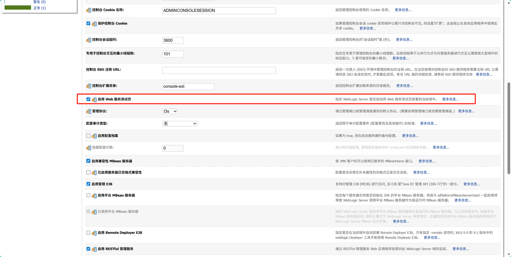
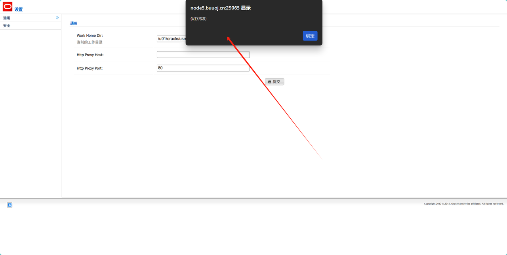
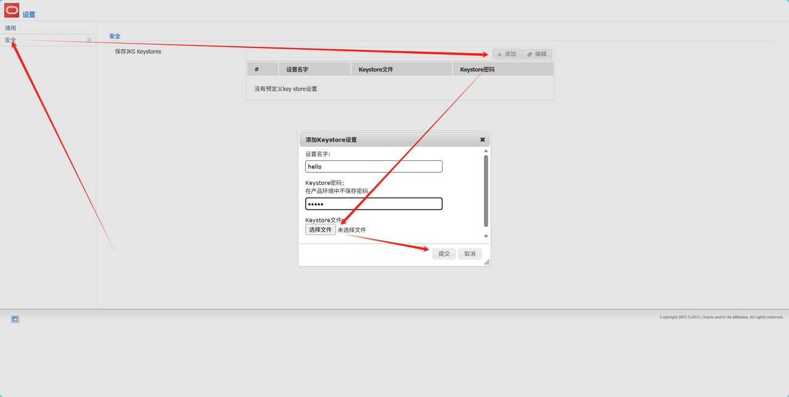
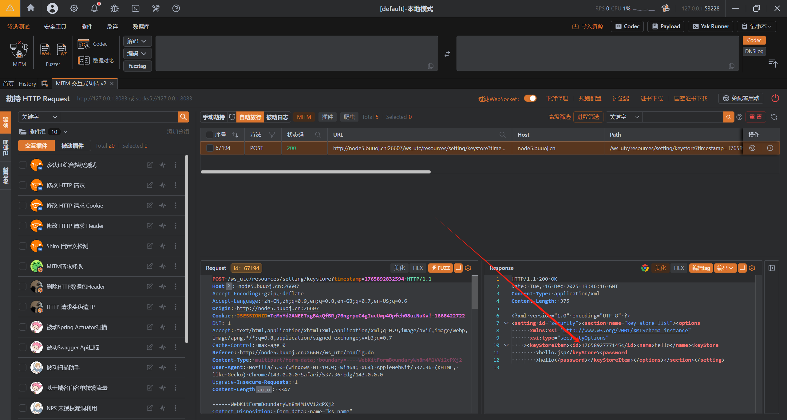
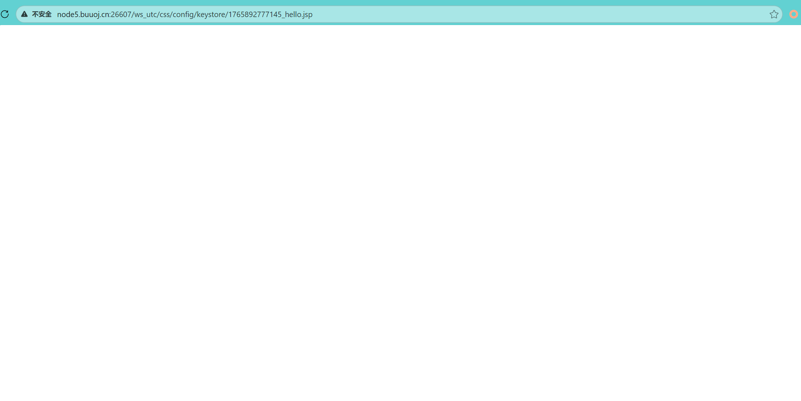
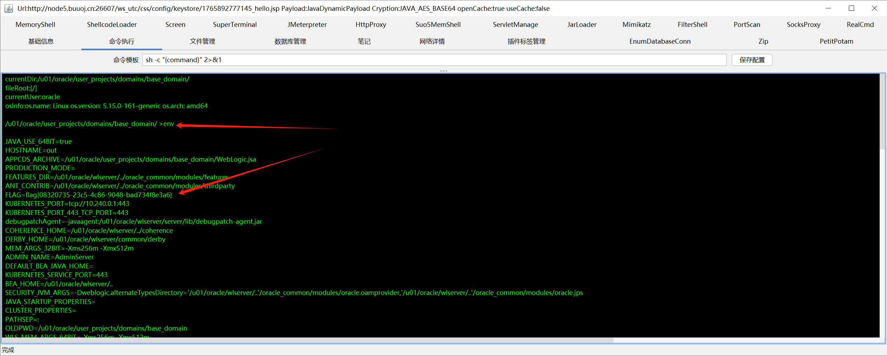

# 1、基础简述
- WebLogic：WebLogic 是 Oracle 公司推出的一款企业级 Java 应用服务器，主要用于部署、运行和管理 Java EE（Java Platform, Enterprise Edition）架构的企业级应用，比如电商后台系统、金融交易系统、政务办公系统等。它具备高可用性、可扩展性、安全性等企业级特性，能支持大规模用户访问和复杂业务逻辑处理，因此广泛应用于各类对稳定性和性能要求较高的企业级 IT 环境中。

# 2、漏洞原理
- 介绍：WebLogic 内置组件ws_utc（Web Services Test Client，用于调试 Web Service 的测试工具）存在未授权访问 + 任意文件上传的组合缺陷
  - 未授权访问：ws_utc组件的两个关键功能页面（/ws_utc/begin.do、/ws_utc/config.do）存在设计缺陷，默认无需身份验证即可访问，比如攻击者未授权访问上传的木马文件
  - 任意文件上传：上述两个未授权页面均包含文件上传功能（原本用于上传 Web Service 调试所需的配置类文件），但该上传机制完全缺乏必要的安全防护，存在如下问题：
    - 无文件类型校验：未限制上传文件的格式，原本仅允许上传配置文件（如 XML），因存在漏洞，所以允许上传JSP等可执行脚本文件。
    - 支持自定义存储路径：在/ws_utc/config.do页面中，攻击者可手动修改文件上传后的 “工作目录”，将其指定为WebLogic服务器中可通过 URL 直接访问的路径，比如：/u01/oracle/user_projects/domains/base_domain/servers/AdminServer/tmp/_WL_internal/com.oracle.webservices.wls.ws-testclient-app-wls/4mcj4y/war/css（ws_utc应用的静态文件css目录）。

# 3、漏洞环境准备
- 登录进后台找到base_domain->高级->启用web服务测试页并启用该功能并保存：

保存之后退出登录即可

# 4、漏洞复现
- 打开URL：http://node5.buuoj.cn:29065/ws_utc/config.do

- 修改Work Home Dir：/u01/oracle/user_projects/domains/base_domain/servers/AdminServer/tmp/_WL_internal/com.oracle.webservices.wls.ws-testclient-app-wls/4mcj4y/war/css，因为访问这个CSS目录是无需权限的

- 上传木马并抓对应的数据包：

- 将时间戳保存下来并访问URL：

- 哥斯拉连接：
