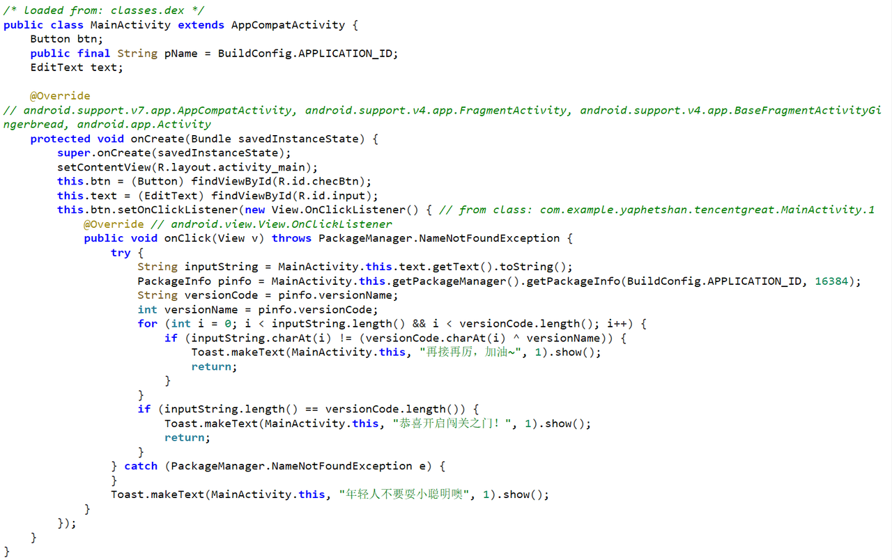
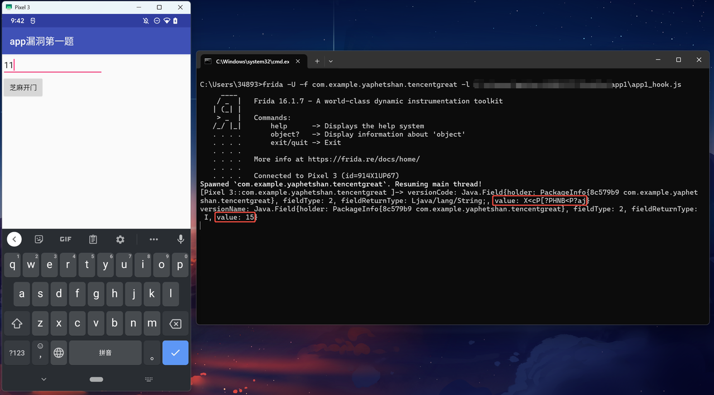

- Jadx分析源码：

很简单，就是将versionName和versionCode进行异或，然后只要用户输入的值和异或之后的相同就得到flag，versionName和versionCode在AndroidManifest.xml中就可以找到，但是我主要是想通过这道题演示一下frida如何hook内部类

- 写出frida脚本：
```javascript
// app1_hook.js
Java.perform(function () {
    var AnonymousClass1 = Java.use("com.example.yaphetshan.tencentgreat.MainActivity$1");
    // $1 表示是MainActivity的第一个匿名内部类，对应new View.OnClickListener() {...}
    AnonymousClass1["onClick"].implementation = function (v) {
        
        var mainActivity = this.this$0.value;
        // this$0 Java内部类中，编译器会自动添加一个this$0字段指向外部类实例，所以这里的this.this$0.value获取到的是匿名类的外部类MainActivity

        // 获取包信息
        var packageManager = mainActivity.getPackageManager();
        var packageInfo = packageManager.getPackageInfo("com.example.yaphetshan.tencentgreat", 16384);
        var versionCode = packageInfo.versionName;
        var versionName = packageInfo.versionCode;
        console.log("versionCode: " + versionCode);
        console.log("versionName: " + versionName);

        this["onClick"](v);
    };
});
```

- 注入脚本：

可以看到成功获取到了versionName和versionCode的值

- 异或脚本：
```python
str = "X<cP[?PHNB<P?aj"
for i in str:
    sum = ord(i)^15
    print (chr(sum))

# 运行结果：W3l_T0_GAM3_0ne
```