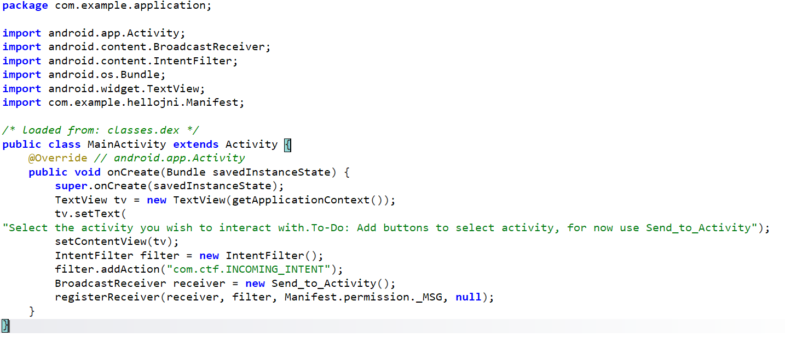
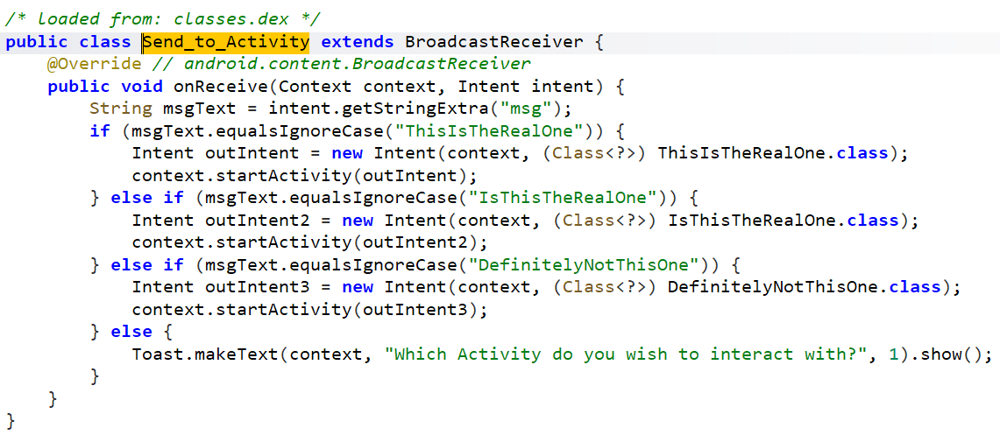
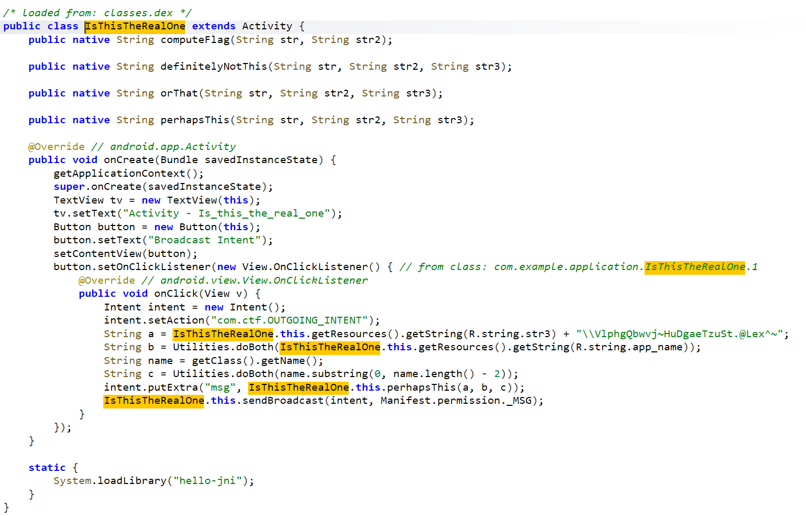
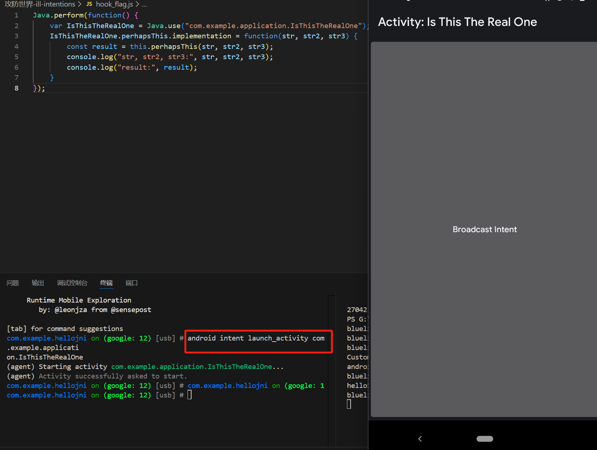
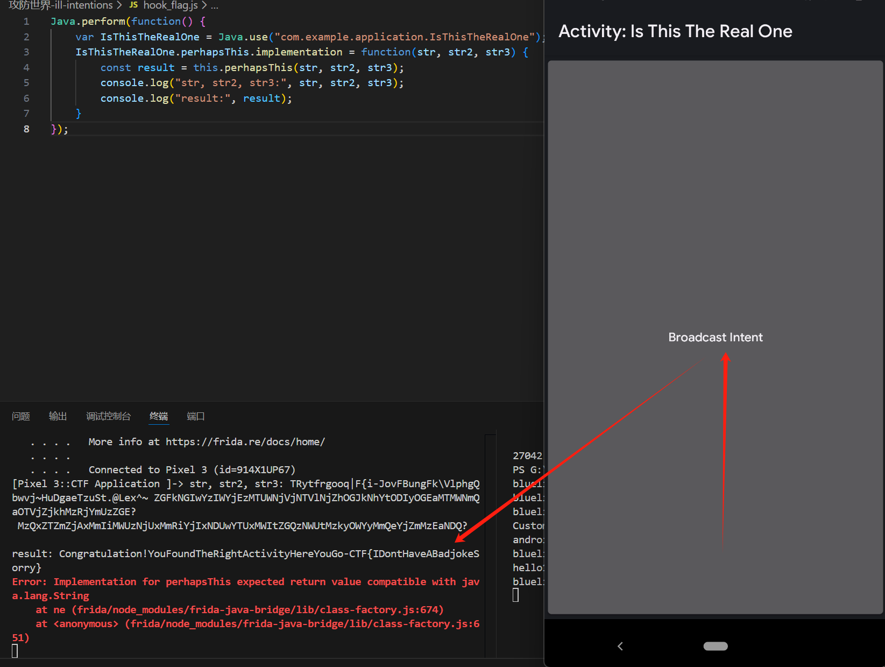

- Jadx分析源码：

注册了一个广播接收器，通过Send_to_Activity接收 action 为"com.ctf.INCOMING_INTENT"的广播

- 进入Send_to_Activity()：

根据接收到的Intent中的数据，然后跳转到对应的Activity
任意进入一个进行查看，比如：IsThisTheRealOne.class

- 跳转到IsThisTheRealOne.class：

页面确实定义了名为 “Broadcast Intent” 的按钮，点击按钮后，会先通过 a、b、c 三个变量作为参数，调用 perhapsThis方法生成一个msg信息，最终通过com.ctf.OUTGOING_INTENT 的广播发送出去

- Hook perhapsThis()方法，查看方法的传参以及返回值内容：
```javascript
// hook_flag.js
Java.perform(function() {
    var IsThisTheRealOne = Java.use("com.example.application.IsThisTheRealOne");
    IsThisTheRealOne.perhapsThis.implementation = function(str, str2, str3) {
        const result = this.perhapsThis(str, str2, str3);
        console.log("str, str2, str3:", str, str2, str3);
        console.log("result:", result);
    }
});
```
因为打开app之后发现没有任何按钮，所以就无法执行上述脚本

- 所以先通过objection打开IsThisTheRealOne.class页面，再执行frida hook脚本：


- 退出objection，attach模式注入frida hook脚本然后点击页面按钮：

成功拿到flag！