``注意：Objection自带命令提示功能，上手无需死记硬背，大家可按需探索即可覆盖更多场景，本文仅聚焦部分高频使用命令``

# 1、介绍
- Objection是基于frida的一款很方便的动态分析工具，可以让用户无需编写frida hook脚本的情况下只通过简单的命令实现对目标app的调试

# 2、安装
```
pip install objection # 默认安装最新版本
pip install objection==x.x.x # 指定版本安装
```
``注意：安装objection时版本要与frida对应``

# 3、基本使用
## 1、注入objection：
```
objection -g xxx.xxx explore
```
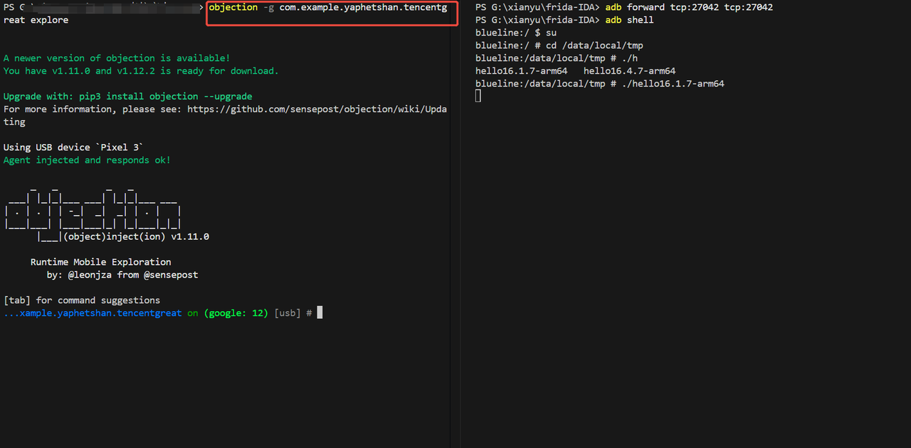

## 2、基本操作：
- help查看命令用法：输入help之后，在后面输入需要了解的命令即可查看该命令的用法
```
help xxx
```
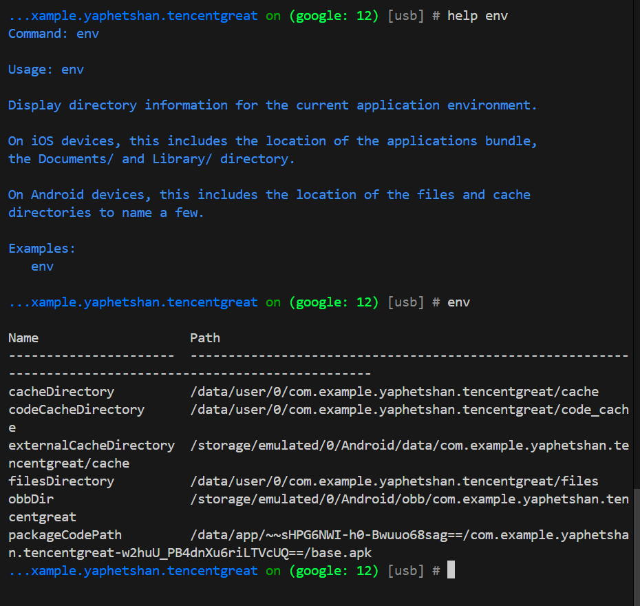

- jobs管理后台运行任务：
```
jobs list # 查看当前后台运行的任务
jobs kill <job-uuid> # 杀掉指定任务
```
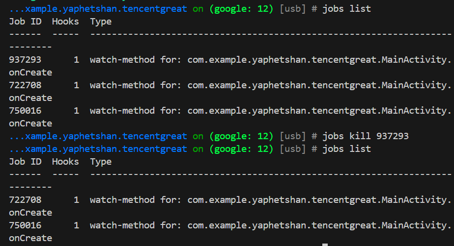

## 3、memory指令：
```
memory list modules                                 # 列出目标app进程中已加载的模块
memory list exports <modules name>                  # 列出指定模块中的导出函数
memory search "xxx" --string --offsets-only         # 搜索目标app内存中字符串
```
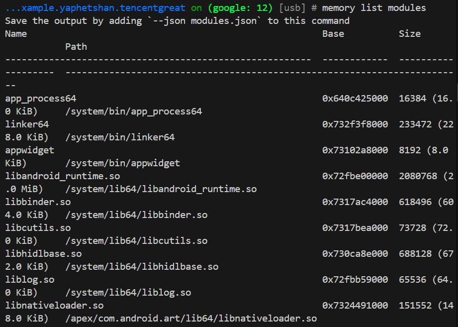
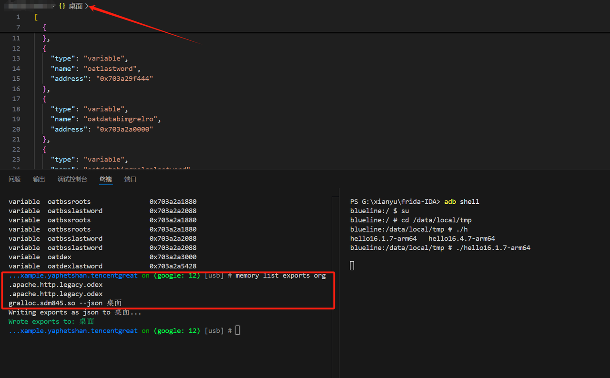
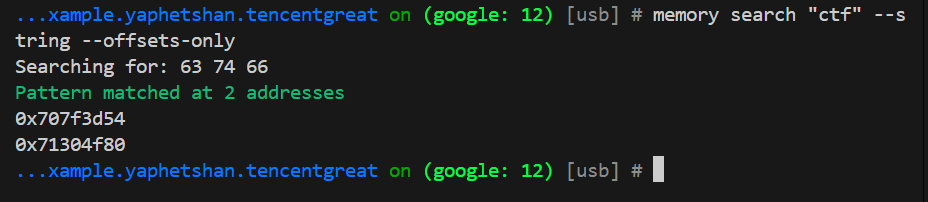

## 4、android指令：
```
android hooking list activities                      # 枚举activity
android hooking list classes                         # 列出内存中所有的类
android hooking list class_methods 包名.类名          # 列出类的所有方法
android hooking search classes 包名的关键词           # 搜索内存中所有已加载的类中包含指定关键词的类
android hooking watch class_method 包名.类名.方法     # hook 类的方法，默认会Hook方法的所有重载
```
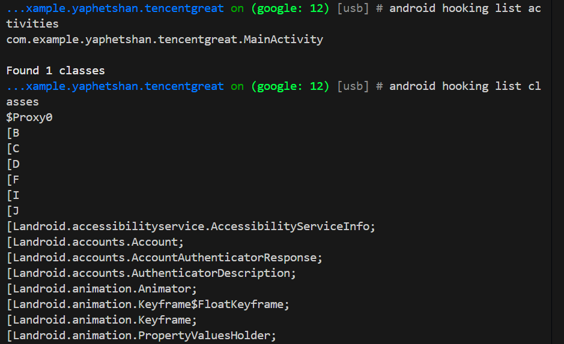
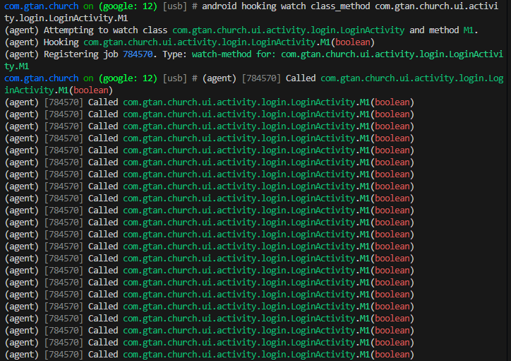

# 4、插件推荐
## wallbreaker：
- 介绍：wallbreaker是objection的一款插件，用于对类/对象进行深度的分析
- 启动：
```
objection -g xxx.xxx explore -P xxx/xxx/wallbreaker/plugins   # windows
```
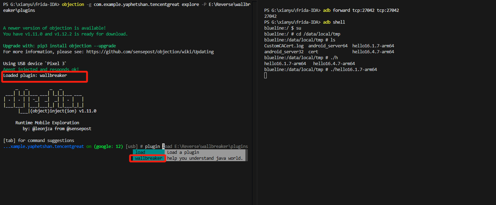

- 基本使用：
```
plugin wallbreaker classsearch xxx               # 在当前加载的类中搜索包含指定关键字的类名
plugin wallbreaker classdump xxx.xxx --fullname  # 导出指定完整类名的详细信息
plugin wallbreaker objectsearch xxx.xxx          # 搜索当前内存中存在的指定类的所有实例对象，返回每个对象的内存地址
plugin wallbreaker objectdump 内存地址 --fullname # 导出指定内存地址对应的对象详情
```
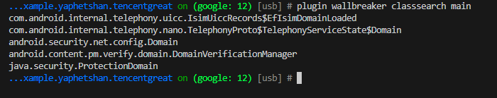
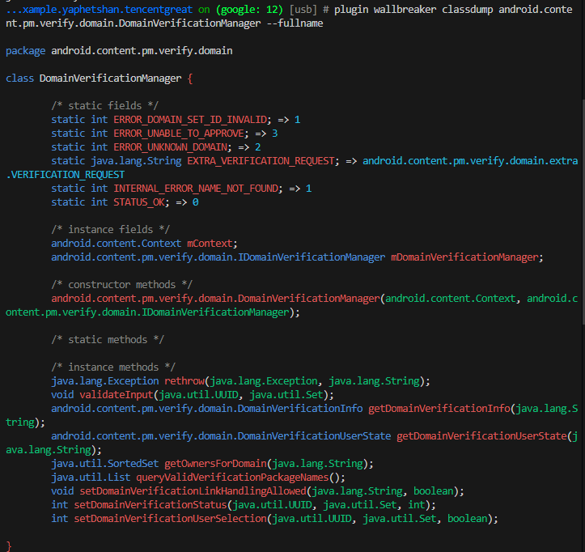
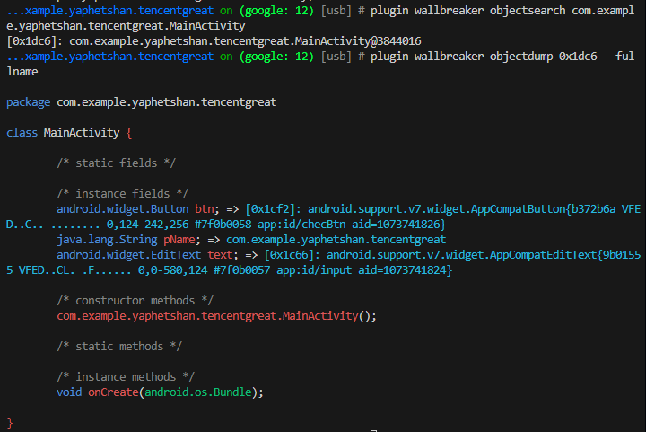