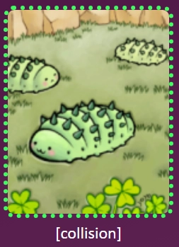
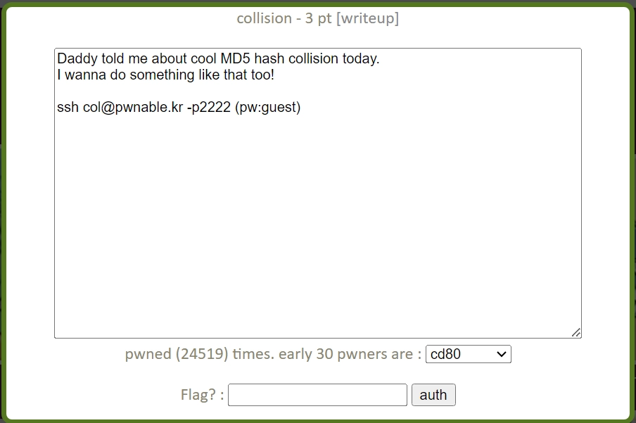
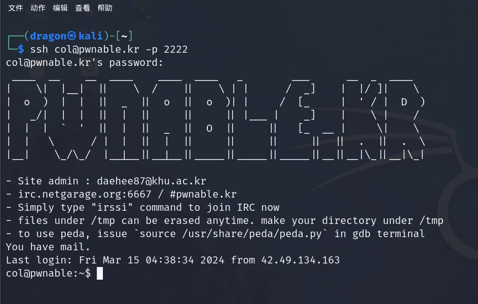
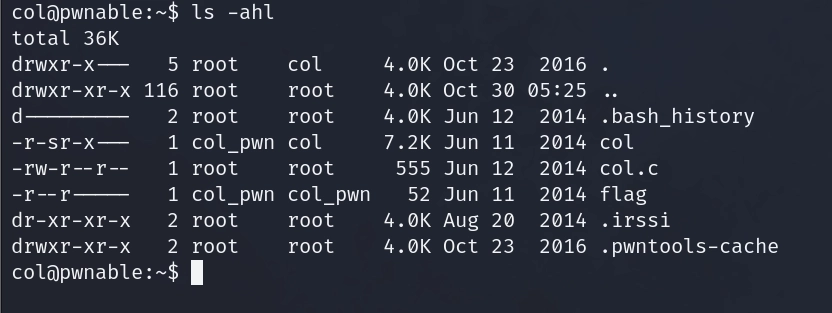
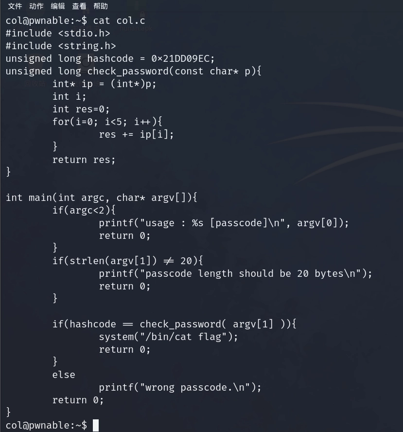

- 靶场标志：
    

- 点开这个标志：
    

- 在kali中输入ssh [col@pwnable.kr](mailto:col@pwnable.kr) -p 2222进入靶场环境：
    

- ls -ahl查看当前目录下的文件：
    

- 查看col.c：
    

- 分析过程：
    ```c
    if(hashcode == check_password( argv[1] )){
        system("/bin/cat flag");
        return 0;
    }
    ```
    由此可以判断出当hashcode等于check_password( argv[1] )（也就是用户输入的第1个参数，第0个就是主函数名main）的时候会输出flag，hashcode已经定义好了：
    
    ``unsigned long hashcode = 0x21DD09EC;``

    看到check_password：
    ```c
    unsigned long check_password(const char* p){
        int* ip = (int*)p;
        int i;
        int res=0;
        for(i=0; i<5; i++){
            res += ip[i];
        }
        return res;
    }
    ```
    传入指针p，再将这个p强制转换成int类型的指针ip，通过一个循环进行5次的叠加最终的值存放到res并返回，所以和hashcode进行比对的值就是res

    主函数中有两个过滤条件，第一个：
    ```c
    if(argc<2){
        printf("usage : %s [passcode]\\n", argv[0]);
        return 0;
    }
    ```
    判断是否传了参

    第二个：
    ```c
    if(strlen(argv[1]) != 20){
        printf("passcode length should be 20 bytes\\n");
        return 0;
    }
    ```
    判断输入的参数字节数是否等于20

    分析结束，此题已经很清楚了，想得到flag，必须要输入一个字节数为20并且经过5次的叠加之后还等于hashcode的参数

    经过上述的判断，用于和hashcode进行比较的res被叠加了5次，而且最终的res值的字节数要达到20才行，突然想到一个int类型的字节数是4，5个int类型加起来正好是20和字节，所以思路就是把hashcode分成5个int类型的数值，并且在传入参数的时候，要将这5个int类型的数值以char类型进行相加，所以：

    ``0x21DD09EC=568134124``，发现除以5后会余1，所以我们选择除以``568134125``，然后在5组数据中的其中一组再减1即可：
    ```
    (568134124 + 1) / 5 = 113626825 = 0x6C5CEC9
    0x21DD09EC = 0x6C5CEC9 + 0x6C5CEC9 + 0x6C5CEC9 + 0x6C5CEC9 + 0x6C5CEC8

    将这五组数据通过小端存储的方法进行一个排列：

    \xc9\xce\xc5\x06\xc9\xce\xc5\x06\xc9\xce\xc5\x06\xc9\xce\xc5\x06\xc8\xce\xc5\x06
    ```

- 然后再通过如下Payload获得FLAG：
    ```python
    ./col python -c 'print "\\xc9\\xce\\xc5\\x06\\xc9\\xce\\xc5\\x06\\xc9\\xce\\xc5\\x06\\xc9\\xce\\xc5\\x06\\xc8\\xce\\xc5\\x06"'
    ```

    ``FLAG：daddy! I just managed to create a hash collision :)``