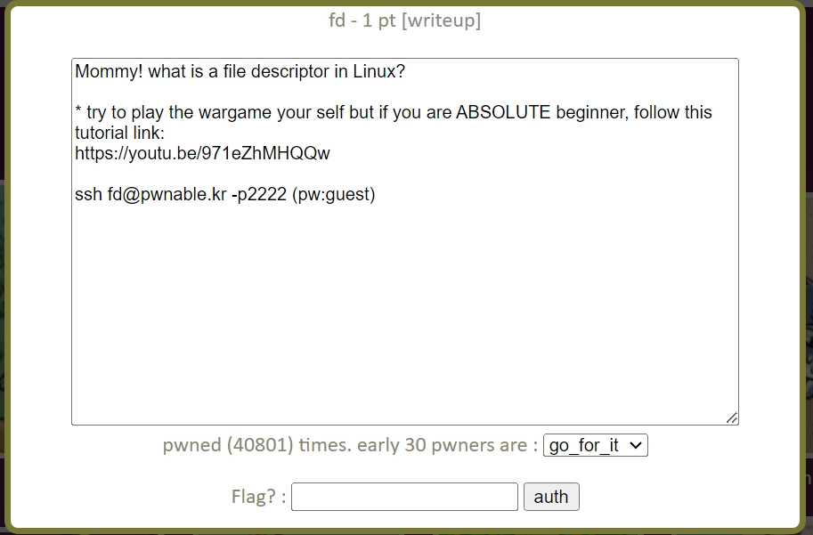
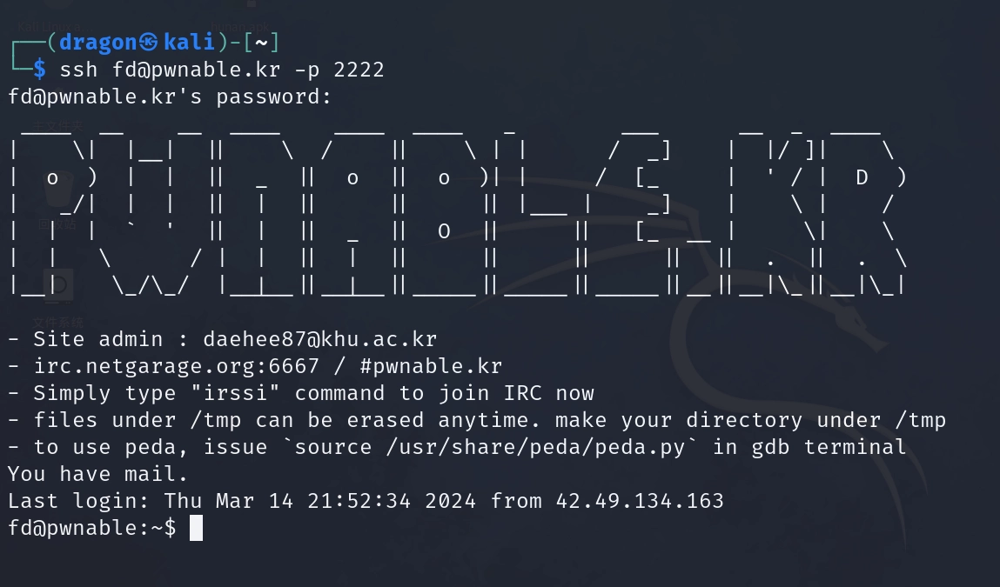
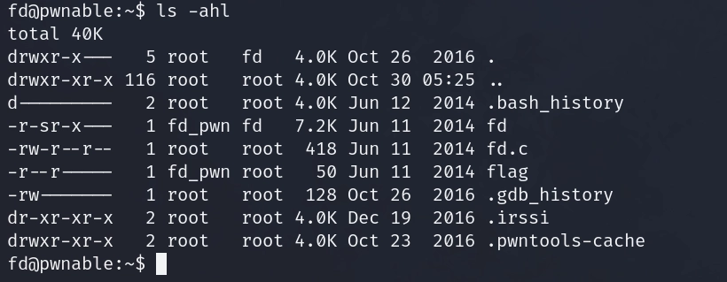
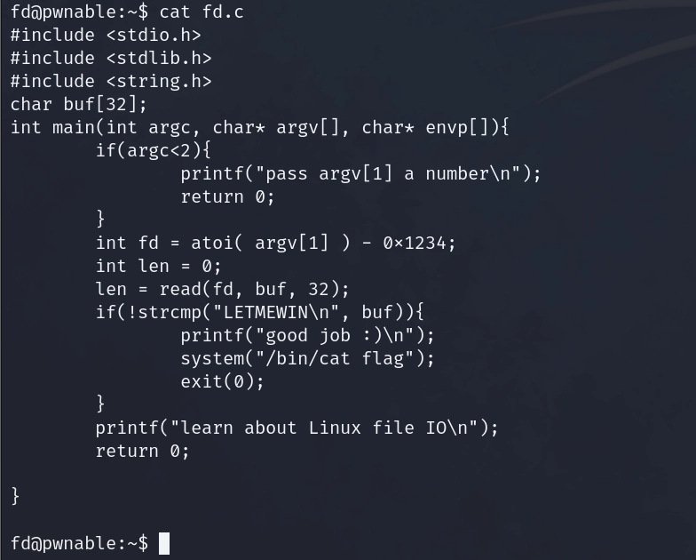
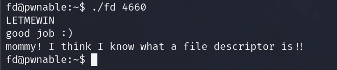

- 靶场标志：
    

- 点开这个标志：
    

- 在kali中输入ssh [fd@pwnable.kr](mailto:fd@pwnable.kr) -p 2222进入靶场环境：
    

- ls -ahl查看当前目录：
    

- 可以看到flag，但是没有任何权限，还有一个可读的文件fd.c和一个可执行文件fd，查看fd.c：
    
    通过分析，不难看到system("/bin/cat flag");就是得出flag的命令，所以我的目标就是如何让程序执行到这条代码，想执行这条代码就必须要buf中的值等于LETMEWIN，而buf的值是将fd中的字符串的前32提取出来放到了buf中，然后将实际读取到的字节数存放到变量len中，而fd又等于argv[1]的值减去0x1234

    if语句通过判断argc是否大于等于2来判断你是否进入程序，目的是判断你在运行这段代码的时候有没有传入参数，但是为什么判断的点是大于等于2呢？因为Linux中一切皆文件，调用函数main，这个函数名main就是参数之一。以上就是分析的全部过程，分析过后，如何让buf变成LETMEWIN呢？

- 在这里先介绍一下read函数：
    ```c
    #include <unistd.h>
    ssize_t read(int fd, void *buf, size_t count);
    ```
    作用就是read函数会从指定的文件中读取count个字节到buf中，并返回实际读取到的字节数。在读取的过程中，文件指针会根据读取的字节数偏移。

    这里我们就是利用了read函数的阻塞与非阻塞模式，所以我们的思路就是使得read函数进入阻塞模式停止运行等待我们输入东西，当read的实际读取数据的字节数为0时，便可进入阻塞模式，所以只要让len的值为0然后我们就可以输入LETMEWIN，这时LETMEWIN就会存放到buf中，然后拿到flag

- FLAG：
    
    ```
    flag：mommy! I think I know what a file descriptor is!!
    ```