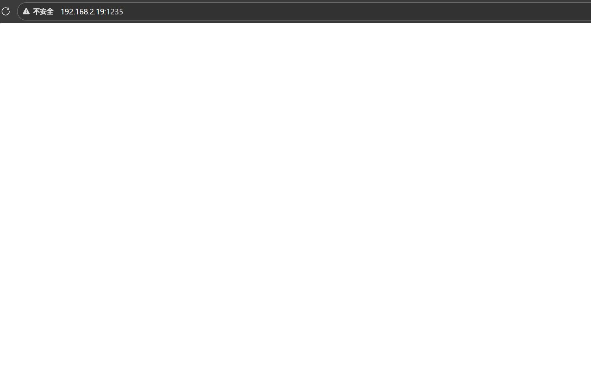
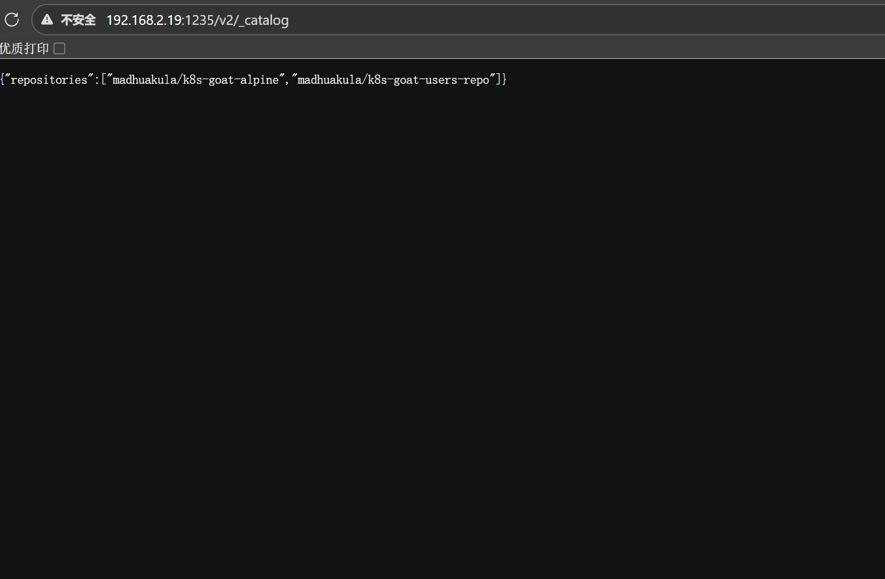
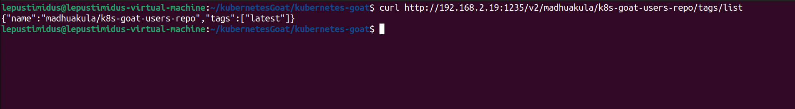
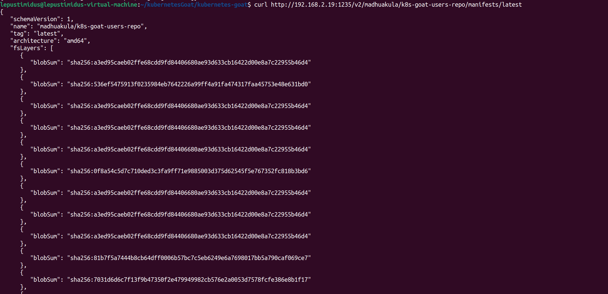
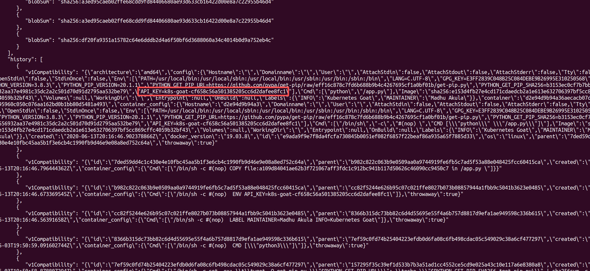

# 1、原理
- Docker Registry 未授权访问：在Docker的实际使用中，企业需要私有容器镜像仓库来存储内部镜像，但错误配置可能导致私有仓库暴露，攻击者无需认证即可访问所有镜像内容，从而导致源代码、敏感配置、凭据信息等信息的泄露。该漏洞源于Registry的错误配置，具体风险及实现原理如下：
  - 未认证的Registry服务暴露：将Docker Registry服务部署时未启用身份验证机制，直接运行docker run -p 5000:5000 registry:2。在这种模式下，Registry的API端点完全开放，攻击者通过访/v2/_catalog可列出所有仓库，通过/v2/<仓库名>/tags/list可查看镜像标签，通过/v2/<仓库名>/manifests/<标签>可获取镜像清单，最后通过/v2/<仓库名>/blobs/<摘要>下载完整的镜像层数据。Docker镜像采用分层结构存储，每个层都包含完整的文件系统快照。攻击者下载镜像层后，可解压分析其中的文件内容。如果Registry服务暴露且未配置认证，攻击者就等同于获得了企业内部所有容器镜像的完整访问权限。[Docker Registry API](https://www.baeldung-cn.com/ops/docker-registry-api-list-images-tags)
  
  - 敏感信息泄露：开发人员常将敏感信息直接打包进容器镜像，包括源代码、数据库密码、API密钥、配置文件等。攻击者获取镜像后，可通过分析镜像层提取敏感信息，如搜索.env文件、*.pem密钥文件、硬编码的密码字符串等，如果攻击者通过未授权访问私有Registry，就可下载所有生产环境镜像，从中提取源代码、AWS凭证等等敏感信息，导致严重的数据泄露。若镜像中还包含特权配置（如挂载docker.sock），攻击者可能进一步利用这些配置实现容器逃逸，获得对宿主机的控制权。
  
  - 网络暴露与弱口令：即使Registry配置了认证，如果服务暴露在公网且使用弱密码或默认凭据，攻击者仍可能通过爆破获得访问权限。

# 2、实验
- 访问靶机1235端口：
    

- 通过``/v2/_catalog``列举出所有仓库：
    

- 通过``/v2/madhuakula/k8s-goat-users-repo/tags/list``查看指定镜像（madhuakula/k8s-goat-users-repo）的所有标签：
    

- 通过``/v2/madhuakula/k8s-goat-users-repo/manifests/latest``查看该镜像的详细信息：
    

- 最终在详细信息中找到了flag：
    