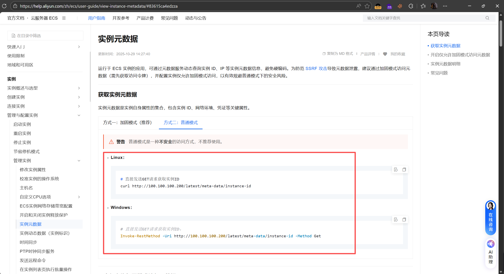
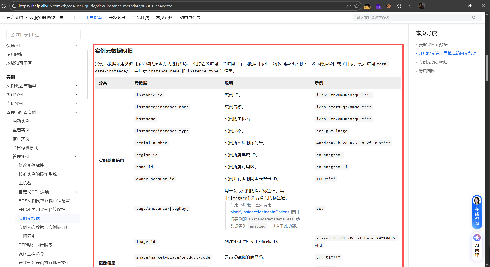
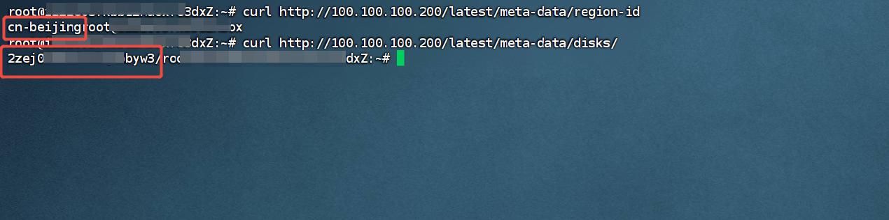
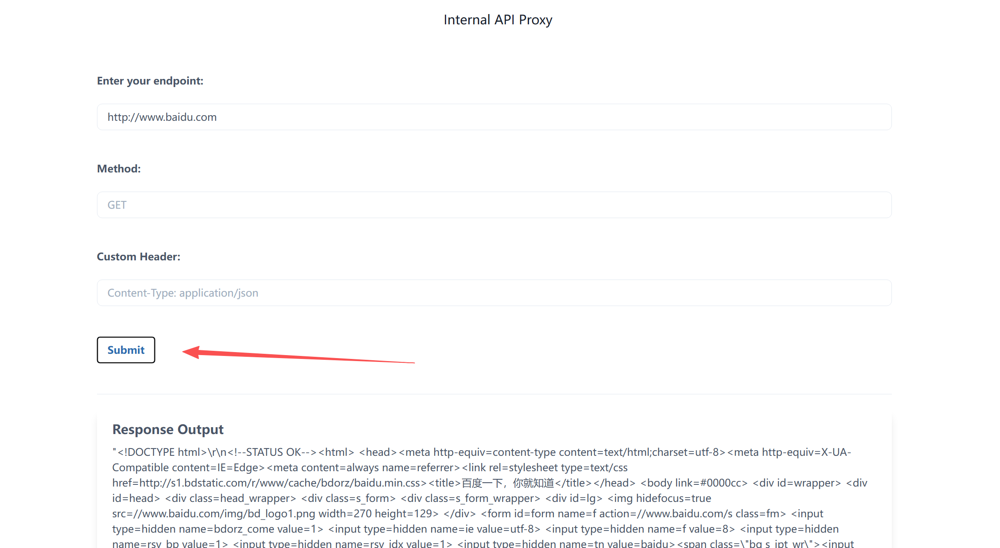
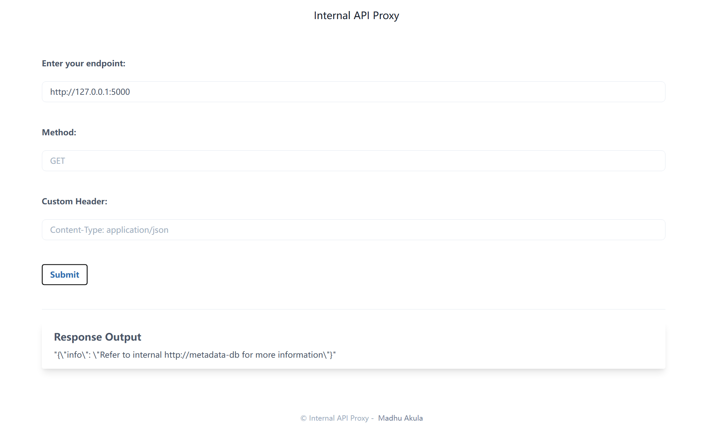
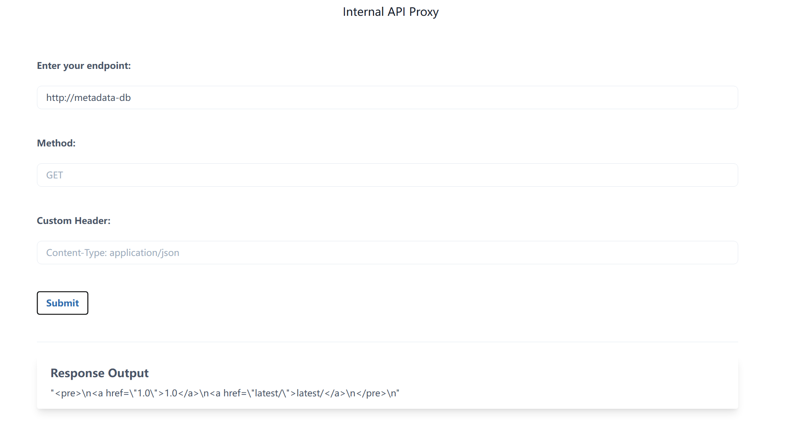
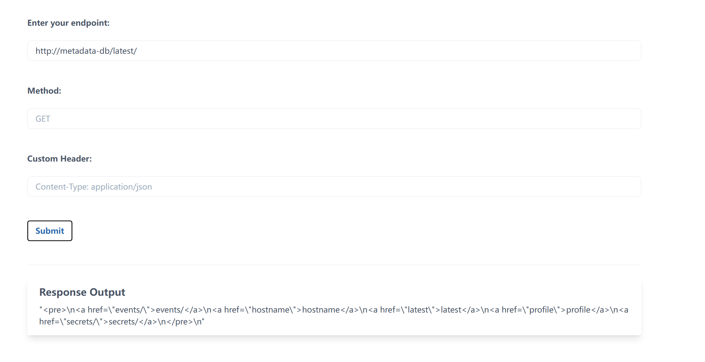
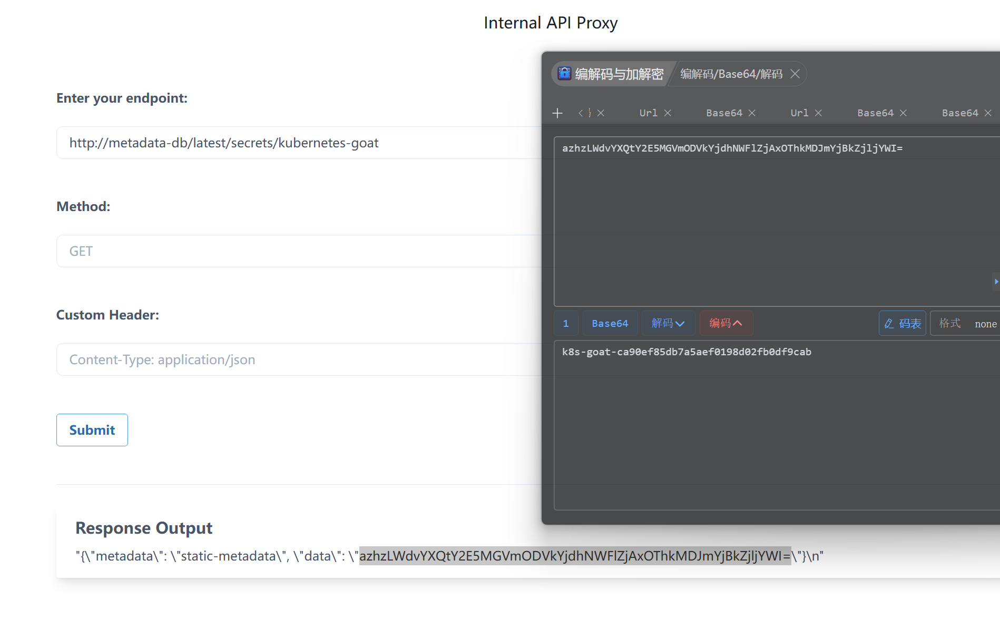

# 1、原理
- SSRF：ssrf是攻击者诱导服务器去发送恶意请求比如访问内网服务、数据等，并将结果发送给攻击者，在k8s集群中的ssrf和普通的ssrf区别不大，只不过k8s中的服务器就是在pod内，敏感数据更多的是：元数据、节点内网服务、kube-apiserver等等，攻击者为什么在k8s中获取的信息和普通场景不太一样呢？这里以元数据为例，做一个简单说明，如果对其他感兴趣可自行了解

- 元数据：
  - 什么是元数据：元数据简单说就是描述资源自身信息的数据。在云原生和 K8s 环境里，最典型的就是云服务器提供的元数据服务，不通云厂商有自己的元数据服务地址，比如阿里的：100.100.100.200，专供虚拟机或容器所在的节点内部访问，不需要额外账号密码。它不存业务数据，只存云资源的 “身份信息” 和 “运行时配置”

  - 为什么发明元数据：云平台中可以部署虚拟机、容器、网络和存储等等，随着在云平台部署越来越多的虚拟机、容器等等，分散管理的效率就会很低下而且容易出错，所以开发出一套标准化的方式让资源可以自己管理自己，避免分散管理的一些弊端，元数据就是为了解决这个问题：让云服务器、Pod 所在节点能自动获取自身配置、网络信息、角色凭证，实现自动化初始化、弹性伸缩、权限分发，不需要人工逐台配置

  - 元数据的作用：为云资源提供自发现、自配置、自授权的能力。它会返回实例 ID、地域、内网 IP、镜像信息、用户数据，以及最关键的 ——IAM 角色的临时凭证（AK/SK/SecurityToken）。这些信息可以让云资源自动对接其他云服务，同时也是云平台做调度、计费、监控、权限管理的依据。而攻击者通过漏洞，比如：SSRF，就可以对Pod发起对内网元数据服务的请求，直接窃取云账号凭证，进而从容器层面突破到云资源层面。

- 元数据简单演示：

    这里以阿里作为演示：
    ```
    阿里元数据官方文档：
    https://help.aliyun.com/zh/ecs/user-guide/view-instance-metadata/#ad933f6041u4z
    ```
    可以在文档中看到阿里提供了大量元数据的访问方式：
    
    
    比如：
    ```
    curl http://100.100.100.200/latest/meta-data/region-id    # 查看实例所属地域ID
    curl http://100.100.100.200/latest/meta-data/disks/       # 查看云盘序列号
    ```
    

# 2、实验
- 访问靶机1232端口：
    
    可以看到输入需要访问的url之后会将结果返回给用户，因为这是ssrf靶机，所以肯定存在ssrf

- 通过对内网端口进行爆破得到如下结果：
    
    可以得知内网有web服务：http://metadata-db正在运行

- 访问该web服务：
    
    得到该服务下存在路径latest

- 访问该路径：
    
    又得到了二级路径，通过拼接访问得到flag最终位置

- 访问http://metadata-db/latest/secrets/kubernetes-goat
    