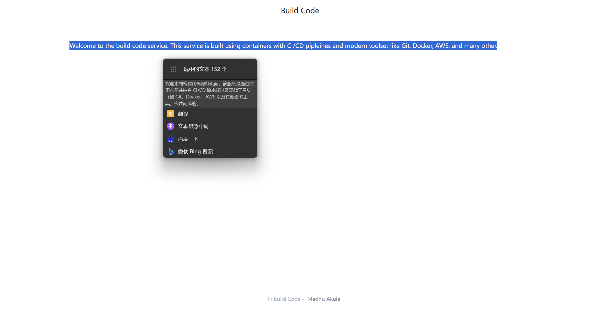
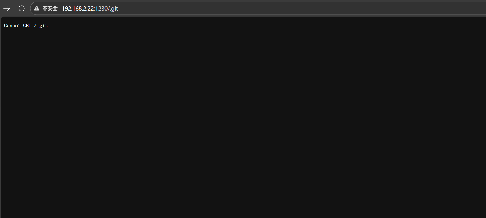
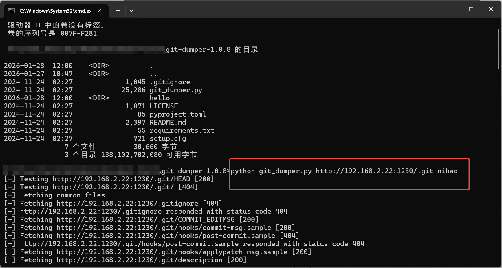
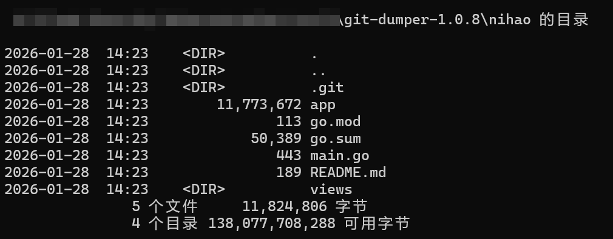
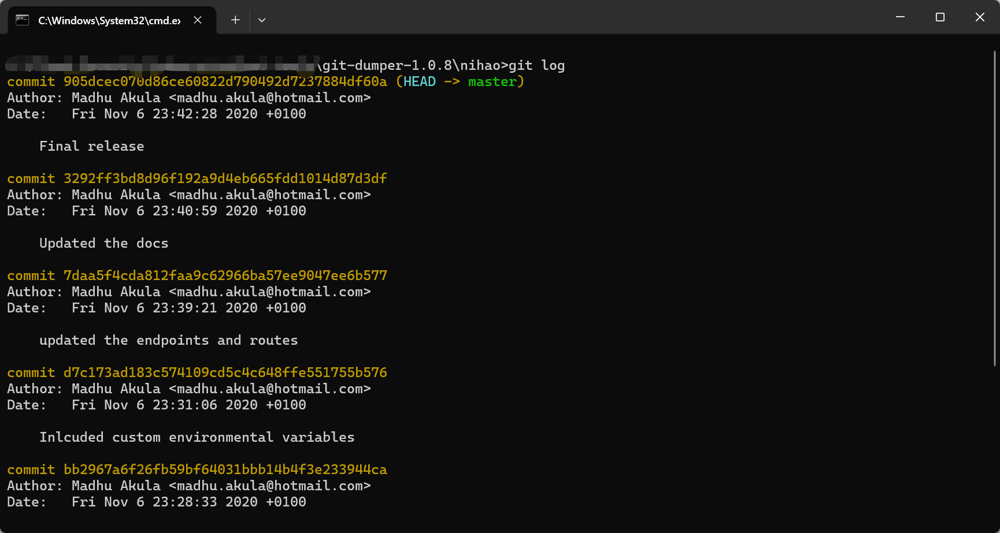
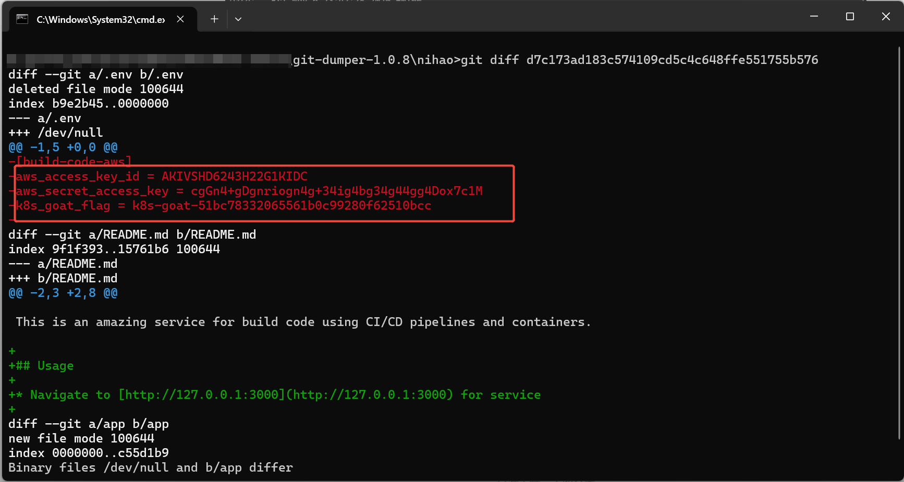

# 1、原理
- 敏感信息泄露：开发者在提交代码库时，可能因为疏忽，导致一些敏感信息，比如：AK/SK等在一些配置文件中没有做删除处理，直接部署在生产线上，导致信息泄露

# 2、实验
- 访问靶机1230端口：
    

- 因为是靶场，所以通过上述文字提示猜测有敏感文件泄露，猜测存在.git文件：
    
    ```bash
    https://github.com/arthaud/git-dumper/releases    # git_dumper工具链接
    ```
    
    获取.git文件内容并存放在nihao目录下，切换进入nihao目录查看：
    
    经过查看文件内容并未发现敏感信息

- 通过git命令查看其他信息：
    ```bash
    # 常用git命令：

    # 1. 查看工作区所有未提交文件
    git status      # 列出未暂存/已暂存文件，重点关注.env、config.yaml等

    # 2. 查看文件具体修改内容
    git diff        # 查看所有未暂存文件的修改
    git diff 文件名  # 精准查看单个文件（如git diff .env）

    # 3. 查看Git历史提交
    git log --oneline  # 精简版提交历史，快速定位可疑提交
    git log -p 文件名  # 查看指定文件的所有历史修改（如git log -p .env）

    # 4. 撤销工作区修改
    git checkout -- 文件名  # 恢复单个文件（如git checkout -- .env）
    git checkout -- .       # 恢复所有未暂存文件

    # 5. 移除已暂存但未提交的敏感文件
    git reset HEAD 文件名  # 撤销单个文件暂存（如git reset HEAD .env）

    # 6. 彻底删除Git历史中的敏感文件
    git filter-branch --force --index-filter 'git rm --cached --ignore-unmatch 文件名' --prune-empty --tag-name-filter cat -- --all  # 如git filter-branch --force --index-filter 'git rm --cached --ignore-unmatch .env' --prune-empty --tag-name-filter cat -- --all

    # 7. 提交修改
    git add .       # 暂存所有合规文件
    git commit -m "移除配置文件中的敏感AK/SK信息"  # 清晰标注提交目的

    # 8. 配置.gitignore
    echo ".env" >> .gitignore  # 将.env加入忽略列表
    echo "config.yaml" >> .gitignore  # 按需添加其他敏感配置文件
    ```
    通过``git log``查看历史提交记录：
    
    通过``git diff <文件名>``查看未暂存文件的修改内容：
    
    可以看到文件：``d7c173ad183c574109cd5c4c648ffe551755b576``中泄露了AK/SK以及该靶场的flag