> 参考文章：https://mp.weixin.qq.com/s/3jY1AmTCfMwocf6nD2iSzw

# 1、起因：
- 因为主包在搭建该靶场时踩了好多坑，所以在此记录一下最终成功的搭建过程，希望对大家有所帮助

# 2、介绍：
- KubernetesGoat是一个云原生漏洞靶场

# 3、搭建过程：
- 准备一只Ubuntu：
    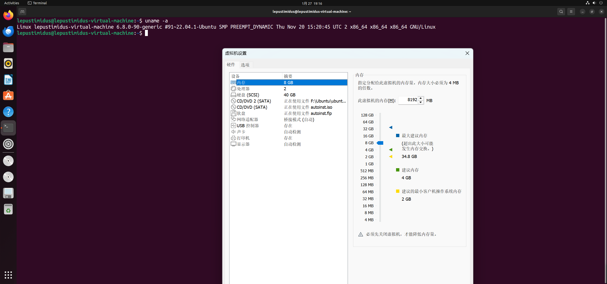

- 添加阿里云密钥：
    ```bash
    curl -fsSL http://mirrors.aliyun.com/docker-ce/linux/ubuntu/gpg | sudo apt-key add -
    sudo apt-get update
    ```
    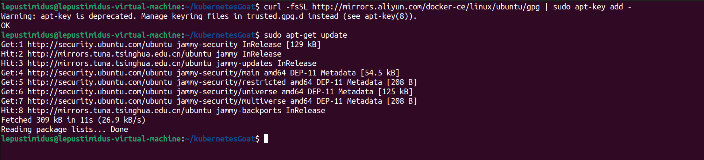

- 安装Docker：
    ```bash
    sudo apt-get install -y apt-transport-https ca-certificates curl software-properties-common
    curl -fsSL https://mirrors.aliyun.com/docker-ce/linux/ubuntu/gpg | sudo apt-key add -
    sudo add-apt-repository "deb [arch=amd64] https://mirrors.aliyun.com/docker-ce/linux/ubuntu $(lsb_release -cs) stable"
    sudo apt-get update
    sudo apt-get install docker-ce docker-ce-cli containerd.io docker-compose-plugin
    ```
    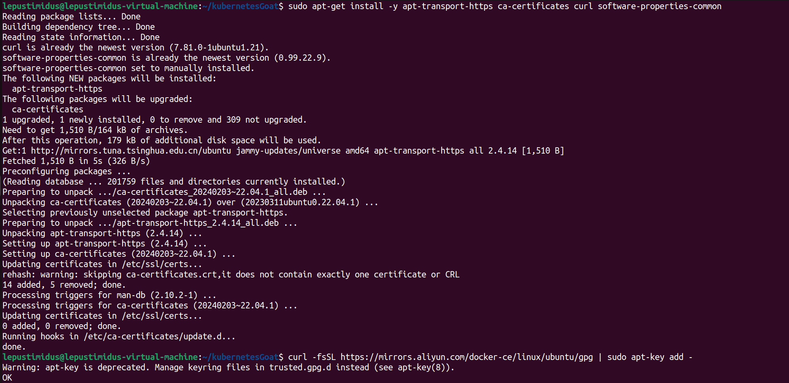
    
    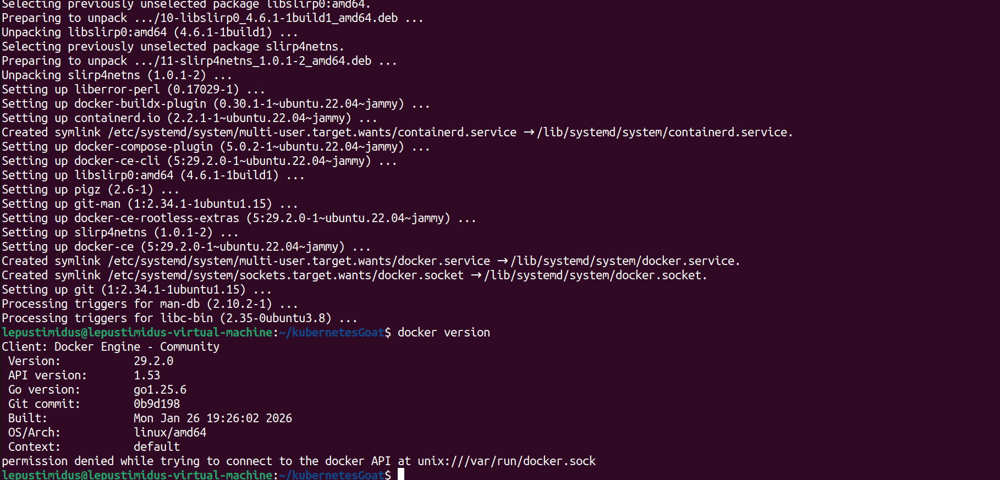

- Docker挂代理并启动：
    ```bash
    # 挂代理：
    sudo mkdir -p /etc/systemd/system/docker.service.d      # 创建 Docker 服务的环境变量配置目录
    sudo vim /etc/systemd/system/docker.service.d/proxy.conf     # 编写代理配置文件

    # 启动：
    sudo systemctl daemon-reload      # 重新加载 systemd 配置（让新的环境变量生效）
    sudo systemctl restart docker     # 重启 Docker 服务

    # 代理配置文件内容：
    [Service]
    Environment="HTTP_PROXY=http://192.168.2.12:10808"
    Environment="HTTPS_PROXY=http://192.168.2.12:10808"
    Environment="NO_PROXY=localhost,127.0.0.1,10.0.0.0/8,10.96.0.0/12,192.168.0.0/16"
    ```
    由于主包用的是v2rayN，所以代理配置是按照v2rayN进行的

    打开v2rayN设置-参数设置-勾选来自局域网连接：
    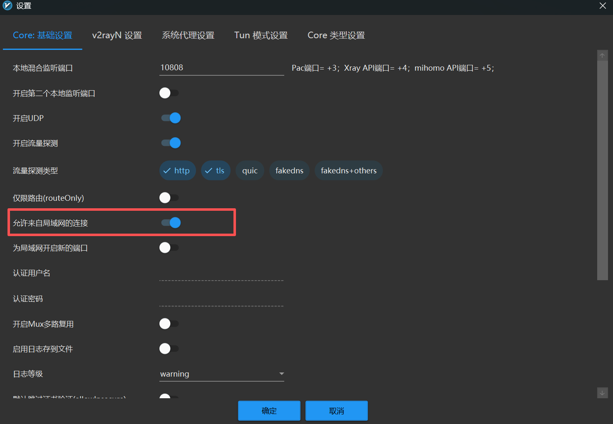
    勾选后即可在主页左下角看到如下内容：
    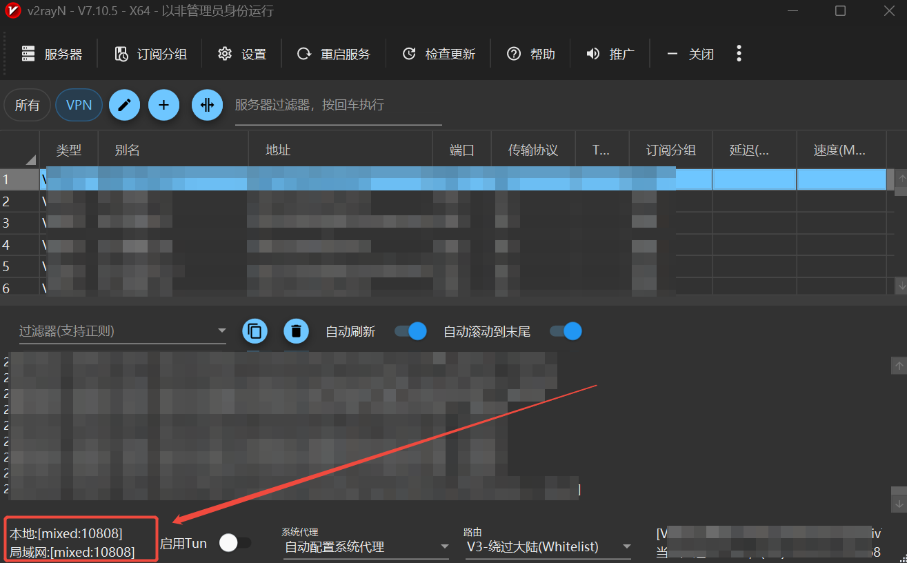
    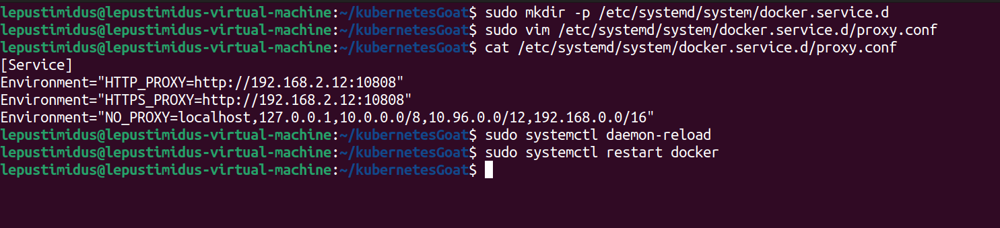

- 安装Minikube前期准备：
    ```bash
    sudo usermod -aG docker $USER && newgrp docker   # 将用户添加到docker组
    sudo apt-get install -y apt-transport-https    # 安装相关依赖
    sudo curl https://mirrors.aliyun.com/kubernetes/apt/doc/apt-key.gpg | sudo apt-key add -   # 安装对应GPG
    # 添加阿里源：
    sudo tee /etc/apt/sources.list.d/kubernetes.list <<-'EOF'
    deb https://mirrors.aliyun.com/kubernetes/apt/ kubernetes-xenial main
    EOF

    sudo apt-get update
    sudo apt-get install -y kubectl    # 安装kubelet
    ```
    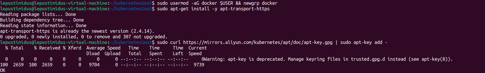
    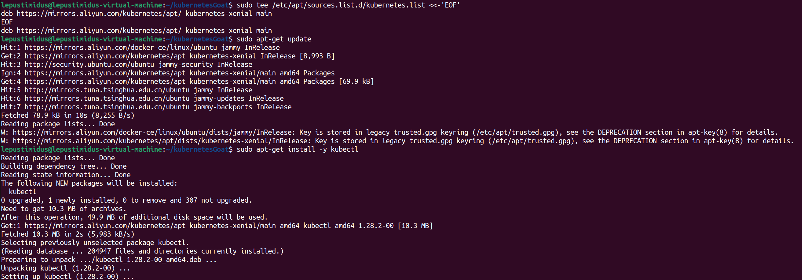
    因为靶场对minikube版本有一定要求，所以这里选择手动安装minikube
    ```bash
    # minikube GitHub链接：
    https://github.com/kubernetes/minikube/releases/download/v1.26.1/minikube-linux-amd64

    # minikube安装过程：
    sudo install minikube-linux-amd64 /usr/local/bin/minikube

    # Minikube挂代理并启动：
    vim start-minikube
    chmod +x start-minikube
    ./start-minikube
    ```
    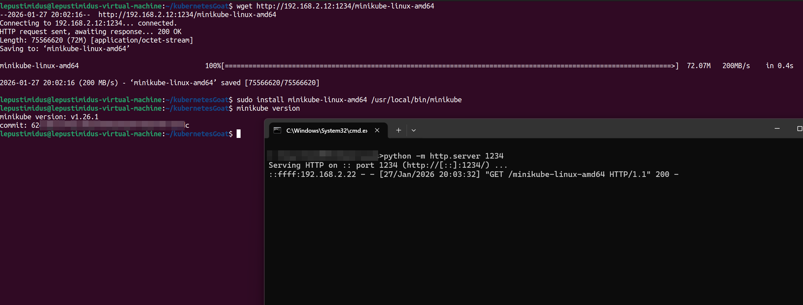
    给Ubuntu加代理，重启终端，重新用户添加到docker组，再运行minikube：
    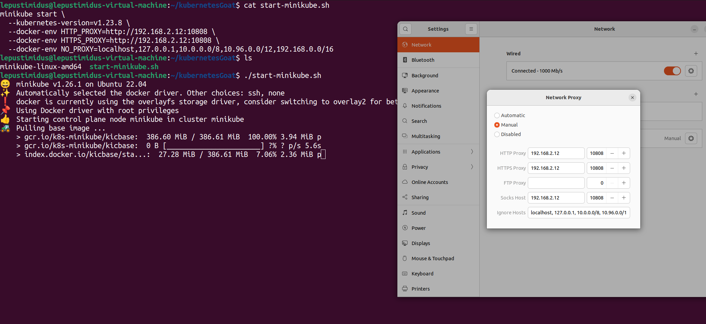
    出现Done说明启动成功：
    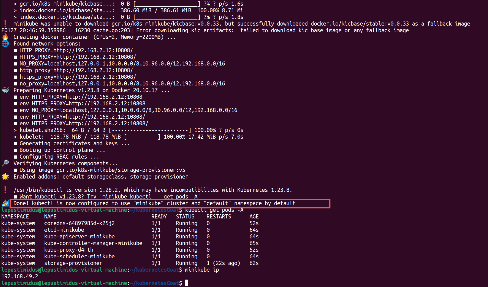

- 安装Helm：

    因为靶场对Helm的版本依然有一定要求，所以选择安装helm3.9.0版本：
    ```bash
    # helm3.9.0链接：
    https://get.helm.sh/helm-v3.9.0-linux-amd64.tar.gz
    tar -zxvf helm-v3.9.0-linux-amd64.tar.gz
    sudo mv linux-amd64/helm /usr/local/bin/helm
    helm version
    ```
    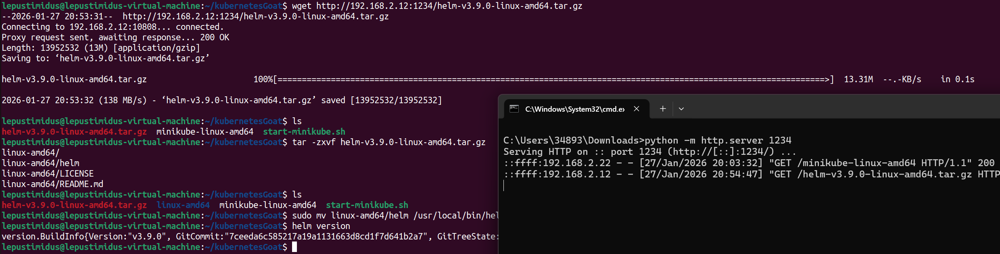

- 部署靶场：
    ```bash
    # 部署靶场：
    git clone https://github.com/madhuakula/kubernetes-goat.git && cd kubernetes-goat && chmod +x setup-kubernetes-goat.sh && bash setup-kubernetes-goat.sh

    # 检查节点状态：
    kubectl get pods -A

    # 启动靶场：
    bash access-kubernetes-goat.sh
    ```
    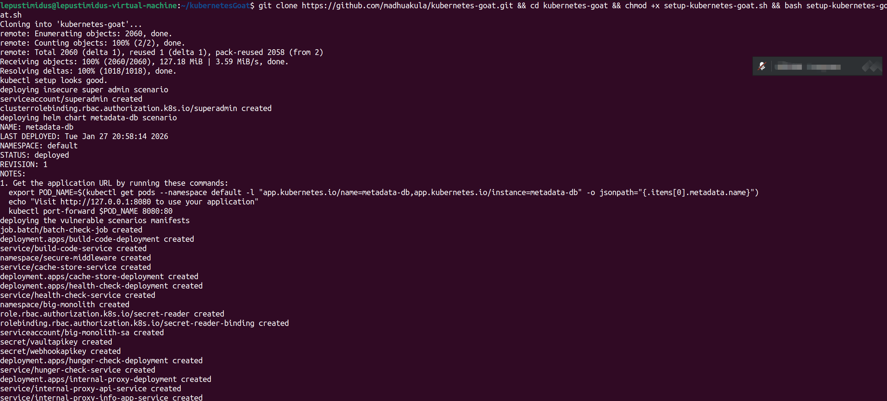
    当节点全部为running状态时说明靶场已经部署成功了，启动即可：
    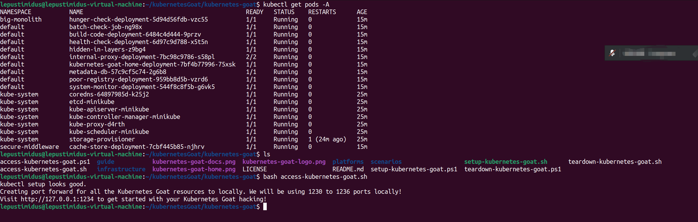
    访问靶机1234端口：
    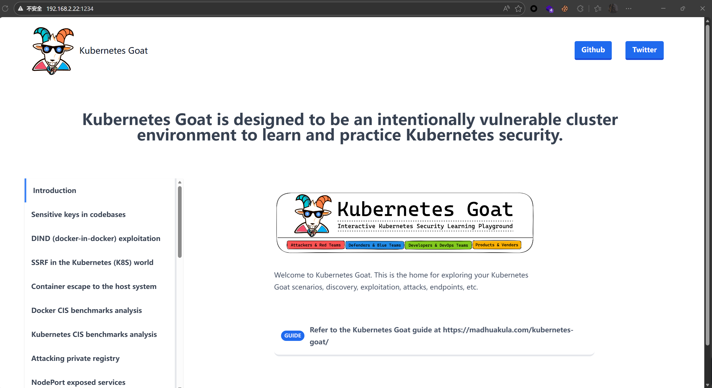
    搭建成功！！！