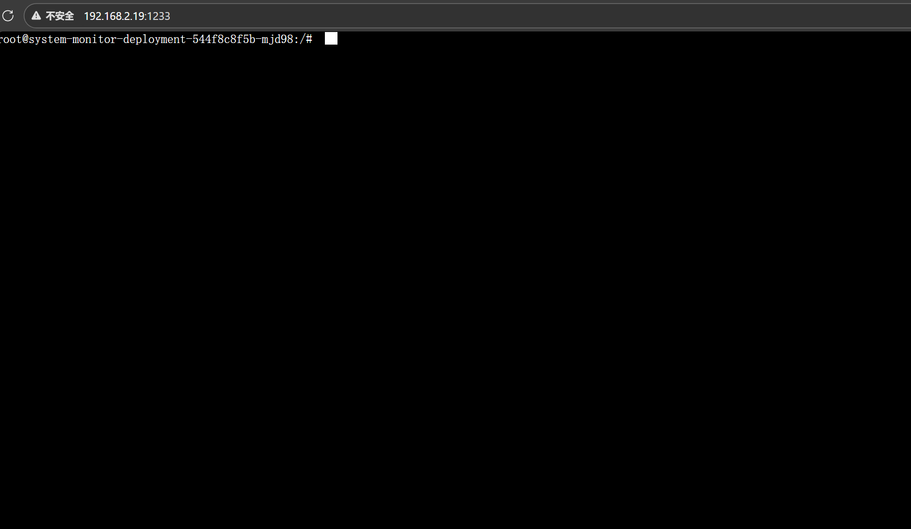
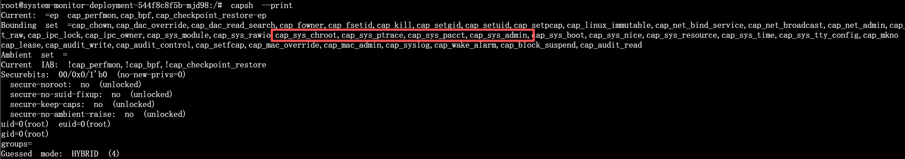
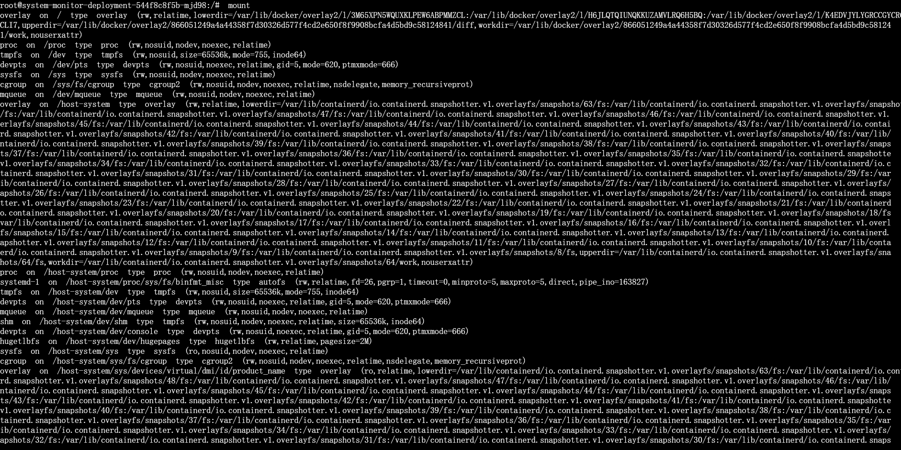
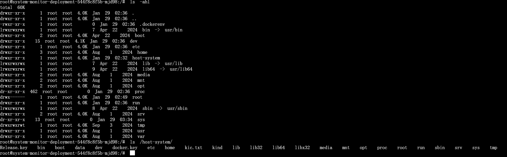
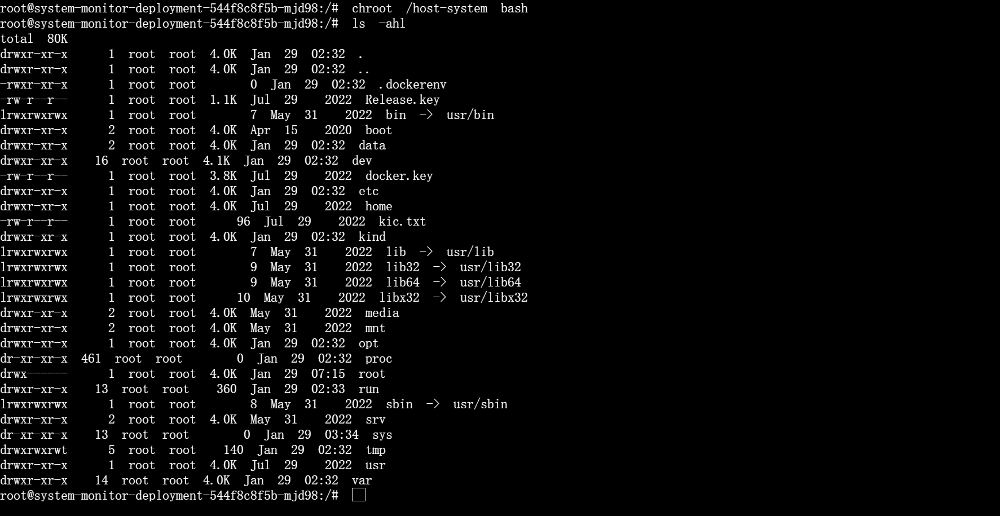
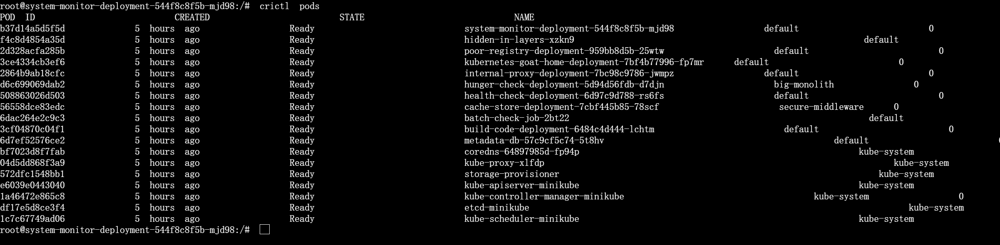

# 1、原理
- 特权容器逃逸：在 Kubernetes 的实际使用中，部分场景需要容器执行系统级操作（如设备管理、调试、构建环境等），为满足该需求，Kubernetes 提供了特权容器（Privileged Container） 运行模式。
 特权容器的设计初衷是放宽容器的安全限制以支持特定功能，但其实现机制决定了其在配置不当时存在较高的安全风险。
- 特权容器（Privileged Container）： 当 Pod 中的容器启用 securityContext.privileged: true 后，容器将被授予几乎完整的 Linux Capabilities，并允许访问宿主机设备节点（如 /dev/*），同时放宽对 mount、namespace 等高权限操作的限制。 在这种模式下，容器内的 root 用户不再是受限的容器 root，而是具备直接操作宿主机资源的能力基础。
- 注意：Docker / Kubernetes 中的特权模式并非按需授权，而是一次性授予一组高危权限集合，这在权限模型上已经违背了最小权限原则。如果攻击者在特权容器内获得命令执行能力，便可以合法地使用这些已被授予的高权限操作宿主机资源，例如通过 mount 将宿主机磁盘设备挂载到容器内，从而实现对宿主机文件系统的直接读写，或通过进入宿主机 namespace 获取宿主机控制权限。

# 2、实验
- 访问靶机1233端口：
    

- 查看当前进程的能力和相关能力配置：
    ```bash
    capsh --print
    ```
    
    可以看到该进程的权限上限有很多，比如cap_sys_chroot可执行chroot命令

- 通过mount命令得知宿主机将根文件系统挂载到容器的/host-system路径：
    
    

- 通过chroot改变host-system/为新根目录并从该目录新启一个终端，从而逃逸到宿主机中：
    ```bash
    chroot /host-system bash
    ```
    
    