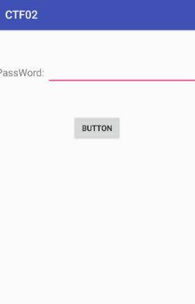
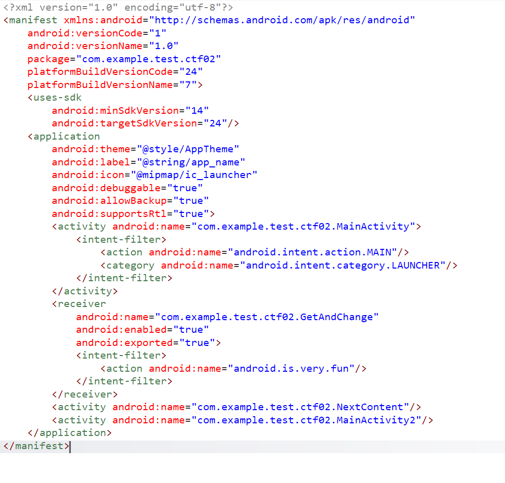
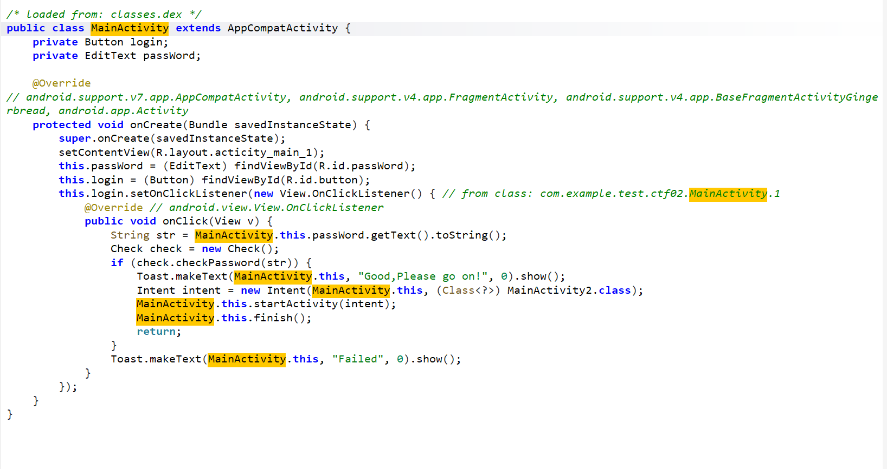
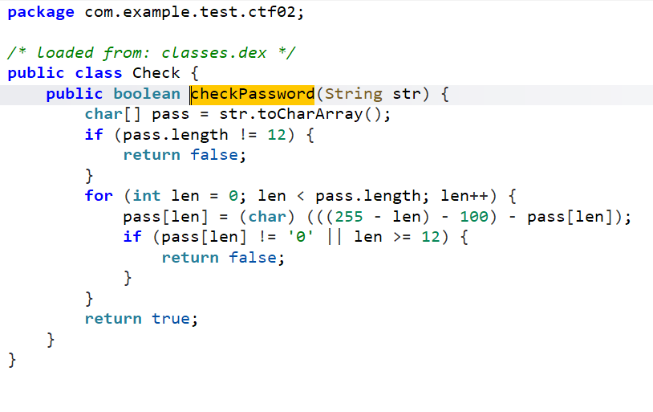
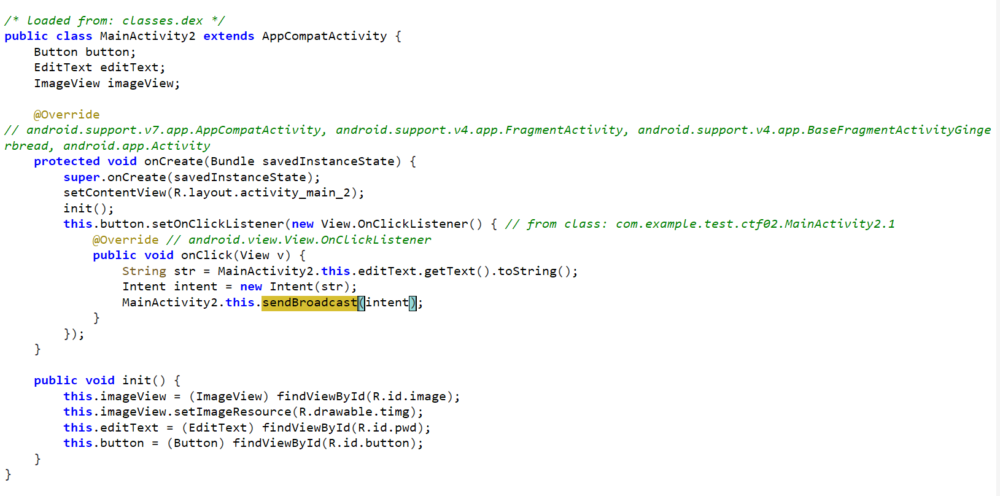
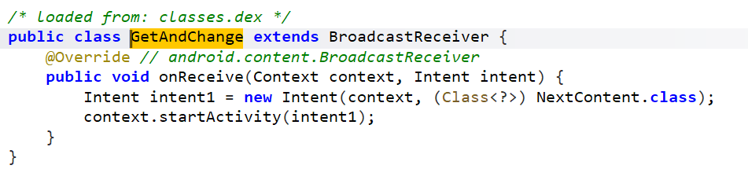
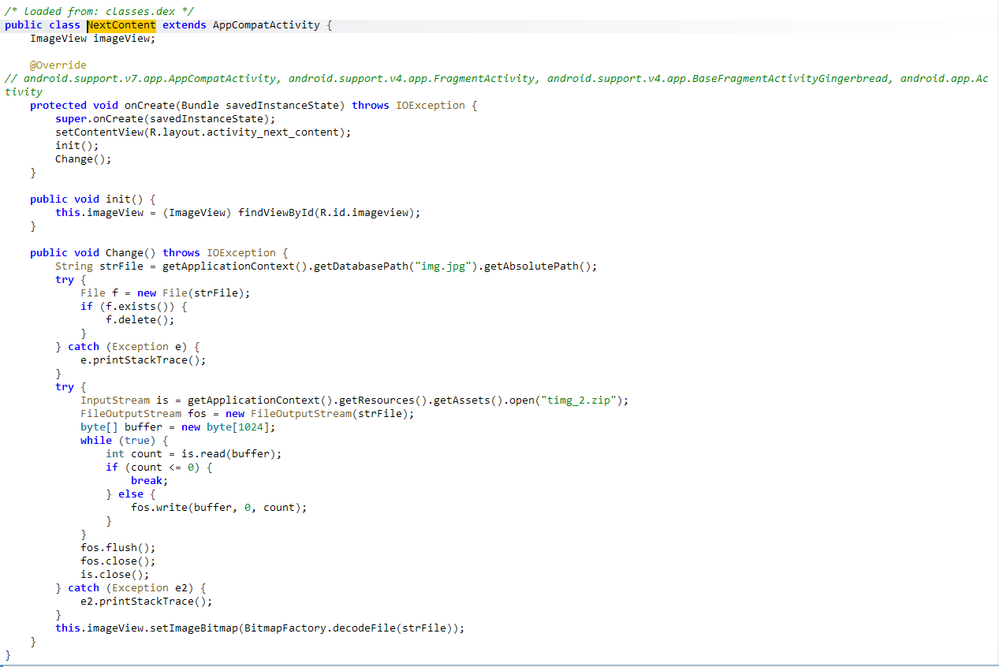
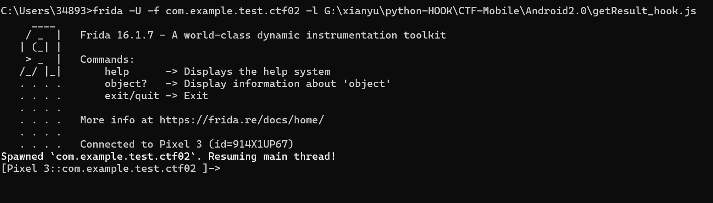
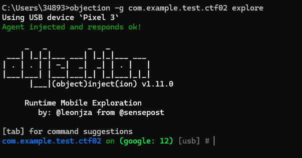
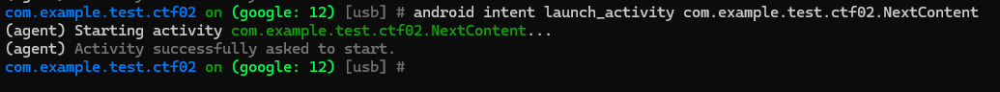

# 方法一：
- 打开apk文件：


- Jadx反编译分析AndroidManifest.xml：

一共有三个页面

- 跳转MainActivity进行分析：

通过setOnClickListener()设置了监听事件用于监听BUTTON按钮，将用户输入的password赋值给str，通过checkPassword()进行判断，如果结果为true，页面将跳转到MainActivity2

- 进入checkPassword()：

```
密码长度为12,for循环中处理逻辑如下：
pass[len] = (char) (((255 - len) - 100) - pass[len]) = 0
155 - len - pass[len] = '0'    # ASCII中字符'0'对应48
155 - len - 48 = pass[len]
len => 0
155 - 0 - 48 = pass[0]  pass[0] => 107
len => 1
155 - 1 - 48 = pass[1]  pass[1] => 106
...

通过12次循环之后得到的值就是正确的密码
```

- 通过密码的校验之后来到了MainActivity2：

定义了页面中展示的图片、输入框、按钮，onClick()方法将用户输入内容通过sendBroadcast()发送广播，通过AndroidManifest.xml中注册的GetAndChange接收器接收广播

- 跳转到GetAndChange：

接收到广播之后跳转到NextContent页面

- 跳转到NextContent页面：

销毁当前页面中展示的img.jpg图片，读取timg_2.zip文件然后解码之后展示在当前页面中

- 通过frida绕过checkPassword()的密码检验：
```javascript
Java.perform(function (){
    var Check = Java.use("com.example.test.ctf02.Check");
    Check["checkPassword"].implementation = function (str) {
        console.log("Start HOOK！");
        let result = this["checkPassword"](str);
        return true;
    };
});
```


- 在登录口任意输入密码点击BUTTON即可绕过来到MainActivity2页面：


- 根据上面的分析可知，图片显示码中填写的内容就是通过广播发送出去的内容，输入AndroidManifest.xml中自定义的广播标识（android.is.very.fun）即可将timg_2.zip文件解码之后的内容展示在页面中：


# 方法二：
- objection注入：


- 启动NextContent：

直接来到了NextContent页面：
