# 1、工具配置
```
frida 16.1.7
frida-tools 12.3.0
frida-server 16.1.7
jadx-gui 1.5.3
objection + 插件wallbreaker
测试机：pixel3
```

# 2、逆向过程

- 打开APP发现存在强制更新弹窗：


- jadx反编译并搜索页面中更新、新版本等相关关键字：
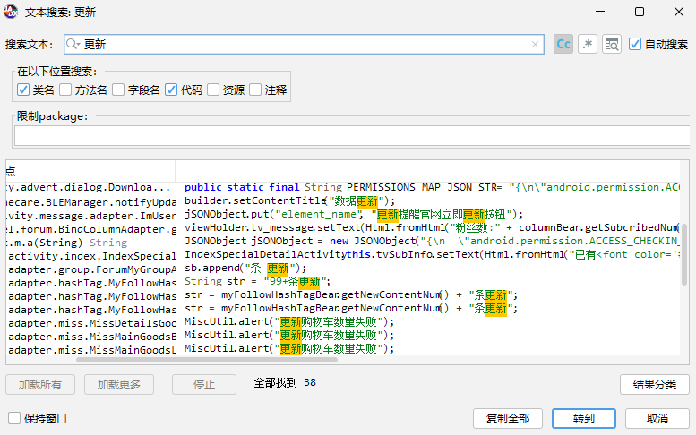
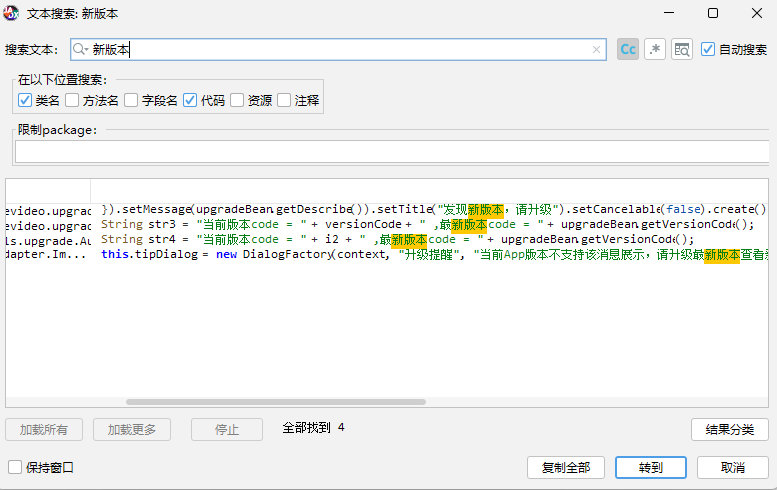
``最终跟进入查看对应代码发现其实都不是强制更新弹窗的触发代码，此时只能换思路了，安卓中实现弹窗的类主要有三种：android.app.Dialog、android.app.AlertDialog、android.widget.PopupWindow，我们可以通过objection工具对调用弹窗的类进行搜索、定位，然后找到对应类的实例和实例中的具体内容``

- 查看app进程：
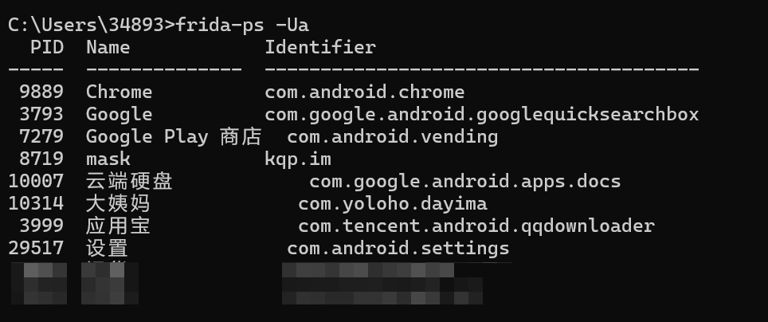

- objection+wallbreaker注入应用：
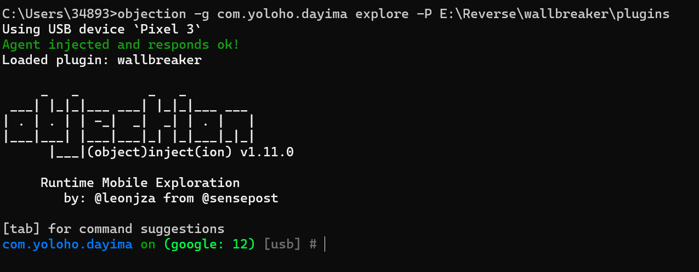

- 在内存中搜索分别搜索三个弹窗类：
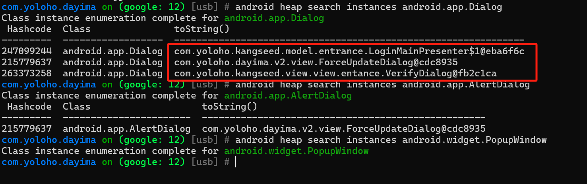
可以看到一共有三个相关实例

- 通过wallbreaker插件将这三个实例中的具体内容打印出来：
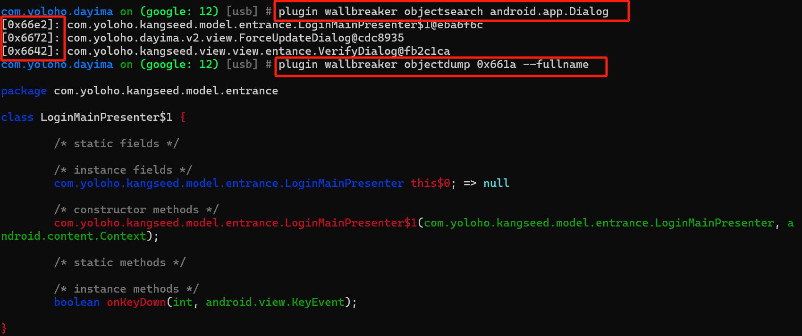
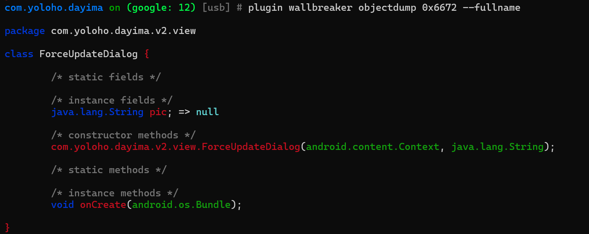
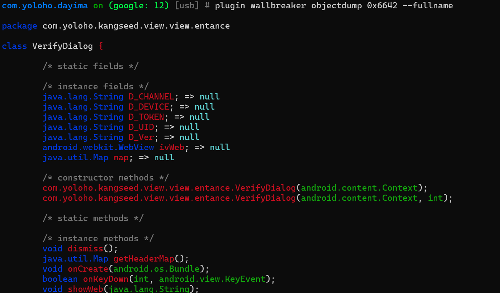

- jadx分别查看相关内容：
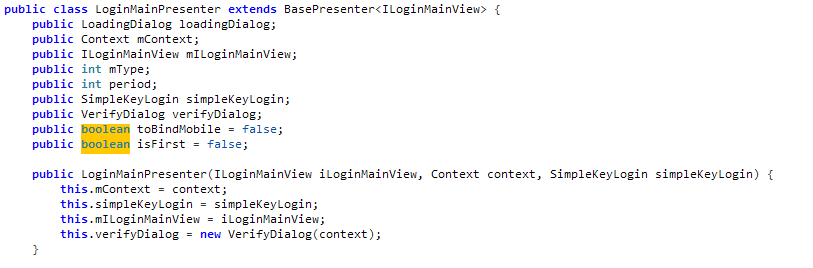
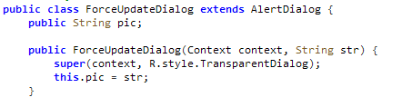
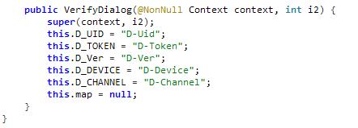
很明显，ForceUpdateDialog是更新相关的内容

- 查看ForceUpdateDialog的用例：
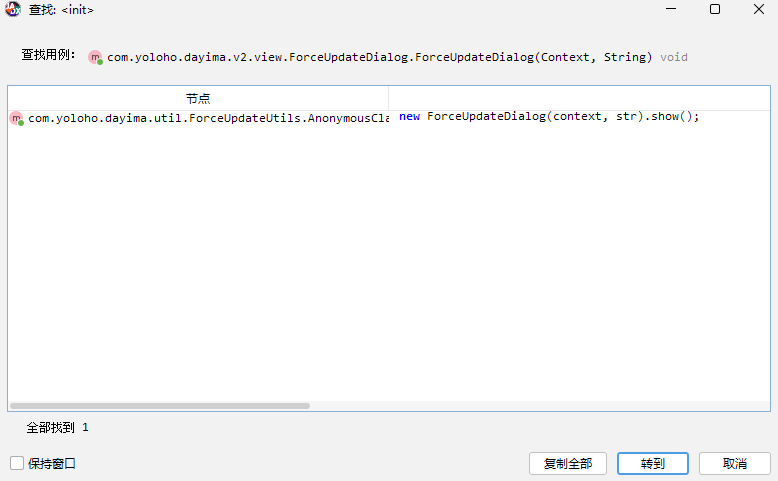

- 跟进查看结果：
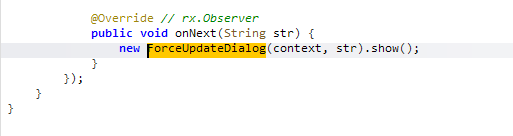
``可以看到当onNext方法收到字符串str之后就创建了ForceUpdateDialog实例并通过show()进行展示``

- 编写脚本Hook onNext方法：
```javascript
// update_hook.js
Java.perform(function (){
    var AnonymousClass1 = Java.use("com.yoloho.dayima.util.ForceUpdateUtils$1");
    AnonymousClass1["onNext"].overload('java.lang.Object').implementation = function () {
        console.log("Hook is over!")
    };
});
```

- 注入Hook脚本：
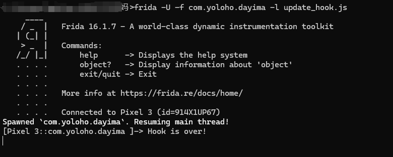

- 成功绕过强制更新弹窗：


> 声明：
>
>本文章中所有内容仅供学习交流使用，不用于其他任何目的，不提供完整代码，抓包内容、敏感网址、数据接口等均已做脱敏处理，严禁用于商业用途和非法用途，否则由此产生的一切后果均与作者无关，如有侵权，请联系作者（3892454318@qq.com）进行删除