# api_sign值逆向

## 1、实验

* 配置抓包环境：
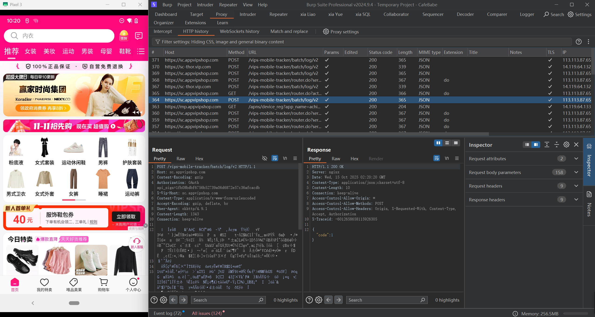

* 任意抓取数据包查看：
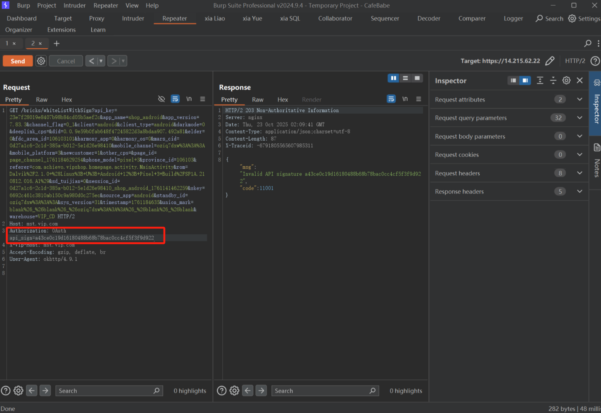

* jadx反编译APP，搜索api_sign：
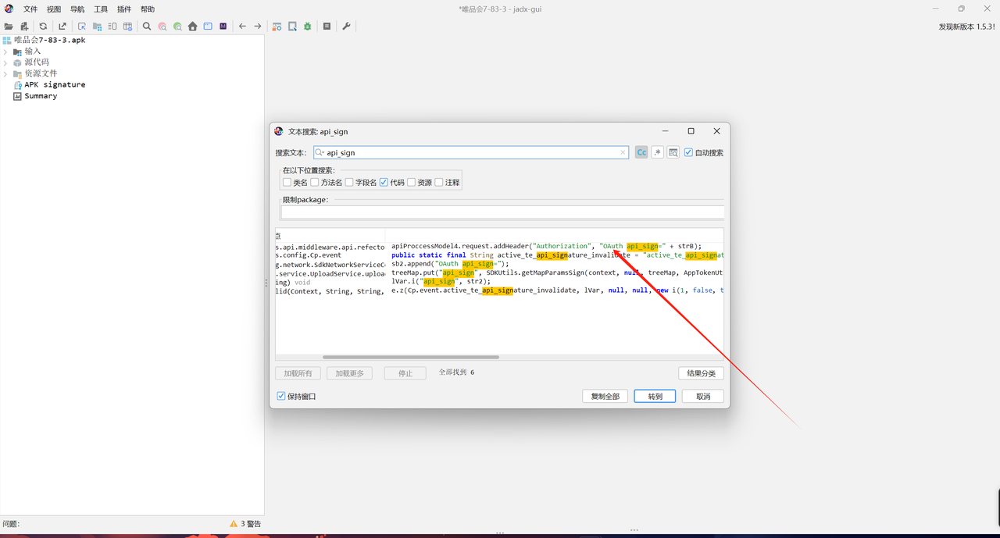

* 进入查看代码
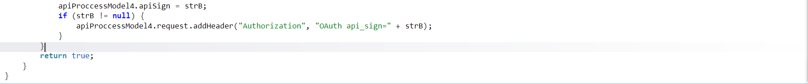

* strB赋值给了api_sign，跟进strB：
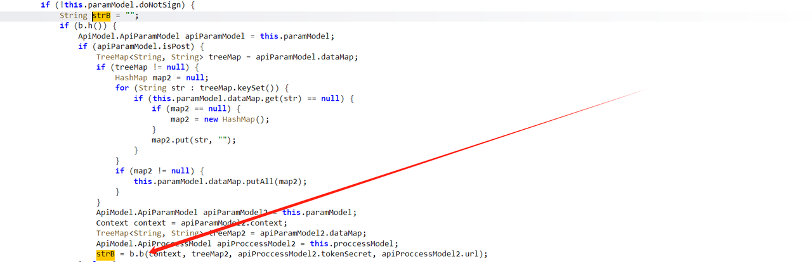
strB来自b.b方法的返回值

* 跟进b.b方法：
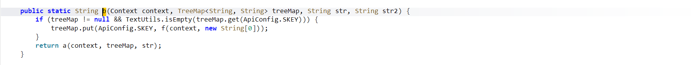
可以看到在b方法中传入了几个参数，context是上下文，treeMap是有序键值对集合，str和str2不知道是做什么的，进入方法之后通过if语句判断treeMap有序键值对中是否为空和treeMap键值对中是否存在一个ApiConfig.SKEY的键，如果treeMap中是空的并且没有SKEY这个键的话就通过treeMap的put方法在里面添加ApiConfig.SKEY这个键，键对应的值通过执行f方法获取到并赋值给这个键，最后再返回a方法（a方法中传入了刚刚处理好的treeMap）

* 跟进a方法：
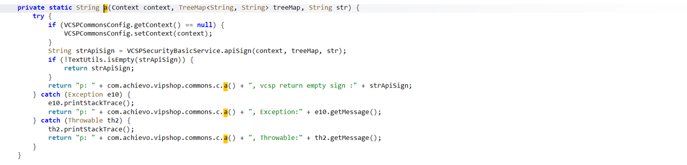
可以看到a方法中有一个strApiSign被赋值了VCSPSecurityBasicService.apiSign方法的返回值，最后再返回strApiSign的值，所以跟进VCSPSecurityBasicService.apiSign方法分析具体方法

* 跟进VCSPSecurityBasicService.apiSign方法：
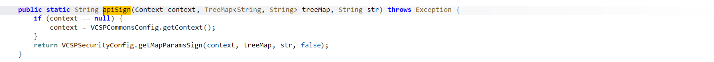
if语句处理了一下context值，返回值是VCSPSecurityConfig.getMapParamsSign方法的执行结果，跟进继续分析

- 跟进VCSPSecurityConfig.getMapParamsSign方法：
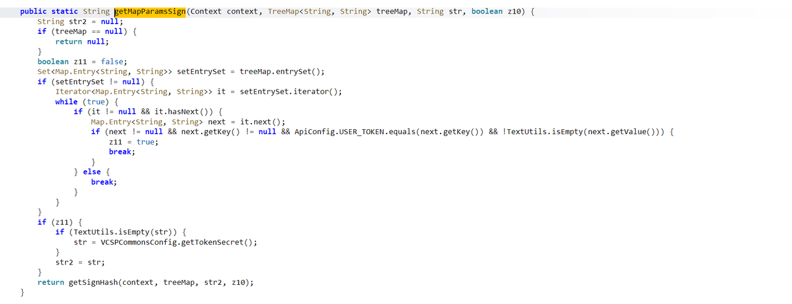
给str2赋值为空，然后判断treeMap是否为空，如果是的话就返回空，将z11初始化为false，给变量setEntrySet（Set类型，每个元素都是Map.Entry对象，代表一个键值对）赋值treeMap.entrySet()方法的执行结果，而treeMap.entrySet()用户获取treeMap中所有键值对的集合，所以就是给变量setEntrySet赋值treeMap键值对中的每一对键值，然后判断是否赋值成功，如果成功了就通过setEntrySet.iterator()迭代器将setEntrySet中的值（键值对）迭代出来赋值给变量it，然后在循环中判断it是否为空和it.hasNext()方法（这方法的作用是判断it中的值是否已经遍历完了）的执行结果是否为true，如果是空且执行结果是true，那么就执行it.next方法获取迭代器的下一个键值对，并将执行结果赋值给next变量，然后判断当next不为空、当前键值对的键不为空、
ApiConfig.USER_TOKEN.equals(next.getKey())：当前键等于常量ApiConfig.USER_TOKEN（即键是用户令牌的标识，如"user_token"）、
!TextUtils.isEmpty(next.getValue())：当前键对应的值不为空（TextUtils.isEmpty是 Android 工具类方法，判断字符串是否为null或空串）的时候就将z11的值改变为true，然后退出循环
来到下一个if判断，判断z11是否为true，如果是，那就判断str是不是空的，如果是的话就通过方法getTokenSecret赋值值给str，然后再把str的值赋值给str2，getTokenSecret方法的作用是获取一个默认的令牌密钥
最后将context、treeMap、str2传入getSignHash方法中

- 跟进getSignHash方法：
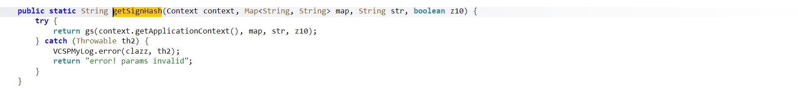
进入了gs方法

- 跟进gs方法：
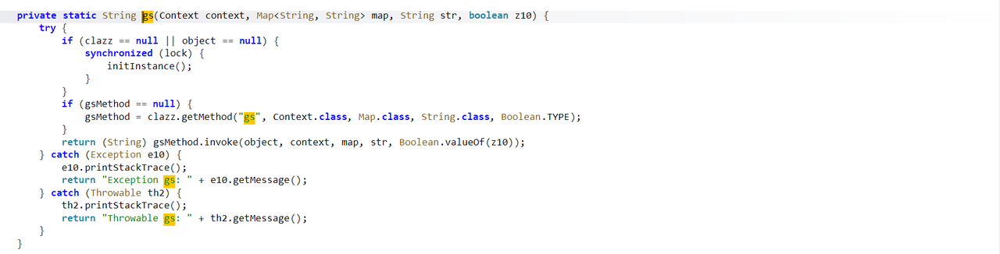
判断clazz或者object是否为空，如果二者其一是空的话就执行initInstance()，用于初始化clazz（例如通过Class.forName("类名")获取目标类的 Class 对象）和object（例如通过clazz.newInstance()创建目标类的实例），也就是为反射准备好目标类和实例，然后再判断gsMethod方法是否为空，如果是那么通过clazz.getMethod进行反射，找到目标类中的gs方法，然后通过gsMethod.invoke嗲用目标类中的方法并将执行结果返回，所以到了这一步需要找到gs方法是那个类的，但是又因为initInstance方法是准备反射的，所以就跟进看看详细

- 跟进initInstance方法：
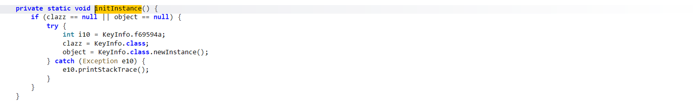
可以看到将KeyInfo.class赋值给了clazz，说明目标类就是KeyInfo了，然后就跟进KeyInfo类并找到里面的gs方法再详细分析一下gs方法的内容

- 跟进KeyInfo类找到gs方法：
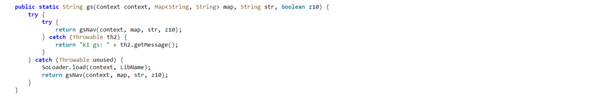
返回了gsNav方法

看到native说明gsNav方法的内容在so文件里面了
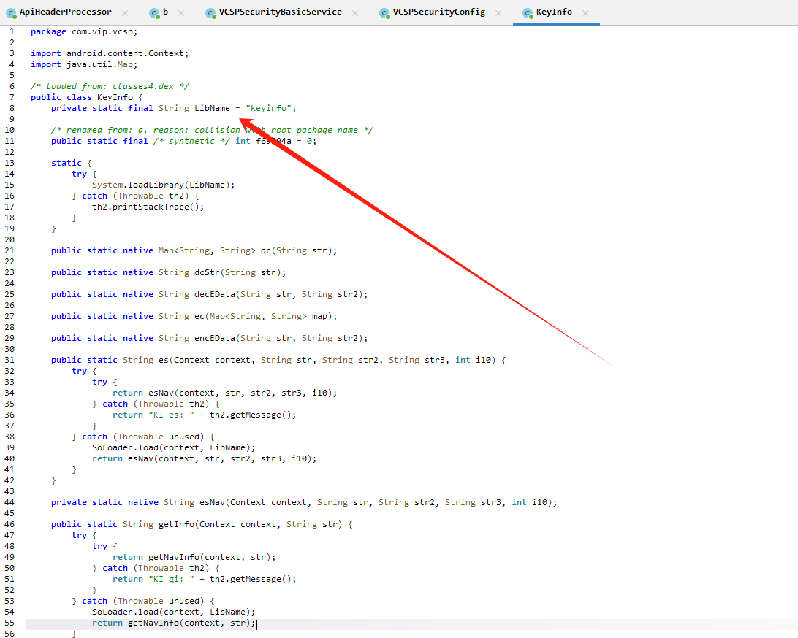
到lib路径下面找到Keyinfo文件
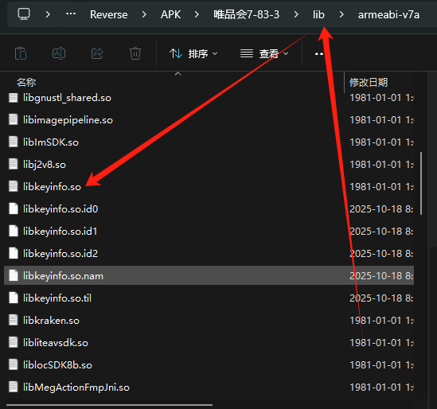

- IDA打开libkeyinfo.so文件：
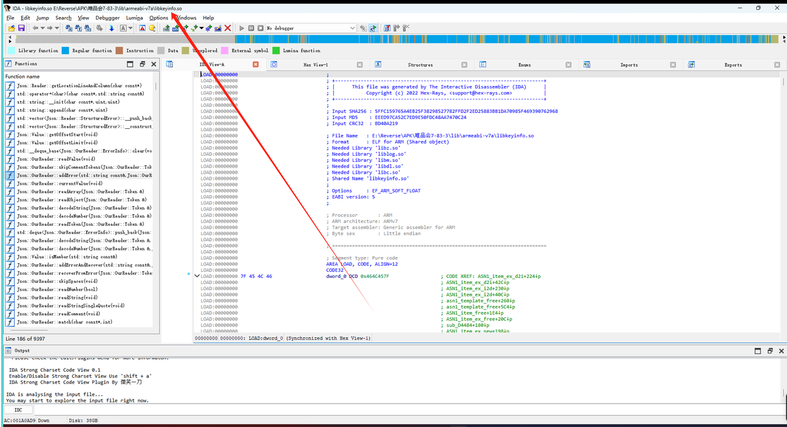
搜索gsNav方法：
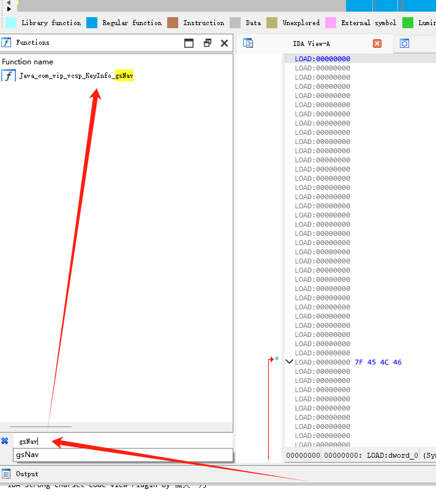
跟进：
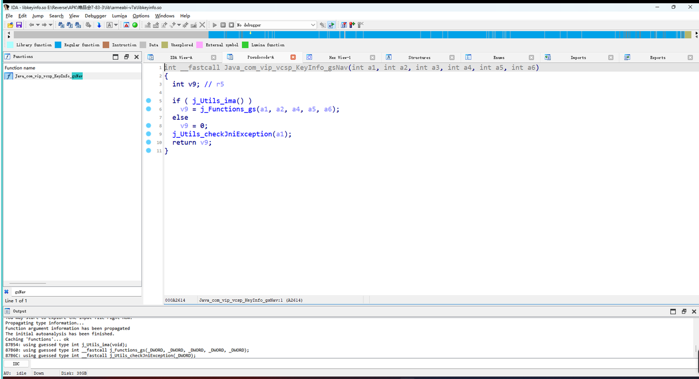
定义了v9变量，之后进入了if语句判断，如果j_Utils_ima()的执行结果为true，那么就将j_Functions_gs方法执行的结果赋值给v9，否则就将0赋值给v9，然后执行j_Utils_checkJniException(a1)方法之后返回v9，分析到这里可以明确的知道，gsNav方法最终返回的值就是v9，至于j_Utils_checkJniException(a1)是做什么的目前可以先不管，但是因为v9的值要么等于0要么是j_Functions_gs方法的执行结果，所以我们跟进j_Functions_gs()方法进行详细分析

- 跟进j_Functions_gs()：
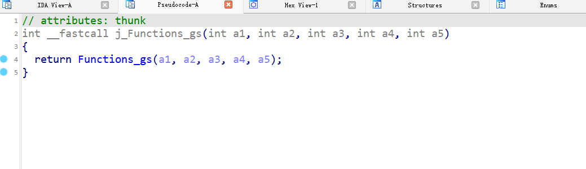
返回了一个Functions_gs()，继续跟进

- 跟进Functions_gs()：
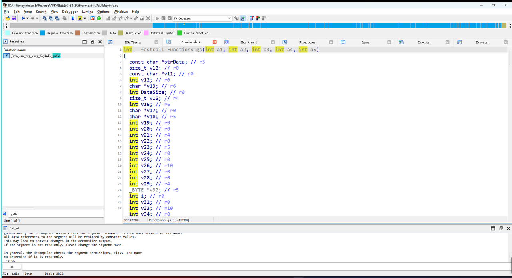
可以看到内容很多，而且前面很多都是对变量的定义，所以我们直接从最后面开始看，看看这方法最终返回了什么东西：
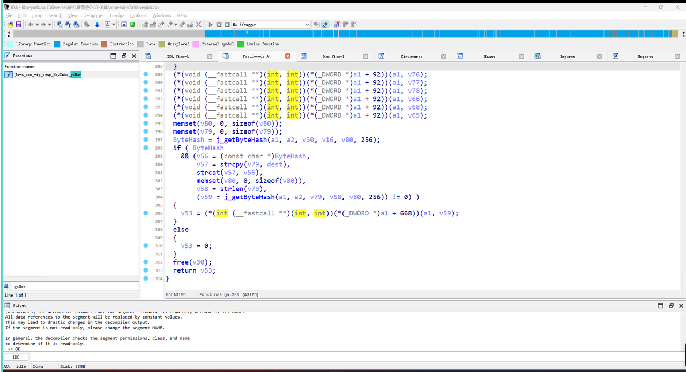
最终返回的是v53变量

- 跟进j_getByteHash()：

继续跟进

- 跟进getByteHash()：
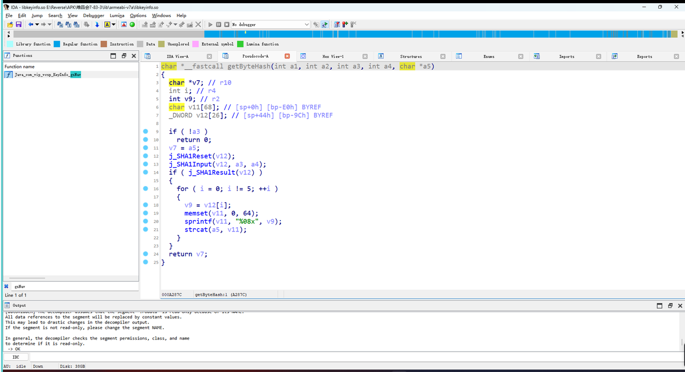
很明显，这段代码就是用来进行SHA1加密并将存储了加密结果的a5的地址赋值给v7然后返回

* 分析结束

* HOOK得到api_sign值：
```javascript
// gsNav_HOOK.js
Java.perform(function () {
  var KeyInfo = Java.use("com.vip.vcsp.KeyInfo");
  var TreeMap = Java.use('java.util.TreeMap');

  KeyInfo.gsNav.implementation = function (context, map, str, z80) {
    console.log("==================gsNav start HOOK!==================")
    console.log("context：", context);
    console.log("map：", Java.cast(map,TreeMap).toString());
    console.log("str：", str);
    console.log("z80：", z80);

    const result = this.gsNav(context, map, str, z80);
    if (result != null) {
      console.log("==================HOOK successed!!==================");
      console.log("返回值：", result);
      return result;
    } else {
      console.log("==================HOOK failed!!==================")
    }
    return 0;
  }
});
```
```bash
frida -U -f com.achievo.vipshop -l gsNav_HOOK.js
```


- 在Burp中任意搜索hook得到的api_sign：
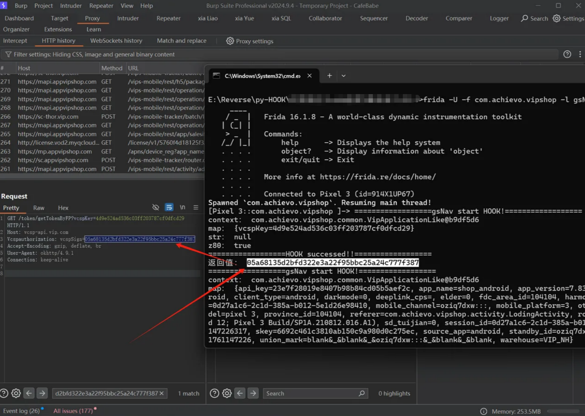
结果一致，说明成功HOOK到了结果，编写SHA1加密还原脚本

- 因为最底层的加密逻辑写在so文件的getByteHash方法中，想要将api_sign的加密逻辑复现出来必须hook底层getByteHash方法
```javascript
// so_getByteHash_HOOK.js
function do_hook() {
    // 延迟10ms执行Hook（避免SO刚加载完就Hook导致的地址异常）
    setTimeout(function() {
        // 查找libkeyinfo.so中的getByteHash导出函数地址
        var addr = Module.findExportByName("libkeyinfo.so", "getByteHash");
        console.log("getByteHash函数地址：", addr);

        // 内联Hook getByteHash函数
        Interceptor.attach(addr, {
            // 函数进入时：记录参数（args[2]和args[3]）
            onEnter: function (args) {
                this.x1 = args[2]; // 保存第3个参数（C函数参数从0开始计数）
            },
            // 函数退出时：打印参数值和返回值
            onLeave: function(retval) {
                console.log("--------------------");
                console.log("参数args[2]值：", Memory.readCString(this.x1));
                console.log("返回值（哈希结果）：", Memory.readCString(retval));
            }
        });
    }, 10);
}

function load_so_and_hook() {
    // 查找系统dlopen和android_dlopen_ext函数（用于捕获SO加载事件）
    var dlopen = Module.findExportByName(null, "dlopen");
    var android_dlopen_ext = Module.findExportByName(null, "android_dlopen_ext");

    // Hook dlopen函数（捕获常规SO加载）
    Interceptor.attach(dlopen, {
        onEnter: function (args) {
            // 获取SO文件路径（args[0]是路径指针）
            var path_ptr = args[0];
            var path = ptr(path_ptr).readCString();
            this.path = path; // 保存路径到当前上下文
        },
        onLeave: function (retval) {
            // 判断是否加载的是目标SO（libkeyinfo.so）
            if (this.path.indexOf("libkeyinfo.so") !== -1) {
                console.log("[dlopen] 开始加载目标SO：", this.path);
                do_hook(); // 加载完成后执行Hook
            }
        }
    });

    // Hook android_dlopen_ext函数（捕获Android特有的SO加载）
    Interceptor.attach(android_dlopen_ext, {
        onEnter: function (args) {
            // 获取SO文件路径（args[0]是路径指针）
            var path_ptr = args[0];
            var path = ptr(path_ptr).readCString();
            this.path = path; // 保存路径到当前上下文
        },
        onLeave: function (retval) {
            // 判断是否加载的是目标SO（libkeyinfo.so）
            if (this.path.indexOf("libkeyinfo.so") !== -1) {
                console.log("\n[android_dlopen_ext] 开始加载目标SO：", this.path);
                do_hook(); // 加载完成后执行Hook
            }
        }
    });
}

// 启动SO加载监听和Hook逻辑
load_so_and_hook();
```
```bash
frida -U -f com.achievo.vipshop -l so_getByteHash_HOOK.js
```

经过分析可以得到对传入的参数进行了两次SHA1加密：
```
原始数据：
aee4c425dbb2288b80c71347cc37d04bactivity=&activity_param=&app_name=shop_android&app_version=7.83.3&channel=1&deeplink_cps=&face_flag=0_1&fdc_area_id=104104&jank_m=0&location=104104&mid=0d27a1c6-2c1d-385a-b012-5e1d26e98410&mobile_channel=oziq7dxw:::&other_cps=&page=page_te_loding_activity&page_id=page_te_loding_activity_1761148005122&page_origin=-99&page_propety={"isBgToFront":"0","scene_entry_id":"-99","refer_page_id":"","module_name":"com.achievo.vipshop","is_back_page":"0"}&page_start_time=1761148005122&repeat=0&service=mobile.page.logger&session_id=0d27a1c6-2c1d-385a-b012-5e1d26e98410_shop_android_1761148005094&skey=6692c461c3810ab150c9a980d0c275ec&source_from=-99&user_class=null&user_group=null&user_label=-99&userid=null&vipruid=null&warehouse=VIP_NH

对此原始数据进行第一次SHA1加密得到如下结果：
5b0544a4219afb58849f960513b87ef3e205657b

然后将原始数据最开始的字符串："aee4c425dbb2288b80c71347cc37d04b"拼接到第一次SHA1加密的结果后组成新字符串："aee4c425dbb2288b80c71347cc37d04b5b0544a4219afb58849f960513b87ef3e205657b"再进行一次SHA1加密得到如下结果：
d3ffb30ebee0bb27ee0e4cdfd794c147220cab6e
```

* 写出加密脚本：
```python
# SHA1加密脚本
import hashlib


def calculate_api_sign(original_data, prefix_str):
    """
    基于两次SHA1加密逻辑计算api_sign
    :param original_data: 原始数据字符串（用户输入的主体数据）
    :param prefix_str: 原始数据开头的前缀字符串
    :return: 最终加密结果（第二次SHA1的十六进制字符串）
    """
    # 第一次SHA1加密：对原始数据进行处理
    sha1_first = hashlib.sha1()
    sha1_first.update(original_data.encode('utf-8'))
    first_result = sha1_first.hexdigest()

    # 拼接前缀和第一次结果，进行第二次SHA1加密
    combined_str = prefix_str + first_result
    sha1_second = hashlib.sha1()
    sha1_second.update(combined_str.encode('utf-8'))
    final_result = sha1_second.hexdigest()

    return first_result, final_result


if __name__ == "__main__":
    print("===== 两次SHA1加密工具 =====")
    # 获取用户输入的原始数据和前缀
    prefix_str = "aee4c425dbb2288b80c71347cc37d04b"
    original_data = input("原始数据：").strip()

    # 计算加密结果
    first_sha1, final_sign = calculate_api_sign(original_data, prefix_str)

    # 输出结果
    print("\n===== 加密结果 =====")
    print(f"第一次SHA1加密结果：{first_sha1}")
    print(f"第二次SHA1加密结果（最终api_sign）：{final_sign}")
```
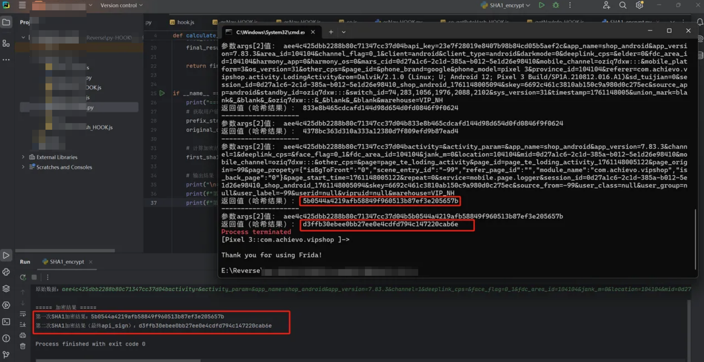
可以看到脚本运行结果与HOOK得到结果一致，至此api_sign逆向完成


> 声明：
>
>本文章中所有内容仅供学习交流使用，不用于其他任何目的，不提供完整代码，抓包内容、敏感网址、数据接口等均已做脱敏处理，严禁用于商业用途和非法用途，否则由此产生的一切后果均与作者无关，如有侵权，请联系作者（3892454318@qq.com）进行删除